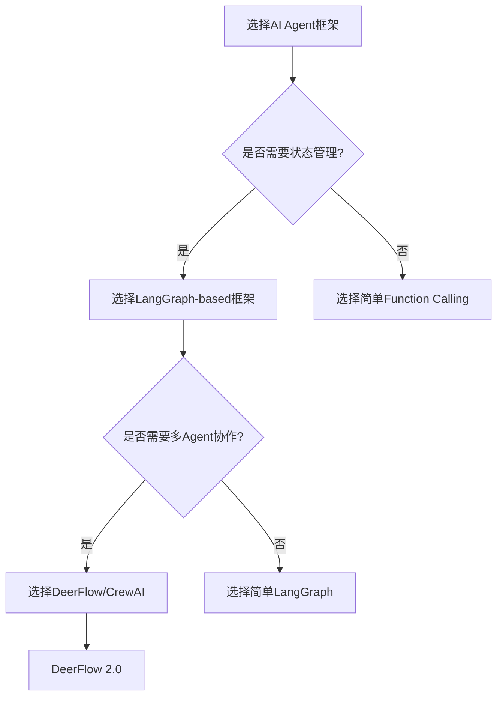
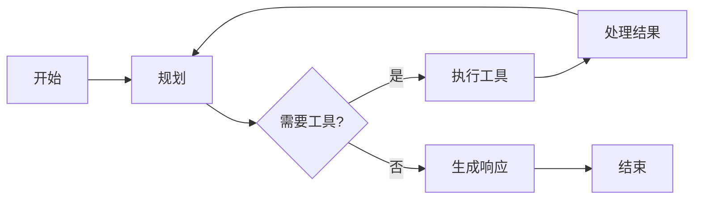

# 🦌 DeerFlow Python Agent 架构师训练营 - 第一周学生讲义

## 📅 Week 1: 基础架构（Day 1-7）

### 学习目标
- 掌握现代AI Agent架构的核心概念，理解LangGraph、LangChain和DeerFlow的关系
- 能够配置开发环境，运行第一个Agent，理解状态管理和中间件机制
- 培养系统化思考Agent架构的能力，理解各组件间的协作关系

---

## Day 1：现代AI Agent架构概览

### 第1节：AI Agent演进史

#### 核心概念
AI Agent（智能代理）的发展经历了四个主要阶段：

1. **规则系统阶段**（1990s-2000s）：
   - 基于预定义规则的专家系统
   - 缺乏灵活性和泛化能力
   - 代表：ELIZA、MYCIN

2. **机器学习阶段**（2010s）：
   - 基于统计模型和特征工程
   - 需要大量标注数据
   - 代表：推荐系统、分类器

3. **深度学习阶段**（2010s后期）：
   - 神经网络驱动的端到端学习
   - 在感知任务（图像、语音）上取得突破
   - 代表：AlexNet、GPT-1/2

4. **大语言模型阶段**（2020s至今）：
   - 基于Transformer架构的生成式模型
   - 涌现出推理、规划、工具使用等能力
   - 代表：GPT-3/4、Claude、Gemini

#### 现代AI Agent特征
- **自主性**：能够独立完成任务规划
- **交互性**：与用户和环境进行多轮对话
- **工具使用**：调用外部工具扩展能力
- **记忆与学习**：从历史交互中学习改进
- **多模态**：处理文本、图像、音频等多种输入

### 第2节：大厂技术选型对比

#### 技术栈对比

| 公司 | 核心框架 | 状态管理 | 工具系统 | 开源状态 |
|------|----------|----------|----------|----------|
| **OpenAI** | GPTs + Function Calling | 无内置状态机 | Function Calling | 闭源 |
| **Anthropic** | Claude + Tool Use | 会话上下文 | Tool Use | 闭源 |
| **Google** | Gemini + Vertex AI | Workflows | Vertex AI Tools | 部分开源 |
| **Meta** | Llama + LangChain | 自定义 | LangChain Tools | 开源 |
| **字节跳动** | **DeerFlow 2.0** | **LangGraph StateGraph** | **统一工具系统** | **开源** |

#### DeerFlow 2.0架构优势
1. **分层架构**：Lead Agent → Middleware Chain → Tool System → Subagents
2. **状态管理**：基于LangGraph的确定性状态机
3. **可扩展性**：插件化设计，支持自定义中间件和工具
4. **生产就绪**：内置监控、日志、错误处理机制
5. **开源开放**：Apache 2.0许可证，活跃社区支持

#### 技术选型决策树


### 第3节：DeerFlow 2.0架构优势

#### 四层架构设计
DeerFlow采用清晰的分层架构，每层职责明确：

1. **Lead Agent层**：主代理，负责任务规划和决策
   - 基于LangChain的AgentExecutor
   - 支持多种思考模式（fast、deep、plan）
   - 内置提示工程和上下文管理

2. **Middleware Chain层**：中间件链，处理请求/响应
   - 可插拔中间件系统
   - 执行顺序：认证 → 日志 → 错误处理 → 业务逻辑
   - 支持异步处理和并行执行

3. **Tool System层**：工具系统，扩展Agent能力
   - 统一工具接口（BaseTool）
   - 动态工具发现和加载
   - 安全沙箱执行环境

4. **Subagents层**：子代理系统，复杂任务分解
   - 并行执行多个子任务
   - 父子代理通信机制
   - 结果聚合和冲突解决

#### 核心组件关系图
```python
# DeerFlow核心组件依赖关系
class DeerFlowArchitecture:
    def __init__(self):
        self.lead_agent = LeadAgent()
        self.middleware_chain = MiddlewareChain()
        self.tool_system = ToolSystem()
        self.subagents = SubagentManager()
    
    async def process_request(self, request: AgentRequest) -> AgentResponse:
        # 1. 中间件链预处理
        request = await self.middleware_chain.before_agent(request)
        
        # 2. 主代理决策
        plan = await self.lead_agent.plan(request)
        
        # 3. 工具执行或子代理分发
        if plan.needs_subagents:
            results = await self.subagents.execute(plan)
        else:
            results = await self.tool_system.execute(plan)
        
        # 4. 中间件链后处理
        response = await self.middleware_chain.after_agent(results)
        
        return response
```

#### 状态管理：LangGraph StateGraph
DeerFlow使用LangGraph的StateGraph管理Agent状态：

```python
from typing import TypedDict, List
from langgraph.graph import StateGraph

# 定义状态类型
class ThreadState(TypedDict):
    messages: List[str]  # 消息历史
    current_step: str    # 当前步骤
    tool_results: List[Dict]  # 工具执行结果
    metadata: Dict       # 元数据

# 创建状态图
graph = StateGraph(ThreadState)

# 添加节点（Agent步骤）
graph.add_node("plan", plan_node)
graph.add_node("execute", execute_node)
graph.add_node("review", review_node)

# 添加边（状态转移）
graph.add_edge("plan", "execute")
graph.add_edge("execute", "review")
graph.add_conditional_edges("review", decide_next_step)

# 编译为可执行图
app = graph.compile()
```

### 第4节：实战：配置与运行

#### 环境配置步骤

**步骤1：克隆代码库**
```bash
git clone https://github.com/bytedance/deer-flow.git
cd deer-flow
```

**步骤2：安装依赖**
```bash
# 创建虚拟环境
python -m venv venv
source venv/bin/activate  # Linux/Mac
# venv\Scripts\activate   # Windows

# 安装核心依赖
pip install -r requirements.txt

# 安装开发依赖
pip install -r requirements-dev.txt
```

**步骤3：配置API密钥**
```bash
# 复制配置文件模板
cp config.example.yaml config.yaml

# 编辑配置文件，添加OpenAI API密钥
# config.yaml内容：
# openai:
#   api_key: "sk-..."
#   base_url: "https://api.openai.com/v1"
```

**步骤4：运行第一个Agent**
```python
# first_agent.py
from deerflow.agents.lead_agent import create_lead_agent
from deerflow.agents.thread_state import ThreadState

async def main():
    # 创建Lead Agent
    agent = await create_lead_agent()
    
    # 初始化状态
    state: ThreadState = {
        "messages": ["Hello, I need help with file processing."],
        "current_step": "start",
        "tool_results": [],
        "metadata": {}
    }
    
    # 运行Agent
    result = await agent.run(state)
    
    print("Agent response:", result["messages"][-1])

if __name__ == "__main__":
    import asyncio
    asyncio.run(main())
```

#### 验证安装成功
运行测试脚本确认环境配置正确：

```bash
# 运行单元测试
pytest tests/test_basic.py -v

# 运行集成测试
pytest tests/test_integration.py -v

# 启动开发服务器
make dev
```

#### 常见问题排查

**问题1：Python版本不兼容**
```
错误：DeerFlow需要Python 3.12+
解决：使用pyenv或conda安装正确版本
```

**问题2：依赖安装失败**
```
错误：某些包无法编译
解决：安装系统依赖（gcc, python3-dev）或使用预编译wheel
```

**问题3：API密钥无效**
```
错误：OpenAI API认证失败
解决：检查config.yaml格式，确认密钥有效
```

#### 下一步学习建议
1. **深入阅读**：LangGraph官方文档前3章
2. **代码探索**：阅读`deerflow/agents/lead_agent/agent.py`
3. **实践练习**：修改第一个Agent，添加自定义工具
4. **社区参与**：加入DeerFlow Discord，参与讨论

---

## Day 2：Agent状态管理与运行时配置

### 第5节：ThreadState状态机设计

#### 状态机核心概念
DeerFlow使用**状态机（State Machine）** 来管理Agent的执行流程。每个Agent任务对应一个`ThreadState`实例，包含：

1. **消息历史**（messages）：对话历史和Agent思考过程
2. **当前步骤**（current_step）：状态图中的节点标识
3. **工具结果**（tool_results）：工具调用的返回结果
4. **元数据**（metadata）：自定义扩展字段

#### ThreadState类型定义
```python
from typing import TypedDict, List, Dict, Optional, Any
from langchain_core.messages import BaseMessage

class ThreadState(TypedDict):
    """Agent线程状态定义"""
    
    # 必需字段
    messages: List[BaseMessage]          # 消息历史
    current_step: str                    # 当前执行步骤
    
    # 可选字段（使用NotRequired）
    tool_results: List[Dict[str, Any]]   # 工具执行结果
    metadata: Dict[str, Any]             # 自定义元数据
    intermediate_steps: List[Dict]       # 中间步骤记录
    error: Optional[str]                 # 错误信息
    retry_count: int                     # 重试次数
```

#### 状态流转示例


#### 状态持久化
DeerFlow支持状态检查点（Checkpoint）机制：
```python
class CheckpointSystem:
    async def save_checkpoint(self, state: ThreadState, checkpoint_id: str):
        """保存状态检查点"""
        # 序列化状态
        serialized = self.serialize_state(state)
        # 存储到持久化后端
        await self.storage.save(checkpoint_id, serialized)
    
    async def load_checkpoint(self, checkpoint_id: str) -> ThreadState:
        """加载状态检查点"""
        # 从存储加载
        serialized = await self.storage.load(checkpoint_id)
        # 反序列化
        return self.deserialize_state(serialized)
```

### 第6节：自定义Reducer函数

#### Reducer函数作用
Reducer是LangGraph中的核心概念，负责**状态转换**。每个状态图节点对应一个Reducer函数，接收当前状态，返回新状态。

#### 内置Reducer类型
1. **messages_reducer**：处理消息列表
2. **tool_results_reducer**：合并工具结果
3. **metadata_reducer**：更新元数据
4. **error_reducer**：错误处理

#### 自定义Reducer示例
```python
from typing import Callable
from langgraph.graph import reduce

def create_custom_reducer(field: str, update_fn: Callable) -> Callable:
    """创建自定义Reducer工厂函数"""
    
    def reducer(state: ThreadState, value: Any) -> ThreadState:
        # 复制当前状态
        new_state = state.copy()
        
        # 应用更新函数
        if field in new_state:
            current = new_state[field]
            new_state[field] = update_fn(current, value)
        else:
            new_state[field] = value
        
        return new_state
    
    return reducer

# 使用示例：计数Reducer
def increment_counter(current: int, increment: int = 1) -> int:
    return current + increment

counter_reducer = create_custom_reducer("counter", increment_counter)
```

#### Reducer组合模式
```python
from langgraph.graph import compose_reducers

# 组合多个Reducer
combined_reducer = compose_reducers(
    messages_reducer,      # 处理消息
    tool_results_reducer,  # 处理工具结果
    counter_reducer,       # 自定义计数器
    error_reducer          # 错误处理
)

# 在状态图中使用
graph.add_node("process", combined_reducer)
```

### 第7节：RunnableConfig运行时配置

#### 配置层次结构
DeerFlow运行时配置采用三层结构：

1. **全局配置**：应用级别默认值
2. **会话配置**：单个会话的配置
3. **请求配置**：单个请求的配置（优先级最高）

#### RunnableConfig字段详解
```python
from typing import TypedDict, Optional

class RunnableConfig(TypedDict):
    """运行时配置"""
    
    # 执行控制
    max_concurrency: Optional[int]       # 最大并发数
    timeout: Optional[float]             # 超时时间（秒）
    
    # 模型配置
    model_name: Optional[str]            # 模型名称
    temperature: Optional[float]         # 温度参数
    max_tokens: Optional[int]            # 最大token数
    
    # 工具配置
    allowed_tools: Optional[List[str]]   # 允许的工具列表
    tool_timeout: Optional[float]        # 工具超时时间
    
    # 调试配置
    verbose: Optional[bool]              # 详细日志
    callbacks: Optional[List]            # 回调函数
```

#### 配置继承与覆盖
```python
def merge_configs(
    base: RunnableConfig,
    override: RunnableConfig
) -> RunnableConfig:
    """合并配置（override覆盖base）"""
    result = base.copy()
    
    for key, value in override.items():
        if value is not None:  # 仅覆盖非None值
            result[key] = value
    
    return result

# 配置继承示例
global_config = {"timeout": 30, "verbose": False}
session_config = {"timeout": 60, "model_name": "gpt-4"}
request_config = {"verbose": True}

# 合并结果：timeout=60, verbose=True, model_name="gpt-4"
final_config = merge_configs(
    global_config,
    merge_configs(session_config, request_config)
)
```

#### 配置驱动的行为
```python
class ConfigurableAgent:
    def __init__(self, config: RunnableConfig):
        self.config = config
    
    async def run(self, state: ThreadState, config: RunnableConfig = None):
        # 合并配置
        runtime_config = merge_configs(self.config, config or {})
        
        # 应用配置
        if runtime_config.get("verbose"):
            print(f"[DEBUG] Starting agent with config: {runtime_config}")
        
        # 执行逻辑
        # ...
```

### 第8节：实战：扩展ThreadState

#### 扩展场景：任务跟踪系统
假设我们需要为Agent添加任务跟踪功能：
1. 记录任务开始时间
2. 跟踪任务进度
3. 计算任务耗时
4. 支持任务暂停/恢复

#### 扩展ThreadState定义
```python
from typing import TypedDict, List, Dict, Optional
from datetime import datetime

class ExtendedThreadState(TypedDict):
    """扩展的线程状态"""
    
    # 基础字段（继承ThreadState）
    messages: List[BaseMessage]
    current_step: str
    tool_results: List[Dict[str, Any]]
    metadata: Dict[str, Any]
    
    # 扩展字段
    task_info: Dict[str, Any]           # 任务信息
    start_time: Optional[datetime]      # 开始时间
    end_time: Optional[datetime]        # 结束时间
    progress: float                     # 进度（0.0-1.0）
    paused: bool                        # 是否暂停
    time_elapsed: float                 # 已用时间（秒）
```

#### 实现任务跟踪Reducer
```python
def task_tracking_reducer(state: ExtendedThreadState, action: str) -> ExtendedThreadState:
    """任务跟踪Reducer"""
    new_state = state.copy()
    
    if action == "start":
        new_state["start_time"] = datetime.now()
        new_state["progress"] = 0.0
        new_state["paused"] = False
        
    elif action == "update_progress":
        progress = state.get("progress", 0.0) + 0.1
        new_state["progress"] = min(progress, 1.0)
        
        # 计算已用时间
        if state.get("start_time"):
            elapsed = (datetime.now() - state["start_time"]).total_seconds()
            new_state["time_elapsed"] = elapsed
    
    elif action == "pause":
        new_state["paused"] = True
    
    elif action == "resume":
        new_state["paused"] = False
    
    elif action == "complete":
        new_state["end_time"] = datetime.now()
        new_state["progress"] = 1.0
        
        # 计算总耗时
        if state.get("start_time") and new_state["end_time"]:
            total_time = (new_state["end_time"] - state["start_time"]).total_seconds()
            new_state["time_elapsed"] = total_time
    
    return new_state
```

#### 集成到状态图
```python
# 创建状态图
graph = StateGraph(ExtendedThreadState)

# 添加任务跟踪节点
graph.add_node("track_task", task_tracking_reducer)

# 在适当的位置插入跟踪节点
graph.add_edge("plan", "track_task")  # 规划后开始跟踪
graph.add_edge("track_task", "execute")

# 添加进度更新边
graph.add_edge("execute", ("track_task", "update_progress"))
```

#### 测试扩展功能
```python
async def test_extended_state():
    # 初始化扩展状态
    state: ExtendedThreadState = {
        "messages": [],
        "current_step": "start",
        "tool_results": [],
        "metadata": {},
        "task_info": {"name": "文件处理"},
        "start_time": None,
        "end_time": None,
        "progress": 0.0,
        "paused": False,
        "time_elapsed": 0.0
    }
    
    # 测试Reducer
    state = task_tracking_reducer(state, "start")
    print(f"任务开始: {state['start_time']}")
    
    state = task_tracking_reducer(state, "update_progress")
    print(f"进度更新: {state['progress']:.0%}")
    
    state = task_tracking_reducer(state, "complete")
    print(f"任务完成，耗时: {state['time_elapsed']:.2f}秒")
```

#### 扩展建议
1. **向后兼容**：确保扩展不影响现有功能
2. **序列化**：考虑扩展字段的序列化/反序列化
3. **性能**：避免扩展字段过多影响性能
4. **测试**：为扩展功能编写完整测试用例

---

## Day 3：系统提示工程与动态注入

### 第9节：提示模板架构

#### 提示模板设计原则
DeerFlow提示模板遵循**模块化**和**可组合**设计：

1. **角色定义**：明确Agent的身份和职责
2. **任务描述**：清晰说明需要完成的工作
3. **约束条件**：列出限制和边界
4. **输出格式**：指定响应的结构和格式
5. **示例演示**：提供少样本示例（few-shot）

#### 模板继承体系
```python
class PromptTemplate:
    """提示模板基类"""
    
    def __init__(self, template: str, variables: Dict[str, Any]):
        self.template = template
        self.variables = variables
    
    def render(self, context: Dict[str, Any]) -> str:
        """渲染模板"""
        # 合并变量
        merged = {**self.variables, **context}
        # 渲染模板
        return self.template.format(**merged)

class SystemPrompt(PromptTemplate):
    """系统提示模板"""
    pass

class UserPrompt(PromptTemplate):
    """用户提示模板"""
    pass

class ToolPrompt(PromptTemplate):
    """工具调用提示模板"""
    pass
```

#### 多语言提示支持
```python
class MultilingualPrompt:
    """多语言提示管理器"""
    
    SUPPORTED_LANGUAGES = ["en", "zh", "ja", "ko", "es", "fr"]
    
    def __init__(self):
        self.templates: Dict[str, Dict[str, str]] = {}
    
    def add_template(self, language: str, role: str, template: str):
        """添加语言特定模板"""
        if language not in self.templates:
            self.templates[language] = {}
        self.templates[language][role] = template
    
    def get_prompt(self, language: str, role: str, context: Dict) -> str:
        """获取指定语言的提示"""
        if language not in self.SUPPORTED_LANGUAGES:
            language = "en"  # 默认英语
        
        template = self.templates.get(language, {}).get(role)
        if not template:
            # 回退到英语
            template = self.templates.get("en", {}).get(role)
        
        return template.format(**context) if template else ""
```

#### 动态模板选择
```python
def select_prompt_template(
    task_type: str,
    complexity: str,
    user_level: str
) -> str:
    """根据任务特征选择模板"""
    
    templates = {
        "simple": {
            "beginner": SIMPLE_BEGINNER_TEMPLATE,
            "advanced": SIMPLE_ADVANCED_TEMPLATE
        },
        "complex": {
            "beginner": COMPLEX_BEGINNER_TEMPLATE,
            "advanced": COMPLEX_ADVANCED_TEMPLATE
        },
        "creative": {
            "beginner": CREATIVE_BEGINNER_TEMPLATE,
            "advanced": CREATIVE_ADVANCED_TEMPLATE
        }
    }
    
    return templates.get(task_type, {}).get(user_level, DEFAULT_TEMPLATE)
```

### 第10节：内存上下文注入机制

#### 内存系统架构
DeerFlow内存系统分为三层：

1. **短期内存**：当前会话的上下文（最近N轮对话）
2. **长期记忆**：跨会话的持久化记忆（向量存储）
3. **工作记忆**：当前任务相关的临时记忆

#### 上下文注入流程
```python
class ContextInjector:
    """上下文注入器"""
    
    def __init__(self, memory_system: MemorySystem):
        self.memory = memory_system
    
    async def inject_context(self, prompt: str, state: ThreadState) -> str:
        """向提示中注入上下文"""
        
        # 1. 注入短期记忆（最近对话）
        short_term = await self.memory.get_short_term(state)
        prompt = self._inject_short_term(prompt, short_term)
        
        # 2. 注入长期记忆（相关历史）
        long_term = await self.memory.get_long_term(state)
        prompt = self._inject_long_term(prompt, long_term)
        
        # 3. 注入工作记忆（当前任务）
        working = await self.memory.get_working(state)
        prompt = self._inject_working(prompt, working)
        
        return prompt
    
    def _inject_short_term(self, prompt: str, memories: List[Dict]) -> str:
        """注入短期记忆"""
        if not memories:
            return prompt
        
        context = "## 最近对话记录：\n"
        for mem in memories[-5:]:  # 最近5条
            context += f"- {mem['role']}: {mem['content'][:100]}...\n"
        
        return f"{context}\n\n{prompt}"
```

#### 记忆检索策略
```python
class MemoryRetriever:
    """记忆检索器"""
    
    async def retrieve_relevant_memories(
        self,
        query: str,
        state: ThreadState,
        top_k: int = 3
    ) -> List[Dict]:
        """检索相关记忆"""
        
        # 1. 基于向量相似度检索
        vector_results = await self.vector_search(query, top_k)
        
        # 2. 基于时间相关性过滤
        recent_results = self.filter_recent(vector_results, days=7)
        
        # 3. 基于任务相关性排序
        task_related = self.sort_by_task(recent_results, state)
        
        return task_related[:top_k]
```

#### 动态上下文窗口管理
```python
class ContextWindowManager:
    """上下文窗口管理器"""
    
    def __init__(self, max_tokens: int = 8000):
        self.max_tokens = max_tokens
    
    def trim_context(
        self,
        context: List[Dict],
        current_tokens: int
    ) -> List[Dict]:
        """修剪上下文以适应token限制"""
        
        if current_tokens <= self.max_tokens:
            return context
        
        # 计算需要移除的token数
        excess = current_tokens - self.max_tokens
        
        # 优先移除最旧的、最不相关的上下文
        trimmed = []
        removed_tokens = 0
        
        for item in reversed(context):  # 从最新到最旧
            if removed_tokens >= excess:
                trimmed.insert(0, item)  # 保留该项
            else:
                # 计算该项的token数
                item_tokens = self.count_tokens(item)
                removed_tokens += item_tokens
        
        return trimmed
```

### 第11节：技能系统集成

#### 技能定义与注册
```python
from typing import Protocol

class Skill(Protocol):
    """技能协议"""
    
    name: str
    description: str
    version: str
    
    async def execute(self, context: Dict) -> Dict:
        """执行技能"""
        pass
    
    async def validate(self, input_data: Dict) -> bool:
        """验证输入"""
        pass

class SkillRegistry:
    """技能注册表"""
    
    def __init__(self):
        self.skills: Dict[str, Skill] = {}
    
    def register(self, skill: Skill):
        """注册技能"""
        self.skills[skill.name] = skill
    
    def get_skill(self, name: str) -> Optional[Skill]:
        """获取技能"""
        return self.skills.get(name)
    
    def list_skills(self) -> List[str]:
        """列出所有技能"""
        return list(self.skills.keys())
```

#### 技能发现与加载
```python
class SkillLoader:
    """技能加载器"""
    
    def __init__(self, skill_dir: str):
        self.skill_dir = skill_dir
    
    async def discover_skills(self) -> List[Skill]:
        """发现技能"""
        skills = []
        
        for file_path in Path(self.skill_dir).glob("*.py"):
            # 动态导入模块
            module = import_module(file_path.stem)
            
            # 查找技能类（以Skill结尾的类）
            for attr_name in dir(module):
                attr = getattr(module, attr_name)
                if (isinstance(attr, type) and 
                    issubclass(attr, Skill) and 
                    attr != Skill):
                    skills.append(attr())
        
        return skills
```

#### 技能组合与编排
```python
class SkillOrchestrator:
    """技能编排器"""
    
    def __init__(self, registry: SkillRegistry):
        self.registry = registry
    
    async def execute_skill_chain(
        self,
        skill_names: List[str],
        initial_context: Dict
    ) -> Dict:
        """执行技能链"""
        
        context = initial_context.copy()
        
        for skill_name in skill_names:
            skill = self.registry.get_skill(skill_name)
            if not skill:
                raise ValueError(f"Skill {skill_name} not found")
            
            # 验证输入
            if not await skill.validate(context):
                raise ValueError(f"Invalid input for skill {skill_name}")
            
            # 执行技能
            result = await skill.execute(context)
            
            # 更新上下文
            context.update(result)
        
        return context
```

### 第12节：实战：创建自定义技能

#### 技能开发流程
1. **需求分析**：明确技能的功能和输入输出
2. **接口设计**：定义技能类的结构
3. **实现逻辑**：编写核心业务逻辑
4. **测试验证**：编写单元测试和集成测试
5. **注册部署**：将技能注册到系统中

#### 示例：文件分析技能
```python
from typing import Dict, List
import json
from pathlib import Path

class FileAnalysisSkill:
    """文件分析技能"""
    
    name = "file_analysis"
    description = "分析文件内容，提取关键信息"
    version = "1.0.0"
    
    SUPPORTED_FORMATS = [".txt", ".json", ".yaml", ".yml", ".csv"]
    
    async def execute(self, context: Dict) -> Dict:
        """执行文件分析"""
        
        file_path = context.get("file_path")
        if not file_path:
            return {"error": "No file path provided"}
        
        # 检查文件格式
        if not self._is_supported_format(file_path):
            return {"error": f"Unsupported file format: {file_path}"}
        
        # 读取文件内容
        content = await self._read_file(file_path)
        
        # 分析内容
        analysis = await self._analyze_content(content, file_path)
        
        return {
            "file_path": file_path,
            "file_size": len(content),
            "analysis": analysis,
            "success": True
        }
    
    async def validate(self, input_data: Dict) -> bool:
        """验证输入"""
        file_path = input_data.get("file_path")
        
        if not file_path:
            return False
        
        # 检查文件是否存在
        if not Path(file_path).exists():
            return False
        
        # 检查文件格式
        if not self._is_supported_format(file_path):
            return False
        
        return True
    
    def _is_supported_format(self, file_path: str) -> bool:
        """检查是否支持的文件格式"""
        ext = Path(file_path).suffix.lower()
        return ext in self.SUPPORTED_FORMATS
    
    async def _read_file(self, file_path: str) -> str:
        """读取文件内容"""
        with open(file_path, 'r', encoding='utf-8') as f:
            return f.read()
    
    async def _analyze_content(self, content: str, file_path: str) -> Dict:
        """分析文件内容"""
        ext = Path(file_path).suffix.lower()
        
        if ext == ".json":
            return self._analyze_json(content)
        elif ext in [".yaml", ".yml"]:
            return self._analyze_yaml(content)
        elif ext == ".csv":
            return self._analyze_csv(content)
        else:  # .txt
            return self._analyze_text(content)
    
    def _analyze_json(self, content: str) -> Dict:
        """分析JSON文件"""
        try:
            data = json.loads(content)
            return {
                "type": "json",
                "size": len(content),
                "keys": list(data.keys()) if isinstance(data, dict) else ["array"],
                "depth": self._calculate_depth(data)
            }
        except json.JSONDecodeError:
            return {"error": "Invalid JSON format"}
    
    def _analyze_text(self, content: str) -> Dict:
        """分析文本文件"""
        lines = content.split('\n')
        words = content.split()
        
        return {
            "type": "text",
            "line_count": len(lines),
            "word_count": len(words),
            "char_count": len(content),
            "avg_line_length": sum(len(line) for line in lines) / max(len(lines), 1)
        }
```

#### 技能测试
```python
import pytest
from unittest.mock import Mock, patch

class TestFileAnalysisSkill:
    """文件分析技能测试"""
    
    @pytest.fixture
    def skill(self):
        return FileAnalysisSkill()
    
    @pytest.fixture
    def temp_json_file(self, tmp_path):
        """创建临时JSON文件"""
        file_path = tmp_path / "test.json"
        data = {"name": "test", "value": 123}
        file_path.write_text(json.dumps(data))
        return str(file_path)
    
    async def test_execute_valid_json(self, skill, temp_json_file):
        """测试有效的JSON文件分析"""
        context = {"file_path": temp_json_file}
        
        result = await skill.execute(context)
        
        assert result["success"] == True
        assert result["file_path"] == temp_json_file
        assert "analysis" in result
        assert result["analysis"]["type"] == "json"
        assert "name" in result["analysis"]["keys"]
    
    async def test_validate_invalid_path(self, skill):
        """验证无效文件路径"""
        assert await skill.validate({"file_path": "/nonexistent/file.txt"}) == False
    
    async def test_validate_unsupported_format(self, skill, tmp_path):
        """验证不支持的文件格式"""
        file_path = tmp_path / "test.pdf"
        file_path.touch()
        
        assert await skill.validate({"file_path": str(file_path)}) == False
```

#### 技能注册与使用
```python
# 注册技能
registry = SkillRegistry()
registry.register(FileAnalysisSkill())

# 使用技能
async def use_file_analysis():
    context = {"file_path": "/path/to/data.json"}
    
    skill = registry.get_skill("file_analysis")
    if skill and await skill.validate(context):
        result = await skill.execute(context)
        print(f"分析结果: {result}")
```

#### 技能开发最佳实践
1. **单一职责**：每个技能只做一件事
2. **明确接口**：清晰的输入输出定义
3. **错误处理**：优雅处理异常情况
4. **性能考虑**：避免阻塞操作，使用异步
5. **可测试性**：编写全面的测试用例
6. **文档完善**：提供使用示例和API文档

---

## Day 4：中间件模式与执行流程

### 第13节：中间件设计模式精讲

#### 中间件核心概念
中间件（Middleware）是DeerFlow的核心扩展机制，允许在Agent处理流程中插入自定义逻辑。中间件遵循**责任链模式**，每个中间件可以：
1. **预处理请求**：修改输入、验证权限、记录日志
2. **处理响应**：修改输出、格式化数据、错误处理
3. **传递控制**：决定是否继续执行链中的下一个中间件

#### 中间件接口定义
```python
from typing import Protocol, Optional
from langchain_core.runnables import RunnableConfig

class AgentMiddleware(Protocol):
    """Agent中间件协议"""
    
    async def before_agent(
        self,
        request: AgentRequest,
        config: Optional[RunnableConfig] = None
    ) -> AgentRequest:
        """Agent执行前调用"""
        pass
    
    async def after_agent(
        self,
        response: AgentResponse,
        config: Optional[RunnableConfig] = None
    ) -> AgentResponse:
        """Agent执行后调用"""
        pass
    
    async def wrap_tool_call(
        self,
        tool_name: str,
        tool_args: Dict,
        config: Optional[RunnableConfig] = None
    ) -> Tuple[str, Dict]:
        """工具调用包装"""
        pass
```

#### 中间件执行顺序
DeerFlow中间件链按固定顺序执行：
```
1. AuthenticationMiddleware    # 认证
2. LoggingMiddleware          # 日志记录
3. RateLimitMiddleware        # 限流
4. ValidationMiddleware       # 输入验证
5. ThreadDataMiddleware       # 线程数据处理
6. MemoryMiddleware           # 内存注入
7. ToolErrorHandlingMiddleware # 工具错误处理
8. ClarificationMiddleware    # 澄清机制
9. TitleMiddleware           # 标题生成
10. ViewImageMiddleware      # 图片处理
11. SubagentLimitMiddleware  # 子代理限制
12. TodoMiddleware           # 任务管理
```

#### 中间件链实现
```python
class MiddlewareChain:
    """中间件链"""
    
    def __init__(self, middlewares: List[AgentMiddleware]):
        self.middlewares = middlewares
    
    async def execute_before(
        self,
        request: AgentRequest,
        config: Optional[RunnableConfig] = None
    ) -> AgentRequest:
        """执行前置中间件链"""
        
        current_request = request
        
        for middleware in self.middlewares:
            current_request = await middleware.before_agent(
                current_request, config
            )
        
        return current_request
    
    async def execute_after(
        self,
        response: AgentResponse,
        config: Optional[RunnableConfig] = None
    ) -> AgentResponse:
        """执行后置中间件链"""
        
        current_response = response
        
        # 反向执行（后置中间件）
        for middleware in reversed(self.middlewares):
            current_response = await middleware.after_agent(
                current_response, config
            )
        
        return current_response
```

### 第14节：中间件执行顺序

#### 执行顺序的重要性
中间件执行顺序影响系统行为：
1. **安全性**：认证必须在授权之前
2. **可靠性**：日志记录应在最外层，确保所有操作被记录
3. **性能**：缓存中间件应尽早执行
4. **正确性**：数据验证应在业务逻辑之前

#### 顺序配置示例
```yaml
middleware:
  execution_order:
    - "authentication"
    - "logging"
    - "rate_limit"
    - "validation"
    - "thread_data"
    - "memory"
    - "tool_error"
    - "clarification"
    - "title"
    - "view_image"
    - "subagent_limit"
    - "todo"
  
  # 中间件配置
  authentication:
    enabled: true
    provider: "jwt"
  
  logging:
    enabled: true
    level: "INFO"
  
  rate_limit:
    enabled: true
    requests_per_minute: 60
```

#### 动态顺序调整
```python
class DynamicMiddlewareScheduler:
    """动态中间件调度器"""
    
    def __init__(self, base_order: List[str]):
        self.base_order = base_order
        self.middleware_registry: Dict[str, AgentMiddleware] = {}
    
    def register_middleware(self, name: str, middleware: AgentMiddleware):
        """注册中间件"""
        self.middleware_registry[name] = middleware
    
    def get_execution_order(
        self,
        request_type: str,
        user_role: str
    ) -> List[AgentMiddleware]:
        """根据请求类型和用户角色获取执行顺序"""
        
        # 基础顺序
        order = self.base_order.copy()
        
        # 根据请求类型调整
        if request_type == "tool_call":
            # 工具调用需要额外的验证中间件
            order.insert(4, "tool_validation")  # 在validation之后
        
        # 根据用户角色调整
        if user_role == "admin":
            # 管理员跳过某些限制
            order.remove("rate_limit")
        
        # 转换为中间件实例
        return [
            self.middleware_registry[name]
            for name in order
            if name in self.middleware_registry
        ]
```

### 第15节：ThreadDataMiddleware深度分析

#### ThreadDataMiddleware作用
`ThreadDataMiddleware`是DeerFlow的核心中间件，负责：
1. **线程数据管理**：维护ThreadState与请求的关联
2. **状态持久化**：自动保存和恢复线程状态
3. **上下文传递**：在中间件链中传递线程上下文
4. **错误恢复**：状态回滚和错误恢复

#### 核心实现分析
```python
class ThreadDataMiddleware:
    """线程数据中间件"""
    
    def __init__(self, storage: ThreadStorage):
        self.storage = storage
    
    async def before_agent(
        self,
        request: AgentRequest,
        config: Optional[RunnableConfig] = None
    ) -> AgentRequest:
        """Agent执行前：加载线程数据"""
        
        thread_id = request.get("thread_id")
        if not thread_id:
            # 创建新线程
            thread_id = self._generate_thread_id()
            request["thread_id"] = thread_id
            request["thread_data"] = self._create_initial_state()
        else:
            # 加载现有线程数据
            thread_data = await self.storage.load(thread_id)
            if thread_data:
                request["thread_data"] = thread_data
            else:
                # 线程不存在，创建新状态
                request["thread_data"] = self._create_initial_state()
        
        return request
    
    async def after_agent(
        self,
        response: AgentResponse,
        config: Optional[RunnableConfig] = None
    ) -> AgentResponse:
        """Agent执行后：保存线程数据"""
        
        thread_id = response.get("thread_id")
        thread_data = response.get("thread_data")
        
        if thread_id and thread_data:
            # 保存线程状态
            await self.storage.save(thread_id, thread_data)
        
        return response
    
    def _generate_thread_id(self) -> str:
        """生成线程ID"""
        return f"thread_{uuid.uuid4().hex[:8]}"
    
    def _create_initial_state(self) -> ThreadState:
        """创建初始线程状态"""
        return {
            "messages": [],
            "current_step": "start",
            "tool_results": [],
            "metadata": {}
        }
```

#### 状态持久化策略
```python
class ThreadStorage:
    """线程存储抽象"""
    
    async def save(self, thread_id: str, state: ThreadState):
        """保存线程状态"""
        raise NotImplementedError
    
    async def load(self, thread_id: str) -> Optional[ThreadState]:
        """加载线程状态"""
        raise NotImplementedError
    
    async def delete(self, thread_id: str):
        """删除线程状态"""
        raise NotImplementedError

class MemoryThreadStorage(ThreadStorage):
    """内存线程存储（开发用）"""
    
    def __init__(self):
        self.storage: Dict[str, ThreadState] = {}
    
    async def save(self, thread_id: str, state: ThreadState):
        self.storage[thread_id] = state
    
    async def load(self, thread_id: str) -> Optional[ThreadState]:
        return self.storage.get(thread_id)
    
    async def delete(self, thread_id: str):
        self.storage.pop(thread_id, None)

class RedisThreadStorage(ThreadStorage):
    """Redis线程存储（生产用）"""
    
    def __init__(self, redis_url: str):
        import redis
        self.redis = redis.from_url(redis_url)
    
    async def save(self, thread_id: str, state: ThreadState):
        import json
        serialized = json.dumps(state)
        self.redis.setex(
            f"thread:{thread_id}",
            3600,  # 1小时过期
            serialized
        )
    
    async def load(self, thread_id: str) -> Optional[ThreadState]:
        import json
        data = self.redis.get(f"thread:{thread_id}")
        if data:
            return json.loads(data)
        return None
```

### 第16节：实战：跟踪中间件执行

#### 调试中间件执行流程
1. **日志跟踪**：在每个中间件添加详细日志
2. **性能监控**：测量每个中间件的执行时间
3. **状态快照**：记录中间件执行前后的状态变化
4. **错误追踪**：跟踪错误在中间件链中的传播

#### 实现跟踪中间件
```python
class TracingMiddleware:
    """跟踪中间件"""
    
    def __init__(self, tracer: Tracer):
        self.tracer = tracer
    
    async def before_agent(
        self,
        request: AgentRequest,
        config: Optional[RunnableConfig] = None
    ) -> AgentRequest:
        """记录请求跟踪信息"""
        
        trace_id = self.tracer.start_trace("middleware_before")
        request["trace_id"] = trace_id
        
        # 记录请求信息
        self.tracer.log_event(trace_id, "request_received", {
            "timestamp": datetime.now().isoformat(),
            "request_keys": list(request.keys()),
            "thread_id": request.get("thread_id")
        })
        
        return request
    
    async def after_agent(
        self,
        response: AgentResponse,
        config: Optional[RunnableConfig] = None
    ) -> AgentResponse:
        """记录响应跟踪信息"""
        
        trace_id = response.get("trace_id")
        if trace_id:
            self.tracer.log_event(trace_id, "response_ready", {
                "timestamp": datetime.now().isoformat(),
                "response_keys": list(response.keys()),
                "has_error": "error" in response
            })
            
            # 结束跟踪
            self.tracer.end_trace(trace_id)
        
        return response
```

#### 可视化跟踪结果
```python
def visualize_trace(trace_id: str):
    """可视化跟踪结果"""
    
    events = tracer.get_events(trace_id)
    
    # 生成时间线图
    timeline = []
    for event in events:
        timeline.append({
            "name": event["name"],
            "timestamp": event["timestamp"],
            "duration": event.get("duration", 0)
        })
    
    # 打印ASCII时间线
    print("Middleware Execution Timeline:")
    print("-" * 60)
    
    for item in timeline:
        duration_bar = "█" * int(item["duration"] * 10)
        print(f"{item['name']:30} {duration_bar} ({item['duration']:.3f}s)")
```

#### 中间件性能分析
```python
class PerformanceMiddleware:
    """性能分析中间件"""
    
    def __init__(self):
        self.metrics: Dict[str, List[float]] = {}
    
    async def before_agent(self, request, config=None):
        request["_start_time"] = time.time()
        return request
    
    async def after_agent(self, response, config=None):
        start_time = response.get("_start_time")
        if start_time:
            duration = time.time() - start_time
            middleware_name = self.__class__.__name__
            
            # 记录指标
            if middleware_name not in self.metrics:
                self.metrics[middleware_name] = []
            self.metrics[middleware_name].append(duration)
        
        return response
    
    def get_performance_report(self) -> Dict:
        """获取性能报告"""
        report = {}
        
        for name, durations in self.metrics.items():
            if durations:
                report[name] = {
                    "count": len(durations),
                    "avg_ms": sum(durations) / len(durations) * 1000,
                    "p95_ms": sorted(durations)[int(len(durations) * 0.95)] * 1000,
                    "max_ms": max(durations) * 1000
                }
        
        return report
```

#### 实战练习：中间件调试
1. **安装跟踪工具**：部署OpenTelemetry或自定义跟踪系统
2. **添加跟踪中间件**：在现有中间件链中插入TracingMiddleware
3. **分析执行流程**：运行Agent任务，收集跟踪数据
4. **优化性能瓶颈**：根据性能报告优化慢速中间件
5. **错误诊断**：使用跟踪数据诊断中间件错误

---

## Day 5：工具错误处理与用户交互

### 第17节：ToolErrorHandlingMiddleware

#### 工具错误分类
DeerFlow将工具错误分为四类：
1. **配置错误**：工具配置无效或缺失
2. **运行时错误**：工具执行过程中出错
3. **超时错误**：工具执行超时
4. **权限错误**：工具访问权限不足

#### 错误处理策略
```python
class ErrorHandlingStrategy:
    """错误处理策略"""
    
    RETRY = "retry"          # 重试
    FALLBACK = "fallback"    # 降级到备用工具
    ASK_USER = "ask_user"    # 询问用户
    FAIL_FAST = "fail_fast"  # 快速失败
    
    @classmethod
    def get_strategy(cls, error_type: str, retry_count: int) -> str:
        """根据错误类型和重试次数选择策略"""
        
        if retry_count >= 3:
            return cls.FAIL_FAST
        
        strategies = {
            "config_error": cls.ASK_USER,
            "runtime_error": cls.RETRY,
            "timeout_error": cls.FALLBACK,
            "permission_error": cls.ASK_USER
        }
        
        return strategies.get(error_type, cls.FAIL_FAST)
```

#### ToolErrorHandlingMiddleware实现
```python
class ToolErrorHandlingMiddleware:
    """工具错误处理中间件"""
    
    def __init__(self, fallback_tools: Dict[str, str]):
        self.fallback_tools = fallback_tools  # 主工具 → 备用工具映射
    
    async def wrap_tool_call(
        self,
        tool_name: str,
        tool_args: Dict,
        config: Optional[RunnableConfig] = None
    ) -> Tuple[str, Dict]:
        """包装工具调用，添加错误处理"""
        
        retry_count = 0
        max_retries = config.get("max_retries", 2) if config else 2
        
        while retry_count <= max_retries:
            try:
                # 尝试调用工具
                result = await self._call_tool(tool_name, tool_args, config)
                return tool_name, result
                
            except ToolError as e:
                retry_count += 1
                
                # 选择处理策略
                strategy = ErrorHandlingStrategy.get_strategy(
                    e.error_type, retry_count
                )
                
                if strategy == ErrorHandlingStrategy.RETRY:
                    # 等待后重试
                    await asyncio.sleep(1 * retry_count)
                    continue
                    
                elif strategy == ErrorHandlingStrategy.FALLBACK:
                    # 切换到备用工具
                    fallback = self.fallback_tools.get(tool_name)
                    if fallback:
                        tool_name = fallback
                        continue
                    
                elif strategy == ErrorHandlingStrategy.ASK_USER:
                    # 返回需要澄清的错误信息
                    return "clarify", {
                        "error": str(e),
                        "original_tool": tool_name,
                        "suggestions": e.suggestions
                    }
                
                # 快速失败或其他策略
                raise
        
        # 重试次数用尽
        raise MaxRetriesExceededError(
            f"Tool {tool_name} failed after {max_retries} retries"
        )
```

### 第18节：ClarificationMiddleware

#### 澄清机制设计
澄清（Clarification）是Agent向用户请求更多信息或确认的机制。DeerFlow澄清系统支持：

1. **参数缺失澄清**：必需参数未提供时询问
2. **歧义澄清**：多个可能解释时请求澄清
3. **确认澄清**：危险操作前请求确认
4. **选项澄清**：提供多个选项让用户选择

#### ClarificationMiddleware实现
```python
class ClarificationMiddleware:
    """澄清中间件"""
    
    async def after_agent(
        self,
        response: AgentResponse,
        config: Optional[RunnableConfig] = None
    ) -> AgentResponse:
        """Agent执行后：处理需要澄清的响应"""
        
        if response.get("needs_clarification"):
            clarification_type = response["clarification_type"]
            clarification_data = response["clarification_data"]
            
            # 根据澄清类型生成用户友好的消息
            message = self._generate_clarification_message(
                clarification_type,
                clarification_data
            )
            
            # 更新响应
            response["messages"].append({
                "role": "assistant",
                "content": message,
                "type": "clarification"
            })
            
            # 设置状态标志，等待用户响应
            response["waiting_for_clarification"] = True
        
        return response
    
    def _generate_clarification_message(
        self,
        clarification_type: str,
        data: Dict
    ) -> str:
        """生成澄清消息"""
        
        templates = {
            "missing_param": (
                "我需要更多信息才能继续。\n"
                "请提供以下参数：{params}\n"
                "示例：{examples}"
            ),
            "ambiguity": (
                "您说的'{input}'可能有多种解释：\n"
                "{options}\n"
                "请选择或澄清您的意思。"
            ),
            "confirmation": (
                "您确定要执行以下操作吗？\n"
                "操作：{action}\n"
                "影响：{impact}\n"
                "请输入'确认'继续，或'取消'中止。"
            ),
            "choice": (
                "请从以下选项中选择：\n"
                "{options}\n"
                "您也可以提供其他选项。"
            )
        }
        
        template = templates.get(clarification_type, "请澄清您的请求。")
        return template.format(**data)
```

#### 澄清状态管理
```python
class ClarificationStateManager:
    """澄清状态管理器"""
    
    async def handle_clarification_response(
        self,
        thread_id: str,
        user_response: str
    ) -> ThreadState:
        """处理用户澄清响应"""
        
        # 加载当前线程状态
        state = await self.storage.load(thread_id)
        
        if not state.get("waiting_for_clarification"):
            raise NoClarificationPendingError()
        
        clarification_type = state["clarification_type"]
        
        # 解析用户响应
        parsed = self._parse_clarification_response(
            clarification_type,
            user_response
        )
        
        # 更新状态
        state["clarification_response"] = parsed
        state["waiting_for_clarification"] = False
        
        # 保存状态
        await self.storage.save(thread_id, state)
        
        return state
```

### 第19节：TitleMiddleware

#### 标题生成机制
`TitleMiddleware`自动为对话生成简洁的标题，便于：
1. **对话管理**：快速识别对话主题
2. **历史浏览**：在对话列表中显示标题
3. **搜索索引**：基于标题进行搜索
4. **用户友好**：提供更好的用户体验

#### 标题生成策略
```python
class TitleGenerationStrategy:
    """标题生成策略"""
    
    @staticmethod
    def generate_from_messages(messages: List[Dict]) -> str:
        """从消息历史生成标题"""
        
        if not messages:
            return "新对话"
        
        # 提取用户第一条消息
        first_user_msg = next(
            (m for m in messages if m["role"] == "user"),
            None
        )
        
        if first_user_msg:
            content = first_user_msg["content"]
            
            # 策略1：截取前N个字符
            if len(content) <= 50:
                return content
            else:
                return content[:47] + "..."
        
        # 策略2：基于工具调用
        tool_calls = [
            m for m in messages 
            if m.get("type") == "tool_call"
        ]
        
        if tool_calls:
            tools = [call["tool_name"] for call in tool_calls[:3]]
            return f"工具调用：{', '.join(tools)}"
        
        # 默认标题
        return f"对话 ({len(messages)} 条消息)"
    
    @staticmethod
    def generate_from_tools(tool_results: List[Dict]) -> str:
        """从工具结果生成标题"""
        
        if not tool_results:
            return "无工具调用"
        
        # 提取主要工具
        main_tool = tool_results[0]["tool_name"]
        
        # 根据工具类型生成标题
        tool_titles = {
            "search": "搜索",
            "calculate": "计算",
            "file_read": "文件读取",
            "code_execute": "代码执行"
        }
        
        return tool_titles.get(main_tool, main_tool)
```

#### TitleMiddleware实现
```python
class TitleMiddleware:
    """标题生成中间件"""
    
    def __init__(self, title_generator: TitleGenerationStrategy):
        self.title_generator = title_generator
    
    async def after_agent(
        self,
        response: AgentResponse,
        config: Optional[RunnableConfig] = None
    ) -> AgentResponse:
        """Agent执行后：生成对话标题"""
        
        # 检查是否需要生成标题
        if (not response.get("title") and 
            len(response.get("messages", [])) >= 3):
            
            # 生成标题
            title = self.title_generator.generate_from_messages(
                response["messages"]
            )
            
            # 更新响应
            response["title"] = title
            
            # 记录标题生成日志
            if config and config.get("verbose"):
                print(f"[TITLE] Generated title: {title}")
        
        return response
```

### 第20节：实战：错误处理和澄清机制

#### 错误处理实战
1. **配置错误处理**：创建配置验证中间件
2. **重试机制**：实现指数退避重试策略
3. **降级策略**：为关键工具配置备用方案
4. **用户通知**：友好地通知用户错误信息

#### 澄清机制实战
1. **参数收集**：实现智能参数提取和验证
2. **选项生成**：基于上下文生成合理选项
3. **确认流程**：危险操作前的二次确认
4. **状态恢复**：澄清后的状态恢复和继续执行

#### 综合练习：构建弹性Agent
```python
class ResilientAgent:
    """弹性Agent，集成错误处理和澄清机制"""
    
    def __init__(self):
        self.error_handler = ToolErrorHandlingMiddleware({
            "search": "fallback_search",
            "calculate": "simple_calculator",
            "file_read": "basic_file_reader"
        })
        
        self.clarification = ClarificationMiddleware()
        self.title_generator = TitleMiddleware(TitleGenerationStrategy())
    
    async def process_request(
        self,
        request: AgentRequest
    ) -> AgentResponse:
        """处理请求，包含完整的错误处理和澄清"""
        
        try:
            # 1. 错误处理包装的工具调用
            tool_name, result = await self.error_handler.wrap_tool_call(
                request["tool_name"],
                request["tool_args"]
            )
            
            # 2. 构建响应
            response = {
                "tool_name": tool_name,
                "result": result,
                "messages": request.get("messages", [])
            }
            
            # 3. 澄清处理（如果需要）
            if tool_name == "clarify":
                response = await self.clarification.after_agent(response)
            
            # 4. 标题生成
            response = await self.title_generator.after_agent(response)
            
            return response
            
        except Exception as e:
            # 5. 全局错误处理
            return await self._handle_global_error(e, request)
```

#### 测试策略
1. **单元测试**：测试每个中间件的独立功能
2. **集成测试**：测试中间件链的协同工作
3. **错误注入测试**：模拟各种错误场景
4. **性能测试**：测试错误处理对性能的影响

---

## Day 6：高级中间件与图片处理

### 第21节：ViewImageMiddleware

#### 图片处理需求
现代AI Agent需要处理图片输入，包括：
1. **图片描述**：生成图片的文字描述
2. **图片分析**：提取图片中的信息
3. **OCR识别**：识别图片中的文字
4. **图片生成**：根据描述生成图片

#### Base64编码与解码
```python
import base64
from PIL import Image
import io

class ImageProcessor:
    """图片处理器"""
    
    @staticmethod
    def image_to_base64(image_path: str) -> str:
        """图片转Base64"""
        with open(image_path, "rb") as image_file:
            encoded = base64.b64encode(image_file.read()).decode('utf-8')
        return f"data:image/jpeg;base64,{encoded}"
    
    @staticmethod
    def base64_to_image(base64_str: str) -> Image.Image:
        """Base64转图片"""
        # 移除data URL前缀
        if "," in base64_str:
            base64_str = base64_str.split(",")[1]
        
        image_data = base64.b64decode(base64_str)
        image = Image.open(io.BytesIO(image_data))
        return image
    
    @staticmethod
    def validate_image(base64_str: str, max_size_mb: int = 10) -> bool:
        """验证图片数据"""
        # 检查数据大小
        if "," in base64_str:
            data = base64_str.split(",")[1]
        else:
            data = base64_str
        
        size_mb = (len(data) * 3) / 4 / 1024 / 1024  # Base64解码后大小估算
        return size_mb <= max_size_mb
```

#### ViewImageMiddleware实现
```python
class ViewImageMiddleware:
    """图片查看中间件"""
    
    def __init__(self, vision_model: BaseChatModel):
        self.vision_model = vision_model
    
    async def before_agent(
        self,
        request: AgentRequest,
        config: Optional[RunnableConfig] = None
    ) -> AgentRequest:
        """Agent执行前：处理图片输入"""
        
        messages = request.get("messages", [])
        
        # 检查消息中是否包含图片
        for i, msg in enumerate(messages):
            if self._contains_image(msg.get("content", "")):
                # 提取图片并生成描述
                description = await self._describe_image(msg["content"])
                
                # 用文字描述替换图片内容
                messages[i]["content"] = (
                    f"[图片描述：{description}]\n"
                    f"{msg['content'].split('[图片]')[0]}"
                )
        
        request["messages"] = messages
        return request
    
    def _contains_image(self, content: str) -> bool:
        """检查内容是否包含图片"""
        return "data:image" in content or "[图片]" in content
    
    async def _describe_image(self, image_content: str) -> str:
        """生成图片描述"""
        # 提取Base64数据
        if "base64," in image_content:
            base64_data = image_content.split("base64,")[1][:100] + "..."
        else:
            base64_data = image_content[:100] + "..."
        
        # 使用视觉模型生成描述
        prompt = f"请描述以下图片：{base64_data[:500]}"
        response = await self.vision_model.ainvoke(prompt)
        
        return response.content[:200]  # 限制描述长度
```

### 第22节：SubagentLimitMiddleware

#### 子代理限制需求
防止Agent系统资源被滥用：
1. **深度限制**：限制子代理嵌套层数
2. **数量限制**：限制同时运行的子代理数量
3. **时间限制**：限制子代理执行时间
4. **资源限制**：限制子代理资源使用

#### 限制策略配置
```yaml
subagent_limits:
  max_depth: 3          # 最大嵌套深度
  max_concurrent: 5     # 最大并发数
  max_total_time: 300   # 总执行时间（秒）
  max_memory_mb: 512    # 最大内存使用（MB）
  allowed_tools:        # 允许子代理使用的工具
    - "search"
    - "calculate"
    - "file_read"
  blocked_tools:        # 禁止子代理使用的工具
    - "system_exec"
    - "database_write"
```

#### SubagentLimitMiddleware实现
```python
class SubagentLimitMiddleware:
    """子代理限制中间件"""
    
    def __init__(self, limits: Dict):
        self.limits = limits
        self.active_subagents: Dict[str, Dict] = {}
    
    async def before_agent(
        self,
        request: AgentRequest,
        config: Optional[RunnableConfig] = None
    ) -> AgentRequest:
        """Agent执行前：检查子代理限制"""
        
        parent_id = request.get("parent_agent_id")
        depth = request.get("agent_depth", 0)
        
        # 检查嵌套深度
        if depth >= self.limits.get("max_depth", 3):
            raise MaxDepthExceededError(
                f"Maximum subagent depth ({self.limits['max_depth']}) exceeded"
            )
        
        # 检查并发数量
        active_count = len([
            a for a in self.active_subagents.values()
            if a.get("status") == "running"
        ])
        
        if active_count >= self.limits.get("max_concurrent", 5):
            raise MaxConcurrentExceededError(
                f"Maximum concurrent subagents ({self.limits['max_concurrent']}) exceeded"
            )
        
        # 注册子代理
        agent_id = request.get("agent_id", "unknown")
        self.active_subagents[agent_id] = {
            "start_time": time.time(),
            "depth": depth,
            "status": "running"
        }
        
        request["agent_depth"] = depth + 1
        return request
    
    async def after_agent(
        self,
        response: AgentResponse,
        config: Optional[RunnableConfig] = None
    ) -> AgentResponse:
        """Agent执行后：更新子代理状态"""
        
        agent_id = response.get("agent_id")
        if agent_id in self.active_subagents:
            self.active_subagents[agent_id]["status"] = "completed"
            self.active_subagents[agent_id]["end_time"] = time.time()
        
        return response
```

### 第23节：TodoMiddleware

#### 任务管理需求
Agent需要管理复杂任务：
1. **任务分解**：将大任务分解为小步骤
2. **进度跟踪**：跟踪任务执行进度
3. **状态持久化**：保存任务状态，支持中断恢复
4. **优先级管理**：管理任务执行优先级

#### 任务数据结构
```python
@dataclass
class TodoItem:
    """待办事项"""
    
    id: str
    description: str
    status: str  # pending, in_progress, completed, cancelled
    priority: int  # 1-5，1为最高优先级
    created_at: datetime
    updated_at: datetime
    dependencies: List[str]  # 依赖的任务ID
    estimated_duration: Optional[float]  # 预计时长（秒）
    actual_duration: Optional[float]     # 实际时长（秒）
    result: Optional[Dict]               # 执行结果
    
    def is_blocked(self, todos: Dict[str, "TodoItem"]) -> bool:
        """检查任务是否被阻塞"""
        for dep_id in self.dependencies:
            dep = todos.get(dep_id)
            if dep and dep.status != "completed":
                return True
        return False
```

#### TodoMiddleware实现
```python
class TodoMiddleware:
    """任务管理中间件"""
    
    def __init__(self, storage: TodoStorage):
        self.storage = storage
    
    async def before_agent(
        self,
        request: AgentRequest,
        config: Optional[RunnableConfig] = None
    ) -> AgentRequest:
        """Agent执行前：加载任务列表"""
        
        thread_id = request.get("thread_id")
        if thread_id:
            # 加载该线程的待办事项
            todos = await self.storage.load_todos(thread_id)
            request["todos"] = todos
        
        return request
    
    async def after_agent(
        self,
        response: AgentResponse,
        config: Optional[RunnableConfig] = None
    ) -> AgentResponse:
        """Agent执行后：更新任务状态"""
        
        thread_id = response.get("thread_id")
        todos = response.get("todos", [])
        
        if thread_id and todos:
            # 保存更新后的待办事项
            await self.storage.save_todos(thread_id, todos)
            
            # 生成任务进度报告
            progress = self._calculate_progress(todos)
            response["task_progress"] = progress
        
        return response
    
    def _calculate_progress(self, todos: List[TodoItem]) -> Dict:
        """计算任务进度"""
        total = len(todos)
        completed = len([t for t in todos if t.status == "completed"])
        
        return {
            "total": total,
            "completed": completed,
            "percentage": (completed / total * 100) if total > 0 else 0,
            "blocked": len([t for t in todos if t.is_blocked(todos)])
        }
```

### 第24节：实战：图片处理和任务管理

#### 综合实战：图片分析流水线
创建一个图片分析Agent，实现：
1. **图片上传**：支持Base64格式图片上传
2. **自动描述**：使用视觉模型生成图片描述
3. **任务分解**：将复杂分析分解为多个子任务
4. **进度跟踪**：实时跟踪分析进度
5. **结果聚合**：合并子任务结果生成完整报告

#### 实现代码框架
```python
class ImageAnalysisPipeline:
    """图片分析流水线"""
    
    def __init__(self):
        self.image_middleware = ViewImageMiddleware(vision_model)
        self.todo_middleware = TodoMiddleware(todo_storage)
        self.limit_middleware = SubagentLimitMiddleware(limits)
    
    async def analyze_image(
        self,
        image_data: str,
        analysis_types: List[str]
    ) -> Dict:
        """分析图片"""
        
        # 创建主任务
        main_todo = TodoItem(
            id="main_analysis",
            description="图片分析主任务",
            status="in_progress",
            priority=1,
            created_at=datetime.now(),
            updated_at=datetime.now(),
            dependencies=[],
            estimated_duration=60
        )
        
        # 创建子任务
        sub_todos = []
        for i, analysis_type in enumerate(analysis_types):
            todo = TodoItem(
                id=f"subtask_{i}",
                description=f"图片分析：{analysis_type}",
                status="pending",
                priority=2,
                created_at=datetime.now(),
                updated_at=datetime.now(),
                dependencies=["main_analysis"],
                estimated_duration=30
            )
            sub_todos.append(todo)
        
        # 构建请求
        request = {
            "thread_id": f"image_analysis_{uuid.uuid4().hex[:8]}",
            "messages": [{
                "role": "user",
                "content": f"请分析图片：{image_data[:100]}...",
                "contains_image": True
            }],
            "todos": [main_todo] + sub_todos,
            "analysis_types": analysis_types
        }
        
        # 应用中间件
        request = await self.image_middleware.before_agent(request)
        request = await self.todo_middleware.before_agent(request)
        request = await self.limit_middleware.before_agent(request)
        
        # 执行分析（模拟）
        # ... 实际分析逻辑
        
        # 更新任务状态
        main_todo.status = "completed"
        main_todo.actual_duration = 45.5
        main_todo.result = {"summary": "分析完成"}
        
        # 构建响应
        response = {
            "thread_id": request["thread_id"],
            "todos": [main_todo] + sub_todos,
            "analysis_results": {...}
        }
        
        # 应用后置中间件
        response = await self.limit_middleware.after_agent(response)
        response = await self.todo_middleware.after_agent(response)
        
        return response
```

#### 测试策略
1. **单元测试**：测试每个中间件的独立功能
2. **集成测试**：测试中间件链协同工作
3. **性能测试**：测试图片处理和任务管理性能
4. **压力测试**：测试高并发下的稳定性

---

## Day 7：工具系统架构

### 第25节：工具发现与装配

#### 工具系统设计原则
DeerFlow工具系统设计遵循以下原则：
1. **统一接口**：所有工具实现相同的BaseTool接口
2. **动态发现**：支持运行时发现和注册新工具
3. **安全沙箱**：危险工具在沙箱环境中执行
4. **权限控制**：基于角色的工具访问控制
5. **性能监控**：监控工具执行性能和资源使用

#### 工具发现机制
```python
class ToolDiscovery:
    """工具发现器"""
    
    def __init__(self, search_paths: List[str]):
        self.search_paths = search_paths
    
    async def discover_tools(self) -> List[Type[BaseTool]]:
        """发现所有可用工具"""
        
        tools = []
        
        for search_path in self.search_paths:
            path = Path(search_path)
            
            if not path.exists():
                continue
            
            # 扫描Python文件
            for file_path in path.glob("**/*.py"):
                module_name = self._path_to_module(file_path)
                
                try:
                    # 动态导入模块
                    module = importlib.import_module(module_name)
                    
                    # 查找工具类
                    for attr_name in dir(module):
                        attr = getattr(module, attr_name)
                        
                        if (isinstance(attr, type) and
                            issubclass(attr, BaseTool) and
                            attr != BaseTool):
                            tools.append(attr)
                            
                except ImportError as e:
                    print(f"Failed to import {module_name}: {e}")
        
        return tools
    
    def _path_to_module(self, file_path: Path) -> str:
        """将文件路径转换为模块名"""
        # 将路径转换为点分隔的模块名
        relative = file_path.relative_to(Path.cwd())
        module_name = str(relative).replace("/", ".").replace(".py", "")
        return module_name
```

#### 工具装配系统
```python
class ToolAssembly:
    """工具装配器"""
    
    def __init__(self, config: ToolConfig):
        self.config = config
        self.tools: Dict[str, BaseTool] = {}
    
    async def assemble_tools(self) -> Dict[str, BaseTool]:
        """装配所有配置的工具"""
        
        # 加载内置工具
        builtin_tools = await self._load_builtin_tools()
        self.tools.update(builtin_tools)
        
        # 加载自定义工具
        custom_tools = await self._load_custom_tools()
        self.tools.update(custom_tools)
        
        # 加载MCP工具
        mcp_tools = await self._load_mcp_tools()
        self.tools.update(mcp_tools)
        
        # 应用配置过滤
        self._apply_config_filters()
        
        return self.tools
    
    async def _load_builtin_tools(self) -> Dict[str, BaseTool]:
        """加载内置工具"""
        builtin_tools = {}
        
        # DeerFlow内置工具模块
        builtin_modules = [
            "deerflow.tools.bash",
            "deerflow.tools.python",
            "deerflow.tools.search",
            "deerflow.tools.calculator"
        ]
        
        for module_name in builtin_modules:
            try:
                module = importlib.import_module(module_name)
                
                # 查找工具类并实例化
                for attr_name in dir(module):
                    attr = getattr(module, attr_name)
                    
                    if (isinstance(attr, type) and
                        issubclass(attr, BaseTool) and
                        attr != BaseTool):
                        
                        tool_instance = attr()
                        builtin_tools[tool_instance.name] = tool_instance
                        
            except ImportError:
                continue
        
        return builtin_tools
```

### 第26节：Sandbox工具集

#### 沙箱工具安全设计
沙箱工具在隔离环境中执行代码，防止：
1. **系统破坏**：防止删除、修改系统文件
2. **数据泄露**：防止访问敏感数据
3. **资源滥用**：防止耗尽系统资源
4. **恶意代码**：防止执行恶意指令

#### BashTool实现
```python
class BashTool(BaseTool):
    """Bash命令工具"""
    
    name = "bash"
    description = "在沙箱中执行Bash命令"
    args_schema = BashArgs
    
    def __init__(self, sandbox_provider: SandboxProvider):
        self.sandbox_provider = sandbox_provider
    
    async def _run(
        self,
        command: str,
        args: List[str] = None,
        timeout: float = 30,
        workdir: str = "/tmp"
    ) -> str:
        """执行Bash命令"""
        
        # 创建沙箱
        sandbox_config = SandboxConfig(
            provider="local",
            workdir=workdir,
            timeout=timeout
        )
        
        sandbox = self.sandbox_provider.create(sandbox_config)
        
        try:
            # 执行命令
            result = await sandbox.execute("bash", ["-c", command])
            
            if result.exit_code != 0:
                return f"命令执行失败（退出码：{result.exit_code}）：\n{result.stderr}"
            
            return result.stdout
            
        finally:
            # 清理沙箱
            await sandbox.cleanup()
    
    async def _arun(self, *args, **kwargs):
        """异步执行"""
        return await self._run(*args, **kwargs)
```

#### PythonTool实现
```python
class PythonTool(BaseTool):
    """Python代码执行工具"""
    
    name = "python"
    description = "在沙箱中执行Python代码"
    args_schema = PythonArgs
    
    def __init__(self, sandbox_provider: SandboxProvider):
        self.sandbox_provider = sandbox_provider
        self.allowed_modules = ["math", "json", "datetime", "re"]
    
    async def _run(
        self,
        code: str,
        timeout: float = 60,
        workdir: str = "/tmp"
    ) -> str:
        """执行Python代码"""
        
        # 安全检查：检查导入的模块
        if not self._check_imports(code):
            return "错误：包含不允许导入的模块"
        
        # 创建沙箱
        sandbox_config = SandboxConfig(
            provider="local",
            workdir=workdir,
            timeout=timeout,
            env={"PYTHONPATH": "/tmp"}
        )
        
        sandbox = self.sandbox_provider.create(sandbox_config)
        
        try:
            # 创建Python脚本文件
            script_path = f"{workdir}/script.py"
            await sandbox.write_file(script_path, code)
            
            # 执行脚本
            result = await sandbox.execute("python", [script_path])
            
            if result.exit_code != 0:
                error_msg = result.stderr or "执行失败"
                return f"Python执行错误：\n{error_msg}"
            
            return result.stdout
            
        finally:
            await sandbox.cleanup()
    
    def _check_imports(self, code: str) -> bool:
        """检查代码中的导入语句"""
        import_pattern = re.compile(r'^\s*import\s+(\w+)|^\s*from\s+(\w+)')
        
        lines = code.split('\n')
        for line in lines:
            match = import_pattern.match(line)
            if match:
                module = match.group(1) or match.group(2)
                if module not in self.allowed_modules:
                    return False
        
        return True
```

### 第27节：内置工具精讲

#### 计算器工具
```python
class CalculatorTool(BaseTool):
    """计算器工具"""
    
    name = "calculator"
    description = "执行数学计算"
    args_schema = CalculatorArgs
    
    async def _run(
        self,
        expression: str,
        precision: int = 10
    ) -> str:
        """计算数学表达式"""
        
        try:
            # 安全评估表达式
            result = self._safe_eval(expression)
            
            # 格式化结果
            if isinstance(result, float):
                # 限制精度，避免浮点误差
                result = round(result, precision)
                if result.is_integer():
                    result = int(result)
            
            return str(result)
            
        except Exception as e:
            return f"计算错误：{str(e)}"
    
    def _safe_eval(self, expression: str):
        """安全评估数学表达式"""
        # 只允许数学表达式，防止代码注入
        allowed_chars = set("0123456789+-*/.()%^&|<> =")
        
        for char in expression:
            if char not in allowed_chars:
                raise ValueError(f"非法字符：{char}")
        
        # 使用Python的eval，但在受限制的上下文中
        math_context = {
            "__builtins__": {},
            "abs": abs,
            "round": round,
            "min": min,
            "max": max,
            "sum": sum,
            "pow": pow,
            "sqrt": math.sqrt,
            "sin": math.sin,
            "cos": math.cos,
            "tan": math.tan,
            "log": math.log,
            "exp": math.exp,
            "pi": math.pi,
            "e": math.e
        }
        
        return eval(expression, math_context)
```

#### 搜索工具
```python
class SearchTool(BaseTool):
    """搜索工具"""
    
    name = "search"
    description = "搜索信息"
    args_schema = SearchArgs
    
    def __init__(self, search_engine: SearchEngine):
        self.search_engine = search_engine
        self.cache = TTLCache(maxsize=100, ttl=300)  # 5分钟缓存
    
    async def _run(
        self,
        query: str,
        max_results: int = 5,
        use_cache: bool = True
    ) -> str:
        """执行搜索"""
        
        # 检查缓存
        cache_key = f"{query}:{max_results}"
        if use_cache and cache_key in self.cache:
            return f"[缓存] {self.cache[cache_key]}"
        
        try:
            # 执行搜索
            results = await self.search_engine.search(
                query,
                max_results=max_results
            )
            
            # 格式化结果
            formatted = self._format_results(results)
            
            # 更新缓存
            self.cache[cache_key] = formatted
            
            return formatted
            
        except Exception as e:
            return f"搜索失败：{str(e)}"
    
    def _format_results(self, results: List[Dict]) -> str:
        """格式化搜索结果"""
        if not results:
            return "未找到相关结果"
        
        formatted = []
        for i, result in enumerate(results[:5], 1):
            title = result.get("title", "无标题")
            snippet = result.get("snippet", "无摘要")
            url = result.get("url", "")
            
            formatted.append(
                f"{i}. {title}\n"
                f"   {snippet[:150]}...\n"
                f"   来源：{url}"
            )
        
        return "\n\n".join(formatted)
```

### 第28节：实战：创建自定义工具

#### 自定义工具开发流程
1. **需求分析**：明确工具的功能和场景
2. **接口设计**：定义输入参数和输出格式
3. **安全设计**：考虑安全风险和防护措施
4. **实现逻辑**：编写核心业务代码
5. **测试验证**：编写单元测试和集成测试
6. **文档编写**：提供使用说明和示例

#### 示例：天气查询工具
```python
class WeatherTool(BaseTool):
    """天气查询工具"""
    
    name = "weather"
    description = "查询城市天气信息"
    args_schema = WeatherArgs
    
    def __init__(self, api_key: str):
        self.api_key = api_key
        self.base_url = "https://api.weatherapi.com/v1"
        self.cache = TTLCache(maxsize=50, ttl=1800)  # 30分钟缓存
    
    async def _run(
        self,
        city: str,
        days: int = 1,
        units: str = "metric"
    ) -> str:
        """查询天气"""
        
        # 检查缓存
        cache_key = f"{city}:{days}:{units}"
        if cache_key in self.cache:
            return self.cache[cache_key]
        
        try:
            # 构建API请求
            params = {
                "key": self.api_key,
                "q": city,
                "days": days,
                "aqi": "no",
                "alerts": "no"
            }
            
            # 发送请求
            async with aiohttp.ClientSession() as session:
                async with session.get(
                    f"{self.base_url}/forecast.json",
                    params=params
                ) as response:
                    
                    if response.status != 200:
                        error_data = await response.json()
                        return f"API错误：{error_data.get('error', {}).get('message', '未知错误')}"
                    
                    data = await response.json()
            
            # 解析响应
            forecast = self._parse_forecast(data, units)
            
            # 更新缓存
            self.cache[cache_key] = forecast
            
            return forecast
            
        except Exception as e:
            return f"天气查询失败：{str(e)}"
    
    def _parse_forecast(self, data: Dict, units: str) -> str:
        """解析天气预报数据"""
        
        location = data["location"]
        current = data["current"]
        forecast_days = data["forecast"]["forecastday"]
        
        # 温度单位
        temp_unit = "°C" if units == "metric" else "°F"
        
        # 当前天气
        result = [
            f"📍 {location['name']}, {location['country']}",
            f"🌡️ 当前温度：{current['temp_' + units]}{temp_unit}",
            f"🌤️ 天气状况：{current['condition']['text']}",
            f"💨 风速：{current['wind_kph']} km/h",
            f"💧 湿度：{current['humidity']}%",
            ""
        ]
        
        # 天气预报
        if len(forecast_days) > 1:
            result.append("📅 天气预报：")
            for day in forecast_days[:3]:  # 只显示最近3天
                date = day["date"]
                max_temp = day["day"]["maxtemp_" + units]
                min_temp = day["day"]["mintemp_" + units]
                condition = day["day"]["condition"]["text"]
                
                result.append(
                    f"  {date}: {min_temp}{temp_unit}~{max_temp}{temp_unit}, {condition}"
                )
        
        return "\n".join(result)
```

#### 工具测试
```python
import pytest
from unittest.mock import Mock, patch

class TestWeatherTool:
    """天气工具测试"""
    
    @pytest.fixture
    def tool(self):
        return WeatherTool(api_key="test_key")
    
    @pytest.mark.asyncio
    async def test_weather_query_success(self, tool):
        """测试成功的天气查询"""
        
        # Mock API响应
        mock_response = {
            "location": {
                "name": "Beijing",
                "country": "China"
            },
            "current": {
                "temp_c": 22.5,
                "temp_f": 72.5,
                "condition": {"text": "Sunny"},
                "wind_kph": 15.0,
                "humidity": 60
            },
            "forecast": {
                "forecastday": [{
                    "date": "2024-03-20",
                    "day": {
                        "maxtemp_c": 25.0,
                        "mintemp_c": 20.0,
                        "condition": {"text": "Sunny"}
                    }
                }]
            }
        }
        
        with patch.object(tool, '_make_api_call', return_value=mock_response):
            result = await tool._run("Beijing")
            
            assert "Beijing" in result
            assert "22.5°C" in result
            assert "Sunny" in result
    
    @pytest.mark.asyncio
    async def test_weather_query_failure(self, tool):
        """测试失败的天气查询"""
        
        with patch.object(tool, '_make_api_call', side_effect=Exception("API错误")):
            result = await tool._run("InvalidCity")
            
            assert "天气查询失败" in result
```

#### 工具注册与使用
```python
# 注册自定义工具
def register_custom_tools():
    """注册自定义工具"""
    
    # 创建工具实例
    weather_tool = WeatherTool(api_key=os.getenv("WEATHER_API_KEY"))
    
    # 创建工具注册表
    registry = ToolRegistry()
    
    # 注册工具
    registry.register(weather_tool)
    
    # 也可以注册其他自定义工具
    # registry.register(OtherTool())
    
    return registry

# 使用工具
async def use_custom_tools():
    """使用自定义工具"""
    
    registry = register_custom_tools()
    
    # 获取工具
    weather_tool = registry.get_tool("weather")
    
    if weather_tool:
        # 执行工具
        result = await weather_tool._run("Beijing", days=3)
        print(result)
```

#### 工具开发最佳实践
1. **安全性**：始终假设输入不可信，进行验证和清理
2. **错误处理**：提供清晰的错误信息和恢复建议
3. **性能**：使用缓存减少重复计算和API调用
4. **可测试性**：编写全面的单元测试和集成测试
5. **文档**：提供清晰的参数说明和使用示例
6. **兼容性**：确保工具在不同环境下正常工作

---