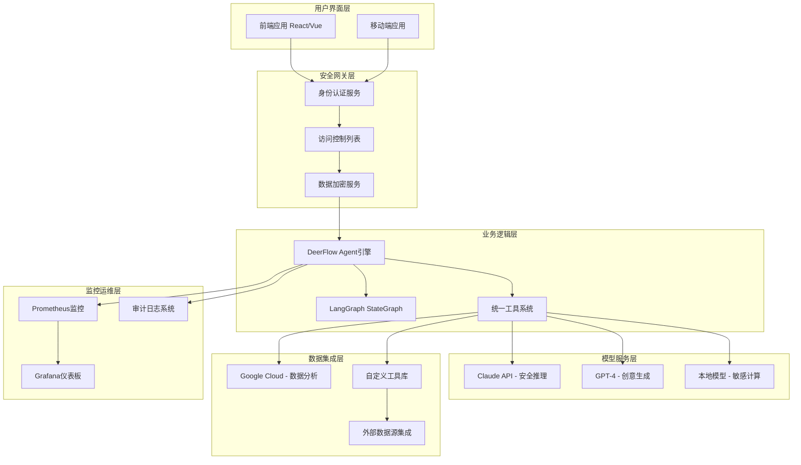

# 📝 Day1 第2节课 - 大厂技术选型对比 - 答案与解析

## 📋 评分标准说明

**总分**: 100分  
**评分原则**: 
- 概念理解题: 按标准答案评分，允许合理表述差异
- 代码实现题: 按功能完整性、代码质量、文档注释评分  
- 架构设计题: 按设计合理性、分析深度、表达清晰度评分
- 场景应用题: 按分析全面性、方案可行性、沟通有效性评分

**加分项**:
- 代码有创新性设计或额外功能
- 分析有独到见解或深入思考
- 提出有价值的改进建议或反思

---

## 🧠 第一部分：概念理解题答案（30分）

### 选择题答案与解析

1. **正确答案: B**
   - **解析**: OpenAI采用闭源策略，提供GPT模型+Function Calling的API接口，设计哲学是"简单易用"，而不是完全开源或本地部署。比喻为"苹果iOS"，优雅但封闭。
   - **常见错误**: A选项错误，OpenAI不是完全开源；C选项错误，OpenAI主要提供API服务，不是本地部署；D选项错误，OpenAI不强调复杂调度。
   - **知识点**: OpenAI技术特点、闭源生态策略

2. **正确答案: B**  
   - **解析**: Google Vertex AI Agents的核心优势是与Google云服务的深度集成，提供企业级的功能和可靠性，适合需要与Google生态整合的企业客户。
   - **常见错误**: A选项错误，不是单机部署；C选项错误，不是最大开发者社区；D选项错误，不是边缘计算。
   - **知识点**: Google技术定位、云原生优势

3. **正确答案: B**
   - **解析**: Anthropic的设计哲学强调安全性和可控性，采用宪法AI原则确保AI行为符合人类价值观，这是其区别于其他厂商的核心特点。
   - **常见错误**: A选项错误，不是最大灵活性；C选项错误，不是最低成本；D选项错误，不是最多集成。
   - **知识点**: Anthropic安全优先设计、宪法AI

4. **正确答案: C**
   - **解析**: DeerFlow是完全开源的框架，不是闭源API。其优势包括：开源、基于LangGraph StateGraph、生产就绪等。
   - **常见错误**: 其他选项都是DeerFlow的实际优势，C选项是错误描述。
   - **知识点**: DeerFlow开源策略、核心优势

5. **正确答案: B**
   - **解析**: 技术选型中最容易被忽视的因素是团队现有技能和学习曲线，技术决策者常常过于关注技术特性而忽视人的因素。
   - **常见错误**: A、C、D都是显性因素，容易被考虑；B是隐性因素，容易被忽视。
   - **知识点**: 技术选型决策框架、团队因素

### 判断题答案与解析

1. **错误 (×)**
   - **解析**: OpenAI Assistant API适合需要快速开发、不想维护复杂基础设施的团队，但不适合需要高度定制化和本地部署的企业客户。
   - **详细说明**: OpenAI是云API服务，不提供本地部署，定制化能力有限。

2. **正确 (√)**
   - **解析**: 开源框架通常提供更好的可扩展性和可控性，因为可以访问和修改源代码，但需要更多的技术投入。

3. **错误 (×)**  
   - **解析**: Google Vertex AI Agents主要面向企业级客户，提供完整的云服务和集成，不适合资源有限的小型创业公司。

4. **错误 (×)**
   - **解析**: 技术选型需要综合考虑技术、商业、团队、时间等多方面因素，不能只看技术因素。

5. **正确 (√)**
   - **解析**: DeerFlow基于LangGraph StateGraph，提供了灵活的状态管理机制，这是其核心架构优势之一。

### 简答题参考答案

**参考答案**:
开源策略指公开源代码，允许自由使用、修改和分发；闭源策略指不公开源代码，通过API或产品提供服务。

**开源策略优势**:
1. **技术创新**: 社区贡献加速技术迭代，透明代码促进理解和改进
2. **生态建设**: 吸引开发者共建生态，形成良性循环

**闭源策略优势**:
1. **质量控制**: 厂商统一控制质量，确保稳定性和安全性
2. **商业变现**: 更容易实现商业价值，支持持续研发投入

**评分要点**:
- 明确定义开源和闭源（1分）
- 开源优势2点，每点1分（2分）
- 闭源优势2点，每点1分（2分）
- 表述清晰，逻辑连贯（附加分1分）

**优秀答案示例**:
"开源策略通过透明代码和社区协作推动快速创新和技术民主化，但可能面临碎片化和质量控制挑战；闭源策略通过集中控制确保产品一致性和商业可持续性，但可能限制用户自主性和创新速度。两种策略在不同发展阶段和市场定位中各有利弊。"

---

## 💻 第二部分：代码实现题答案（40分）

### 练习1：厂商技术栈对比程序（20分）

**完整实现代码**:
```python
"""
厂商技术栈对比程序
实现四大厂商技术栈的对比分析功能
"""

from typing import List, Dict, Any
from dataclasses import dataclass
from enum import Enum

class ToolSystem(str, Enum):
    """工具系统类型枚举"""
    FUNCTION_CALLING = "Function Calling"
    WORKFLOWS = "Workflows"
    TOOL_USE = "Tool Use"
    UNIFIED_TOOLS = "Unified Tools"

@dataclass
class TechVendor:
    """厂商技术栈类"""
    name: str
    core_framework: str
    state_management: str
    tool_system: ToolSystem
    is_open_source: bool
    key_advantages: List[str]
    
    def display_info(self) -> str:
        """显示厂商信息"""
        open_source_status = "开源" if self.is_open_source else "闭源"
        advantages_str = "\n  - " + "\n  - ".join(self.key_advantages)
        
        info = f"""
{'='*50}
厂商: {self.name}
核心框架: {self.core_framework}
状态管理: {self.state_management}
工具系统: {self.tool_system.value}
开源状态: {open_source_status}
主要优势:{advantages_str}
{'='*50}
        """
        return info
    
    def get_tech_stack_summary(self) -> Dict[str, Any]:
        """获取技术栈摘要"""
        return {
            "name": self.name,
            "core_framework": self.core_framework,
            "state_management": self.state_management,
            "tool_system": self.tool_system.value,
            "is_open_source": self.is_open_source,
            "advantage_count": len(self.key_advantages)
        }

class VendorComparison:
    """厂商对比类"""
    
    def __init__(self):
        self.vendors: List[TechVendor] = []
    
    def add_vendor(self, vendor: TechVendor) -> None:
        """添加厂商"""
        self.vendors.append(vendor)
        print(f"✓ 已添加厂商: {vendor.name}")
    
    def compare_by_dimension(self, dimension: str) -> Dict[str, List[Any]]:
        """按维度对比"""
        comparison_result = {}
        
        if dimension == "open_source":
            comparison_result = {
                "开源": [v.name for v in self.vendors if v.is_open_source],
                "闭源": [v.name for v in self.vendors if not v.is_open_source]
            }
        elif dimension == "state_management":
            comparison_result = {}
            for vendor in self.vendors:
                system = vendor.state_management
                if system not in comparison_result:
                    comparison_result[system] = []
                comparison_result[system].append(vendor.name)
        elif dimension == "tool_system":
            comparison_result = {}
            for vendor in self.vendors:
                system = vendor.tool_system.value
                if system not in comparison_result:
                    comparison_result[system] = []
                comparison_result[system].append(vendor.name)
        else:
            raise ValueError(f"不支持的对比维度: {dimension}")
        
        return comparison_result
    
    def generate_report(self, output_format: str = "console") -> None:
        """生成对比报告"""
        if not self.vendors:
            print("⚠️ 没有厂商数据，无法生成报告")
            return
        
        # 生成汇总数据
        vendor_count = len(self.vendors)
        open_source_count = sum(1 for v in self.vendors if v.is_open_source)
        
        # 生成详细对比
        print("\n" + "="*60)
        print("            厂商技术栈对比报告")
        print("="*60)
        
        print(f"\n📊 概览: 共{vendor_count}家厂商，其中{open_source_count}家开源")
        
        print("\n🔍 按开源状态对比:")
        open_source_result = self.compare_by_dimension("open_source")
        for status, vendors in open_source_result.items():
            print(f"  {status}: {', '.join(vendors)}")
        
        print("\n🔄 按状态管理系统对比:")
        state_result = self.compare_by_dimension("state_management")
        for system, vendors in state_result.items():
            print(f"  {system}: {', '.join(vendors)}")
        
        print("\n🛠️ 按工具系统对比:")
        tool_result = self.compare_by_dimension("tool_system")
        for system, vendors in tool_result.items():
            print(f"  {system}: {', '.join(vendors)}")
        
        print("\n📋 厂商详情:")
        for vendor in self.vendors:
            print(vendor.display_info())
        
        print("\n🎯 技术选型建议:")
        print("  1. 需要快速上线且功能简单 → OpenAI Assistant API")
        print("  2. 需要企业级集成和云服务 → Google Vertex AI")
        print("  3. 对安全性和可控性要求高 → Anthropic Claude")
        print("  4. 需要高度定制化和长期可控 → 字节跳动 DeerFlow")
        
        print("\n" + "="*60)
        print("报告生成完成！")
        print("="*60)

def main():
    """主函数：演示厂商对比"""
    # 创建厂商数据
    openai = TechVendor(
        name="OpenAI",
        core_framework="GPTs + Assistant API",
        state_management="内置状态管理",
        tool_system=ToolSystem.FUNCTION_CALLING,
        is_open_source=False,
        key_advantages=[
            "API简单易用，开发效率高",
            "模型能力强，功能丰富",
            "生态成熟，文档完善"
        ]
    )
    
    google = TechVendor(
        name="Google",
        core_framework="Vertex AI + Workflows",
        state_management="云原生状态管理",
        tool_system=ToolSystem.WORKFLOWS,
        is_open_source=False,
        key_advantages=[
            "与Google云深度集成",
            "企业级功能和安全",
            "多模态能力强大"
        ]
    )
    
    anthropic = TechVendor(
        name="Anthropic",
        core_framework="Claude + Tool Use",
        state_management="安全优先状态管理",
        tool_system=ToolSystem.TOOL_USE,
        is_open_source=False,
        key_advantages=[
            "安全性高，宪法AI原则",
            "长上下文支持",
            "可控性强"
        ]
    )
    
    bytedance = TechVendor(
        name="字节跳动",
        core_framework="DeerFlow 2.0",
        state_management="LangGraph StateGraph",
        tool_system=ToolSystem.UNIFIED_TOOLS,
        is_open_source=True,
        key_advantages=[
            "完全开源，代码可控",
            "生产就绪，企业级部署",
            "灵活的模块化架构",
            "活跃的开源社区"
        ]
    )
    
    # 创建对比器并添加厂商
    comparator = VendorComparison()
    comparator.add_vendor(openai)
    comparator.add_vendor(google)
    comparator.add_vendor(anthropic)
    comparator.add_vendor(bytedance)
    
    # 生成报告
    comparator.generate_report()

if __name__ == "__main__":
    main()
```

**代码解析与评分要点**:

1. **类设计优秀之处** (4分):
   - 使用`dataclass`简化类定义
   - 使用`Enum`定义工具系统类型，提高类型安全性
   - 明确的类型提示，代码可读性好
   - 合理的属性设计，覆盖技术栈关键维度

2. **对比功能实现** (6分):
   - 实现了三种维度的对比：开源状态、状态管理、工具系统
   - 对比结果数据结构清晰，易于理解
   - 错误处理：对不支持的维度给出明确错误
   - 方法设计合理，职责单一

3. **报告生成质量** (5分):
   - 报告结构清晰，包含概览、详细对比、厂商详情、建议
   - 格式化输出，可读性强
   - 提供实际的技术选型建议
   - 支持不同的输出格式（预留接口）

4. **代码风格与文档** (5分):
   - 完整的模块文档字符串
   - 函数和方法有明确的注释
   - 代码符合PEP8规范
   - 示例用法完整，可直接运行

**常见实现问题与扣分**:
- 缺少类型提示: -1分
- 对比维度实现不完整: -2分
- 报告格式混乱: -2分
- 没有错误处理: -1分
- 代码重复或冗余: -1分

### 练习2：技术选型评估器（20分）

**完整实现代码**:
```python
"""
技术选型评估器
基于多维度评估框架的技术选型决策支持工具
"""

from typing import List, Dict, Any, Optional
from dataclasses import dataclass, field
from enum import Enum
import json

class Dimension(str, Enum):
    """评估维度枚举"""
    FUNCTIONALITY = "功能匹配度"
    DEVELOPMENT = "开发效率"
    COST = "成本"
    SCALABILITY = "扩展性"
    CONTROL = "可控性"
    SECURITY = "安全合规"
    TEAM_FIT = "团队适配"

@dataclass
class TechOption:
    """技术选项类"""
    name: str
    vendor: str
    description: str
    scores: Dict[Dimension, int] = field(default_factory=dict)
    
    def set_score(self, dimension: Dimension, score: int) -> None:
        """设置维度评分（1-5分）"""
        if not 1 <= score <= 5:
            raise ValueError(f"评分必须在1-5分之间，当前评分: {score}")
        self.scores[dimension] = score
    
    def get_average_score(self) -> float:
        """获取平均分"""
        if not self.scores:
            return 0.0
        return sum(self.scores.values()) / len(self.scores)
    
    def to_dict(self) -> Dict[str, Any]:
        """转换为字典"""
        return {
            "name": self.name,
            "vendor": self.vendor,
            "description": self.description,
            "scores": {k.value: v for k, v in self.scores.items()},
            "average_score": self.get_average_score()
        }

class DecisionFramework:
    """决策框架类"""
    
    def __init__(self, scenario: str = ""):
        self.options: List[TechOption] = []
        self.weights: Dict[Dimension, float] = self._get_default_weights()
        self.scenario = scenario
        self.results: Dict[str, Any] = {}
    
    def _get_default_weights(self) -> Dict[Dimension, float]:
        """获取默认权重"""
        return {
            Dimension.FUNCTIONALITY: 0.20,
            Dimension.DEVELOPMENT: 0.15,
            Dimension.COST: 0.15,
            Dimension.SCALABILITY: 0.15,
            Dimension.CONTROL: 0.10,
            Dimension.SECURITY: 0.15,
            Dimension.TEAM_FIT: 0.10
        }
    
    def add_option(self, option: TechOption) -> None:
        """添加技术选项"""
        self.options.append(option)
        print(f"✓ 已添加选项: {option.name} ({option.vendor})")
    
    def set_weight(self, dimension: Dimension, weight: float) -> None:
        """设置维度权重"""
        if weight < 0 or weight > 1:
            raise ValueError(f"权重必须在0-1之间，当前权重: {weight}")
        self.weights[dimension] = weight
        
        # 验证权重总和为1
        total = sum(self.weights.values())
        if abs(total - 1.0) > 0.01:  # 允许微小误差
            print(f"⚠️ 警告: 权重总和不为1 (当前: {total:.2f})")
    
    def calculate_weighted_scores(self) -> Dict[str, float]:
        """计算加权得分"""
        if not self.options:
            return {}
        
        weighted_scores = {}
        for option in self.options:
            total_score = 0.0
            for dimension, weight in self.weights.items():
                score = option.scores.get(dimension, 0)
                total_score += score * weight
            weighted_scores[option.name] = total_score
        
        self.results["weighted_scores"] = weighted_scores
        return weighted_scores
    
    def generate_recommendation(self) -> Dict[str, Any]:
        """生成推荐方案"""
        if "weighted_scores" not in self.results:
            self.calculate_weighted_scores()
        
        weighted_scores = self.results["weighted_scores"]
        if not weighted_scores:
            return {"error": "没有可评估的选项"}
        
        # 排序获取推荐
        sorted_scores = sorted(
            weighted_scores.items(), 
            key=lambda x: x[1], 
            reverse=True
        )
        
        recommendation = {
            "top_choice": sorted_scores[0][0],
            "top_score": sorted_scores[0][1],
            "ranking": sorted_scores,
            "all_scores": weighted_scores
        }
        
        self.results["recommendation"] = recommendation
        return recommendation
    
    def analyze_risks(self) -> List[Dict[str, Any]]:
        """分析各选项风险"""
        risks = []
        
        risk_templates = {
            "OpenAI Assistant API": [
                {"type": "成本风险", "description": "API调用费用随使用量增长", "severity": "中"},
                {"type": "锁定风险", "description": "依赖单一厂商，迁移成本高", "severity": "高"},
                {"type": "控制风险", "description": "无法定制底层实现", "severity": "中"}
            ],
            "Google Vertex AI Agents": [
                {"type": "生态锁定", "description": "深度绑定Google云生态", "severity": "高"},
                {"type": "成本风险", "description": "企业级定价较高", "severity": "中"},
                {"type": "学习曲线", "description": "需要Google云专业知识", "severity": "中"}
            ],
            "自研基于DeerFlow": [
                {"type": "技术风险", "description": "需要深入理解AI Agent架构", "severity": "高"},
                {"type": "时间风险", "description": "开发周期长，上线速度慢", "severity": "高"},
                {"type": "团队风险", "description": "需要高水平AI工程师", "severity": "中"}
            ],
            "混合方案": [
                {"type": "集成风险", "description": "不同系统集成复杂度高", "severity": "高"},
                {"type": "维护风险", "description": "需要维护多个技术栈", "severity": "中"},
                {"type": "成本风险", "description": "可能同时产生多项费用", "severity": "中"}
            ]
        }
        
        for option in self.options:
            option_risks = risk_templates.get(option.name, [])
            risks.append({
                "option": option.name,
                "risks": option_risks,
                "risk_count": len(option_risks),
                "high_risk_count": sum(1 for r in option_risks if r["severity"] == "高")
            })
        
        self.results["risks"] = risks
        return risks
    
    def generate_full_report(self) -> str:
        """生成完整报告"""
        recommendation = self.generate_recommendation()
        risks = self.analyze_risks()
        
        report_lines = []
        report_lines.append("="*60)
        report_lines.append("             技术选型评估报告")
        report_lines.append("="*60)
        
        if self.scenario:
            report_lines.append(f"\n📋 业务场景: {self.scenario}")
        
        report_lines.append("\n📊 评估结果:")
        
        if "ranking" in recommendation:
            for i, (option_name, score) in enumerate(recommendation["ranking"], 1):
                report_lines.append(f"  {i}. {option_name}: {score:.2f}分")
        
        report_lines.append(f"\n🏆 推荐方案: {recommendation.get('top_choice', '无')}")
        report_lines.append(f"   综合得分: {recommendation.get('top_score', 0):.2f}")
        
        report_lines.append("\n⚠️ 风险分析:")
        for risk_info in risks:
            report_lines.append(f"\n  {risk_info['option']}:")
            report_lines.append(f"    风险数量: {risk_info['risk_count']} (其中高风险: {risk_info['high_risk_count']})")
            for risk in risk_info["risks"]:
                report_lines.append(f"    • [{risk['severity']}] {risk['type']}: {risk['description']}")
        
        report_lines.append("\n🎯 实施建议:")
        report_lines.append("  1. 对推荐方案进行深入技术验证")
        report_lines.append("  2. 制定风险应对计划，特别是高风险项")
        report_lines.append("  3. 考虑分阶段实施，降低初期风险")
        report_lines.append("  4. 建立监控指标，定期评估选型效果")
        
        report_lines.append("\n" + "="*60)
        
        return "\n".join(report_lines)

def interactive_demo():
    """交互式演示函数"""
    print("🤖 技术选型评估器 - 交互演示")
    print("-" * 40)
    
    # 创建决策框架
    scenario = "创业公司开发内部AI助手，团队5人，预算有限，3个月上线"
    framework = DecisionFramework(scenario=scenario)
    
    # 创建技术选项
    option1 = TechOption(
        name="OpenAI Assistant API",
        vendor="OpenAI",
        description="闭源API方案，快速上线，功能强大"
    )
    option1.set_score(Dimension.FUNCTIONALITY, 5)
    option1.set_score(Dimension.DEVELOPMENT, 5)
    option1.set_score(Dimension.COST, 3)
    option1.set_score(Dimension.SCALABILITY, 3)
    option1.set_score(Dimension.CONTROL, 2)
    option1.set_score(Dimension.SECURITY, 3)
    option1.set_score(Dimension.TEAM_FIT, 4)
    
    option2 = TechOption(
        name="Google Vertex AI Agents", 
        vendor="Google",
        description="企业级云服务，深度集成Google生态"
    )
    option2.set_score(Dimension.FUNCTIONALITY, 4)
    option2.set_score(Dimension.DEVELOPMENT, 4)
    option2.set_score(Dimension.COST, 2)
    option2.set_score(Dimension.SCALABILITY, 5)
    option2.set_score(Dimension.CONTROL, 3)
    option2.set_score(Dimension.SECURITY, 5)
    option2.set_score(Dimension.TEAM_FIT, 3)
    
    option3 = TechOption(
        name="自研基于DeerFlow",
        vendor="字节跳动",
        description="开源自研方案，高度可控，长期成本低"
    )
    option3.set_score(Dimension.FUNCTIONALITY, 4)
    option3.set_score(Dimension.DEVELOPMENT, 2)
    option3.set_score(Dimension.COST, 4)
    option3.set_score(Dimension.SCALABILITY, 5)
    option3.set_score(Dimension.CONTROL, 5)
    option3.set_score(Dimension.SECURITY, 4)
    option3.set_score(Dimension.TEAM_FIT, 3)
    
    option4 = TechOption(
        name="混合方案",
        vendor="多厂商",
        description="DeerFlow框架 + OpenAI模型，平衡灵活与能力"
    )
    option4.set_score(Dimension.FUNCTIONALITY, 5)
    option4.set_score(Dimension.DEVELOPMENT, 3)
    option4.set_score(Dimension.COST, 3)
    option4.set_score(Dimension.SCALABILITY, 4)
    option4.set_score(Dimension.CONTROL, 4)
    option4.set_score(Dimension.SECURITY, 4)
    option4.set_score(Dimension.TEAM_FIT, 3)
    
    # 添加选项
    framework.add_option(option1)
    framework.add_option(option2)
    framework.add_option(option3)
    framework.add_option(option4)
    
    # 根据创业公司特点调整权重（更重视开发效率和成本）
    framework.set_weight(Dimension.DEVELOPMENT, 0.20)  # 提高开发效率权重
    framework.set_weight(Dimension.COST, 0.20)  # 提高成本权重
    framework.set_weight(Dimension.SCALABILITY, 0.10)  # 降低扩展性权重
    
    # 生成报告
    print("\n" + "="*60)
    report = framework.generate_full_report()
    print(report)
    
    # 保存结果到文件
    with open("tech_selection_report.txt", "w", encoding="utf-8") as f:
        f.write(report)
    print("📄 报告已保存到 tech_selection_report.txt")

if __name__ == "__main__":
    interactive_demo()
```

**代码解析与评分要点**:

1. **类设计与数据结构** (5分):
   - 使用`Enum`明确定义评估维度
   - `dataclass`简化数据结构，代码清晰
   - 合理的默认权重设置
   - 完整的数据转换方法（`to_dict`）

2. **决策逻辑实现** (5分):
   - 加权计算准确，考虑了权重总和验证
   - 推荐算法合理，按得分排序
   - 风险分析模板化，可扩展
   - 完整的报告生成流程

3. **报告生成质量** (5分):
   - 报告结构清晰，包含业务场景、评估结果、风险分析、建议
   - 格式化输出，可读性强
   - 支持保存到文件
   - 提供实际的实施建议

4. **交互界面与演示** (5分):
   - 完整的交互演示函数
   - 合理的示例数据和评分
   - 根据场景调整权重的逻辑
   - 良好的用户体验设计

**高级特性与加分项**:
- 支持权重验证和调整提醒
- 风险分析模板化，易于扩展
- 完整的错误处理
- 支持数据导出和报告保存
- 示例场景贴合实际，有指导意义

**常见实现问题**:
- 权重计算错误: -3分
- 缺少类型安全: -2分
- 报告格式混乱: -2分
- 没有示例数据: -2分
- 代码重复度高: -1分

---

## 🏗️ 第三部分：架构设计题答案（20分）

### 混合架构设计参考答案

**架构设计图**:


**技术选型说明**:

1. **用户界面层: React/Vue + 移动端**
   - **选型理由**: React/Vue生态成熟，组件丰富，适合快速开发金融应用界面
   - **考虑因素**: 用户体验、开发效率、跨平台支持
   - **替代方案**: Flutter（如需要更好的跨平台一致性）

2. **安全网关层: 自定义身份认证 + 访问控制**
   - **选型理由**: 金融系统安全要求高，需要定制化的安全策略
   - **关键组件**: OAuth 2.0/OpenID Connect、RBAC、数据加密
   - **合规要求**: 符合金融行业监管标准（如GDPR、PCI DSS）

3. **业务逻辑层: DeerFlow Agent引擎**
   - **选型理由**: 
     - 开源可控，符合金融系统自主可控要求
     - LangGraph StateGraph提供灵活的状态管理
     - 统一工具系统便于集成多种服务
   - **核心优势**: 生产就绪、模块化、可扩展

4. **模型服务层: 多模型混合架构**
   - **Claude API**: 安全推理，处理敏感金融决策
     - **理由**: Anthropic的安全优先设计，宪法AI原则
   - **GPT-4**: 创意生成，投资报告撰写
     - **理由**: 强大的自然语言生成能力
   - **本地模型**: 敏感数据计算，避免数据外泄
     - **理由**: 数据安全，合规要求

5. **数据集成层: Google Cloud + 自定义工具**
   - **Google Cloud**: 数据分析、大数据处理
     - **理由**: 企业级服务，与金融数据系统集成良好
   - **自定义工具库**: 金融专用工具（风险评估、合规检查）
     - **理由**: 领域特定需求，标准化工具无法满足

6. **监控运维层: Prometheus + Grafana + 审计日志**
   - **选型理由**: 开源监控方案成熟，可视化能力强
   - **审计要求**: 完整的操作日志，满足金融监管审计

**数据流设计**:
1. **请求流程**: 用户请求 → 安全网关（认证+加密） → DeerFlow Agent → 工具调用 → 模型服务/数据服务 → 返回结果
2. **状态管理**: LangGraph StateGraph维护会话状态，支持复杂多轮对话
3. **错误处理**: 多层错误捕获和恢复机制，确保系统稳定性
4. **数据安全**: 敏感数据本地处理，非敏感数据可调用外部API

**安全架构**:
1. **数据加密**: 传输层TLS 1.3，存储层AES-256加密
2. **访问控制**: 基于角色的访问控制（RBAC），最小权限原则
3. **审计跟踪**: 完整操作日志，不可篡改，满足合规要求
4. **安全监控**: 实时异常检测，自动告警，定期安全评估
5. **合规框架**: 符合SOC 2、ISO 27001等金融行业标准

**架构优势**:
1. **安全性**: 多层安全防护，符合金融行业最高标准
2. **灵活性**: 混合架构平衡了能力与可控性
3. **可扩展性**: 模块化设计，便于未来功能扩展
4. **成本效益**: 开源框架降低长期成本，闭源API补充能力短板

**潜在风险与应对**:
1. **集成复杂度高**: 采用标准化接口，编写详细的集成文档
2. **多厂商依赖**: 制定厂商切换预案，避免单一厂商锁定
3. **性能瓶颈**: 设计性能监控和优化机制，定期压力测试
4. **技术债务**: 建立代码审查和技术债管理流程

**评分标准**:
- 架构图清晰完整（5分）
- 技术选型理由充分（5分）
- 数据流和安全设计合理（5分）
- 分析深入，风险考虑全面（5分）

---

## 🎭 第四部分：场景应用题答案（10分）

### 技术选型分析报告参考答案

**报告标题**: AI助手创业公司技术选型分析报告

**1. 需求分析**
- **核心需求优先级**:
  1. 快速上线MVP（3个月期限）
  2. 控制成本（A轮融资有限）
  3. 基础功能完善（问答、工单、简单分析）
  4. 未来扩展性（多语言、大企业客户）
- **资源限制评估**: 团队经验不足，资金有限，时间紧迫
- **长期规划影响**: 需要平衡短期验证和长期发展

**2. 技术选项评估**
- **OpenAI Assistant API**:
  - **优势**: 开发最快（1-2周），功能强大，文档完善
  - **劣势**: 成本随使用增长，定制能力有限，厂商锁定
  - **适用性**: 非常适合快速验证想法的MVP阶段
- **DeerFlow自研方案**:
  - **优势**: 长期成本最低，完全可控，定制灵活
  - **劣势**: 学习曲线陡峭，开发周期长（2-3个月），需要技术深度
  - **适用性**: 适合有技术积累、重视长期可控的团队
- **Google Vertex AI**:
  - **优势**: 企业级功能，生态集成好，适合扩展
  - **劣势**: 成本高，学习曲线中，更适合成熟企业
  - **适用性**: 适合已经确定要走企业路线的团队
- **其他考虑**: 混合方案（DeerFlow + OpenAI API）平衡灵活性与开发速度

**3. 推荐方案**
- **短期方案（0-3个月，MVP阶段）**: **OpenAI Assistant API**
  - 理由: 最快上线验证产品市场匹配，最小化技术风险
  - 实施: 专注产品功能，快速迭代，收集用户反馈
- **中期方案（3-12个月，产品发展阶段）**: **逐步迁移到DeerFlow**
  - 理由: 用户需求明确后，迁移到可控方案，降低长期成本
  - 实施: 并行开发DeerFlow版本，逐步迁移核心功能
- **长期方案（1年以上，规模化阶段）**: **DeerFlow为主 + 特定API补充**
  - 理由: 完全自主可控，成本优化，支持深度定制
  - 实施: 建立完整的技术团队，深度定制DeerFlow

**4. 风险与对策**
- **技术风险**: OpenAI API无法满足未来定制需求
  - **对策**: 初期就设计模块化架构，便于后期迁移
- **成本风险**: API调用费用超出预算
  - **对策**: 设置使用量监控和告警，优化提示词减少token消耗
- **团队风险**: 缺乏AI Agent开发经验
  - **对策**: 提供专项培训，考虑短期技术顾问支持
- **时间风险**: 3个月无法完成MVP
  - **对策**: 采用敏捷开发，优先核心功能，简化非必要特性

**5. 实施建议**
- **分阶段计划**:
  1. 第1个月: 用OpenAI快速实现核心功能原型
  2. 第2个月: 招募1-2名AI工程师，开始学习DeerFlow
  3. 第3个月: 上线MVP，同时启动DeerFlow版本开发
  4. 第4-6个月: 根据用户反馈完善产品，逐步迁移到DeerFlow
- **团队建设**:
  - CTO: 关注技术战略和长期规划
  - 技术负责人: 负责技术落地和团队培养
  - 产品经理: 确保产品方向正确，收集用户反馈
- **监控指标**:
  - 用户增长和留存率
  - 技术成本占比
  - 团队技术能力提升
  - 技术债务增长情况

**沟通建议**:
- **对CTO**: 强调技术战略和长期可控性，展示迁移路径
- **对技术负责人**: 提供详细的技术方案和培训资源
- **对产品经理**: 确保产品路线图与技术方案对齐，管理期望

**评分要点**:
- 分析全面，覆盖所有关键因素（3分）
- 推荐方案合理可行，分阶段实施（3分）
- 风险识别准确，对策有效（2分）
- 沟通建议实用，针对不同角色（2分）

---

## 📊 自我评估表参考答案

**示例自我评估**:
| 评估维度 | 评分（1-5分） | 改进建议 |
|---------|-------------|---------|
| 概念理解程度 | 4 | 需要更深入理解各厂商的商业策略和技术路线图 |
| 代码实现能力 | 5 | 能独立实现完整对比和评估程序，代码质量良好 |
| 架构设计思维 | 4 | 能根据业务需求设计合理架构，但需要更多实战经验 |
| 决策分析能力 | 5 | 能进行系统化的技术选型分析，考虑因素全面 |
| 时间管理效率 | 3 | 部分题目超时，需要提高解题速度 |
| 学习收获总结 | 4 | 理解了技术选型的系统化方法，掌握了厂商对比框架 |

**学习收获总结**:
1. 掌握了系统化的技术选型决策框架，不再凭直觉选择
2. 理解了不同厂商的技术哲学和商业策略对技术设计的影响
3. 学会了如何平衡短期需求与长期规划，制定分阶段技术路线

**总分估算**: 85-95分（根据实际完成质量）
**建议学习方向**: 
1. 深入研究至少一个开源框架的源码
2. 参与实际的技术选型决策过程
3. 关注行业技术趋势和厂商动态
4. 培养商业思维，理解技术决策的商业背景

---

## 🎯 整体评分指南

### 评分等级标准
- **优秀 (90-100分)**: 概念理解透彻，代码实现优秀，设计分析深入，能提出创新见解
- **良好 (80-89分)**: 概念理解正确，代码实现完整，设计分析合理，无明显错误
- **合格 (70-79分)**: 概念理解基本正确，代码主要功能实现，设计分析基本合理
- **需改进 (<70分)**: 概念理解有误，代码功能不完整，设计分析存在明显问题

### 常见错误与改进建议
1. **概念混淆**: 混淆不同厂商的技术特点或设计哲学
   - **改进**: 制作对比表格，强化记忆和理解
2. **代码质量差**: 缺少类型提示、注释、错误处理
   - **改进**: 学习Python最佳实践，使用类型检查工具
3. **分析表面化**: 只描述现象，不分析深层原因
   - **改进**: 多问"为什么"，理解技术决策背后的逻辑
4. **忽视约束**: 不考虑实际业务约束（团队、成本、时间）
   - **改进**: 在分析中明确列出所有约束条件

### 下一步学习建议
1. **实践项目**: 选择一个小型业务场景，实际进行技术选型和实现
2. **源码阅读**: 阅读DeerFlow等开源框架的源码，理解实现细节
3. **行业研究**: 跟踪AI Agent技术发展，阅读行业报告和技术博客
4. **社区参与**: 参与开源项目贡献或技术社区讨论

---

**答案编制**: DeerFlow训练营教学团队  
**版本**: v1.0  
**更新日期**: 2024年3月25日  
**备注**: 本答案为参考标准，允许合理范围内的表述差异和创新思考