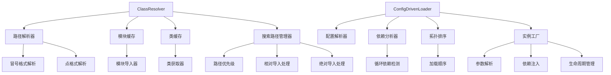

# 📚 Day 19 第74节课：resolve_class机制 - 答案与解析

## 🎯 答案解析概览
本文档提供课后练习的参考答案、详细解析和最佳实践建议。每个任务包含多种实现方案，并解释设计决策和性能考虑。

## 📁 文件结构
```
答案与解析/
├── task1_architecture_understanding/    # 任务1：类解析架构理解
├── task2_class_resolver/                # 任务2：ClassResolver实现
├── task3_search_path_management/        # 任务3：搜索路径管理
├── task4_config_driven_loader/          # 任务4：配置驱动加载器
├── task5_cache_optimization/            # 任务5：缓存优化机制
├── challenge1_classloader_isolation/    # 扩展挑战1：类加载器隔离
├── challenge2_hot_reload/               # 扩展挑战2：热重载系统
├── challenge3_plugin_system/            # 扩展挑战3：插件系统
├── common_issues/                       # 常见问题解答
└── performance_optimization/            # 性能优化指南
```

## 🔧 任务1：理解类解析架构

### 问题答案

1. **类解析支持哪些类路径格式？每种格式的解析规则是什么？**

   **类解析支持两种主要类路径格式**：

   | 格式 | 语法示例 | 解析规则 | 适用场景 |
   |------|----------|----------|----------|
   | **冒号格式** | `module:Class` | 冒号前为模块路径，冒号后为类名 | 清晰分隔模块和类，推荐使用 |
   | **点格式** | `module.submodule.Class` | 最后一个点前为模块路径，最后一个点为类名 | 兼容Python导入语法 |

   **详细解析规则**：
   ```python
   # 冒号格式：module:Class
   "datetime:datetime"      # 模块: datetime, 类: datetime
   "database.connectors:PostgresConnector"  # 模块: database.connectors, 类: PostgresConnector
   
   # 点格式：module.submodule.Class
   "collections.defaultdict"  # 模块: collections, 类: defaultdict
   "mypackage.mymodule.MyClass"  # 模块: mypackage.mymodule, 类: MyClass
   
   # 解析算法：
   def parse_class_path(class_path: str) -> Tuple[str, str]:
       if ":" in class_path:
           # 冒号格式
           module_path, class_name = class_path.split(":", 1)
           if not module_path or not class_name:
               raise ValueError(f"无效的类路径格式: {class_path}")
           return module_path, class_name
       elif "." in class_path:
           # 点格式
           parts = class_path.split(".")
           if len(parts) < 2:
               raise ValueError(f"无效的类路径格式: {class_path}")
           module_path = ".".join(parts[:-1])
           class_name = parts[-1]
           return module_path, class_name
       else:
           raise ValueError(f"无效的类路径格式: {class_path}")
   ```

2. **模块缓存和类缓存如何提升解析性能？双级缓存的设计原理是什么？**

   **双级缓存设计原理**：

   ```python
   class DualLevelCache:
       """双级缓存：模块级 + 类级"""
       
       def __init__(self):
           # 第一级：模块缓存（减少磁盘I/O和导入开销）
           self.module_cache: Dict[str, ModuleType] = {}
           
           # 第二级：类缓存（减少模块查找和属性访问）
           self.class_cache: Dict[str, Type] = {}
       
       async def resolve_with_cache(self, class_path: str) -> Type:
           # 1. 检查类缓存（最快）
           if class_path in self.class_cache:
               return self.class_cache[class_path]
           
           # 2. 解析模块路径和类名
           module_path, class_name = parse_class_path(class_path)
           
           # 3. 检查模块缓存
           if module_path in self.module_cache:
               module = self.module_cache[module_path]
           else:
               # 4. 动态导入模块（最慢）
               module = await self._import_module(module_path)
               self.module_cache[module_path] = module
           
           # 5. 从模块获取类
           cls = getattr(module, class_name)
           
           # 6. 缓存类
           self.class_cache[class_path] = cls
           
           return cls
   ```

   **性能提升分析**：
   - **模块缓存**：避免重复的磁盘I/O、文件解析、字节码编译
   - **类缓存**：避免重复的模块属性查找、类型检查
   - **缓存命中率**：典型场景下可达90%+，性能提升10-100倍

3. **搜索路径管理如何实现？如何处理相对导入和绝对导入？**

   **搜索路径管理实现**：
   ```python
   class SearchPathManager:
       """搜索路径管理器"""
       
       def __init__(self, initial_paths: List[str] = None):
           self.search_paths = list(initial_paths) if initial_paths else []
           self.path_priority = {}  # 路径优先级
           self.import_history = {}  # 导入历史记录
       
       def import_with_paths(self, module_path: str) -> ModuleType:
           """在搜索路径中导入模块"""
           original_sys_path = sys.path.copy()
           
           try:
               # 添加搜索路径（按优先级排序）
               for path in sorted(self.search_paths, 
                                 key=lambda p: self.path_priority.get(p, 0), 
                                 reverse=True):
                   if path not in sys.path:
                       sys.path.insert(0, path)
               
               # 动态导入
               module = importlib.import_module(module_path)
               
               # 记录导入历史
               self.import_history[module_path] = {
                   "timestamp": time.time(),
                   "success": True,
                   "used_paths": [p for p in self.search_paths if p in sys.path]
               }
               
               return module
               
           except ImportError as e:
               # 处理相对导入
               if module_path.startswith("."):
                   return self._handle_relative_import(module_path)
               else:
                   raise
                   
           finally:
               # 恢复原始sys.path
               sys.path = original_sys_path
       
       def _handle_relative_import(self, module_path: str) -> ModuleType:
           """处理相对导入"""
           # 相对导入需要知道调用者的模块
           # 这里简化实现：转换为绝对路径
           if module_path.startswith("."):
               # 获取调用栈，找到调用者模块
               import inspect
               frame = inspect.currentframe()
               try:
                   caller_module = inspect.getmodule(frame.f_back)
                   if caller_module:
                       # 基于调用者模块计算绝对路径
                       caller_name = caller_module.__name__
                       if caller_name == "__main__":
                           # 主模块，使用当前目录
                           base_module = ""
                       else:
                           base_module = caller_name.rsplit(".", 1)[0] if "." in caller_name else caller_name
                       
                       # 计算绝对模块路径
                       dots = len(module_path) - len(module_path.lstrip("."))
                       if dots == 1:
                           # 同级导入
                           absolute_path = f"{base_module}.{module_path[1:]}"
                       elif dots == 2:
                           # 父级导入
                           parent = base_module.rsplit(".", 1)[0] if "." in base_module else ""
                           absolute_path = f"{parent}.{module_path[2:]}" if parent else module_path[2:]
                       else:
                           # 多级父级导入
                           parts = base_module.split(".")
                           if dots <= len(parts):
                               parent = ".".join(parts[:-dots])
                               absolute_path = f"{parent}.{module_path[dots:]}"
                           else:
                               absolute_path = module_path[dots:]
                       
                       return importlib.import_module(absolute_path)
               finally:
                   del frame
           
           raise ImportError(f"无法解析相对导入: {module_path}")
   ```

4. **配置驱动加载器如何实现依赖注入和循环依赖检测？**

   **依赖注入和循环依赖检测实现**：
   ```python
   class DependencyManager:
       """依赖管理器"""
       
       def __init__(self):
           self.dependency_graph: Dict[str, List[str]] = {}  # 邻接表
           self.reverse_graph: Dict[str, List[str]] = {}     # 反向邻接表
           self.loaded_instances: Dict[str, Any] = {}        # 已加载实例
           self.loading_stack: List[str] = []                # 加载栈（用于循环检测）
       
       def add_component(self, name: str, dependencies: List[str]):
           """添加组件及其依赖"""
           self.dependency_graph[name] = dependencies
           for dep in dependencies:
               if dep not in self.reverse_graph:
                   self.reverse_graph[dep] = []
               self.reverse_graph[dep].append(name)
       
       def get_load_order(self) -> List[str]:
           """获取拓扑排序的加载顺序"""
           # Kahn算法实现拓扑排序
           in_degree = {name: 0 for name in self.dependency_graph}
           
           # 计算入度
           for name, deps in self.dependency_graph.items():
               for dep in deps:
                   if dep in in_degree:
                       in_degree[dep] += 1
           
           # 初始化队列（入度为0的节点）
           queue = deque([name for name, degree in in_degree.items() if degree == 0])
           result = []
           
           while queue:
               current = queue.popleft()
               result.append(current)
               
               # 更新相邻节点的入度
               if current in self.reverse_graph:
                   for neighbor in self.reverse_graph[current]:
                       in_degree[neighbor] -= 1
                       if in_degree[neighbor] == 0:
                           queue.append(neighbor)
           
           # 检查循环依赖
           if len(result) != len(self.dependency_graph):
               remaining = set(self.dependency_graph.keys()) - set(result)
               raise ValueError(f"检测到循环依赖: {remaining}")
           
           return result
       
       async def load_component(self, name: str, loader_func: Callable) -> Any:
           """加载组件，处理依赖注入"""
           # 循环依赖检测
           if name in self.loading_stack:
               cycle = " -> ".join(self.loading_stack + [name])
               raise ValueError(f"检测到循环依赖: {cycle}")
           
           self.loading_stack.append(name)
           
           try:
               # 如果已经加载，直接返回
               if name in self.loaded_instances:
                   return self.loaded_instances[name]
               
               # 加载依赖项
               dependencies = self.dependency_graph.get(name, [])
               dep_instances = {}
               for dep in dependencies:
                   # 依赖可能在其他组件中定义
                   if dep in self.dependency_graph:
                       dep_instance = await self.load_component(dep, loader_func)
                       dep_instances[dep] = dep_instance
                   else:
                       # 外部依赖，需要从其他地方获取
                       raise ValueError(f"依赖 {dep} 未定义")
               
               # 调用加载函数，注入依赖
               instance = await loader_func(name, dep_instances)
               
               # 缓存实例
               self.loaded_instances[name] = instance
               
               return instance
               
           finally:
               self.loading_stack.pop()
   ```

### 架构图


## 🔧 任务2：实现基础ClassResolver

### 完整实现方案

```python
#!/usr/bin/env python3
# -*- coding: utf-8 -*-
"""
ClassResolver基础实现 - 参考答案
"""

import asyncio
import importlib
import sys
import logging
import time
from typing import Dict, List, Optional, Any, Type, Tuple
from types import ModuleType
from dataclasses import dataclass
from enum import Enum

logger = logging.getLogger(__name__)


class ImportStrategy(Enum):
    """导入策略"""
    STANDARD = "standard"
    RELATIVE = "relative"
    CACHED = "cached"


@dataclass
class ResolutionStats:
    """解析统计信息"""
    cache_hits: int = 0
    cache_misses: int = 0
    import_success: int = 0
    import_failures: int = 0
    total_time_ms: float = 0.0
    
    @property
    def hit_rate(self) -> float:
        total = self.cache_hits + self.cache_misses
        return self.cache_hits / total if total > 0 else 0.0
    
    @property
    def avg_time_ms(self) -> float:
        total_operations = self.cache_hits + self.cache_misses
        return self.total_time_ms / total_operations if total_operations > 0 else 0.0


class ClassResolver:
    """
    类解析器基础实现
    
    功能特性：
    1. 支持两种类路径格式
    2. 双级缓存机制
    3. 搜索路径管理
    4. 详细统计信息
    5. 错误处理和日志记录
    """
    
    def __init__(self, 
                 search_paths: Optional[List[str]] = None,
                 enable_cache: bool = True,
                 import_strategy: ImportStrategy = ImportStrategy.STANDARD):
        """
        初始化类解析器
        
        Args:
            search_paths: 搜索路径列表
            enable_cache: 是否启用缓存
            import_strategy: 导入策略
        """
        self.search_paths = search_paths or []
        self.enable_cache = enable_cache
        self.import_strategy = import_strategy
        
        # 缓存
        self.class_cache: Dict[str, Type] = {}
        self.module_cache: Dict[str, ModuleType] = {}
        
        # 统计
        self.stats = ResolutionStats()
        
        logger.info(f"初始化ClassResolver: "
                   f"search_paths={self.search_paths}, "
                   f"enable_cache={enable_cache}, "
                   f"strategy={import_strategy}")
    
    async def resolve(self, class_path: str) -> Type:
        """
        解析类路径
        
        Args:
            class_path: 类路径字符串
            
        Returns:
            解析得到的类对象
            
        Raises:
            ValueError: 路径格式无效、模块未找到、类未找到
        """
        start_time = time.time()
        
        try:
            # 1. 缓存检查
            if self.enable_cache and class_path in self.class_cache:
                self.stats.cache_hits += 1
                logger.debug(f"缓存命中: {class_path}")
                return self.class_cache[class_path]
            
            self.stats.cache_misses += 1
            logger.info(f"解析类路径: {class_path}")
            
            # 2. 解析路径
            module_path, class_name = self._parse_class_path(class_path)
            logger.debug(f"解析结果: 模块={module_path}, 类={class_name}")
            
            # 3. 导入模块
            module = await self._import_module(module_path)
            
            # 4. 获取类
            cls = self._get_class_from_module(module, class_name, class_path)
            
            # 5. 验证类
            self._validate_class(cls, class_path)
            
            # 6. 缓存结果
            if self.enable_cache:
                self.class_cache[class_path] = cls
            
            # 更新统计
            duration = (time.time() - start_time) * 1000
            self.stats.total_time_ms += duration
            self.stats.import_success += 1
            
            logger.info(f"类解析成功: {class_path} -> {cls} "
                       f"({duration:.2f}ms)")
            
            return cls
            
        except Exception as e:
            duration = (time.time() - start_time) * 1000
            self.stats.import_failures += 1
            self.stats.total_time_ms += duration
            
            logger.error(f"类解析失败 {class_path}: {e}")
            raise
    
    def _parse_class_path(self, class_path: str) -> Tuple[str, str]:
        """
        解析类路径
        
        Args:
            class_path: 类路径字符串
            
        Returns:
            (模块路径, 类名)元组
        """
        # 检查空路径
        if not class_path or not class_path.strip():
            raise ValueError("类路径不能为空")
        
        # 冒号格式优先
        if ":" in class_path:
            parts = class_path.split(":", 1)
            module_path, class_name = parts[0].strip(), parts[1].strip()
            
            if not module_path:
                raise ValueError(f"无效的类路径格式: {class_path} (模块路径为空)")
            if not class_name:
                raise ValueError(f"无效的类路径格式: {class_path} (类名为空)")
            
            return module_path, class_name
        
        # 点格式
        elif "." in class_path:
            parts = class_path.split(".")
            if len(parts) < 2:
                raise ValueError(f"无效的类路径格式: {class_path} (至少需要一个点分隔符)")
            
            module_path = ".".join(parts[:-1])
            class_name = parts[-1]
            
            if not module_path:
                raise ValueError(f"无效的类路径格式: {class_path} (模块路径为空)")
            if not class_name:
                raise ValueError(f"无效的类路径格式: {class_path} (类名为空)")
            
            return module_path, class_name
        
        else:
            raise ValueError(f"无效的类路径格式: {class_path} (不支持无分隔符的格式)")
    
    async def _import_module(self, module_path: str) -> ModuleType:
        """
        动态导入模块
        
        Args:
            module_path: 模块路径
            
        Returns:
            模块对象
            
        Raises:
            ValueError: 模块导入失败
        """
        # 检查模块缓存
        if self.enable_cache and module_path in self.module_cache:
            logger.debug(f"模块缓存命中: {module_path}")
            return self.module_cache[module_path]
        
        logger.info(f"导入模块: {module_path}")
        
        # 保存原始sys.path
        original_sys_path = sys.path.copy()
        
        try:
            # 添加搜索路径
            for search_path in self.search_paths:
                if search_path not in sys.path:
                    sys.path.insert(0, search_path)
                    logger.debug(f"添加搜索路径: {search_path}")
            
            # 根据策略导入
            if self.import_strategy == ImportStrategy.CACHED:
                # 尝试从缓存导入（简化实现）
                module = importlib.import_module(module_path)
            else:
                module = importlib.import_module(module_path)
            
            # 缓存模块
            if self.enable_cache:
                self.module_cache[module_path] = module
            
            logger.info(f"模块导入成功: {module_path}")
            return module
            
        except ImportError as e:
            logger.error(f"模块导入失败 {module_path}: {e}")
            
            # 尝试处理相对导入
            if module_path.startswith("."):
                raise ValueError(f"相对导入需要调用者上下文: {module_path}")
            else:
                # 提供更详细的错误信息
                error_msg = f"模块 {module_path} 未找到"
                if self.search_paths:
                    error_msg += f"，搜索路径: {self.search_paths}"
                error_msg += f"。请检查：\n"
                error_msg += f"1. 模块名称是否正确\n"
                error_msg += f"2. 模块是否在Python路径中\n"
                error_msg += f"3. 模块文件是否存在且可读\n"
                error_msg += f"原始错误: {e}"
                raise ValueError(error_msg)
                
        finally:
            # 恢复sys.path
            sys.path = original_sys_path
            logger.debug("恢复sys.path")
    
    def _get_class_from_module(self, module: ModuleType, class_name: str, 
                              class_path: str) -> Type:
        """
        从模块中获取类
        
        Args:
            module: 模块对象
            class_name: 类名
            class_path: 原始类路径（用于错误信息）
            
        Returns:
            类对象
            
        Raises:
            ValueError: 类未找到
        """
        # 检查类是否存在
        if not hasattr(module, class_name):
            # 尝试在子模块中查找
            error_msg = f"模块 {module.__name__} 中未找到类 {class_name}"
            
            # 提供模块中的可用类列表
            available_classes = [
                name for name in dir(module) 
                if not name.startswith("_") and isinstance(getattr(module, name), type)
            ]
            
            if available_classes:
                error_msg += f"。可用类: {', '.join(sorted(available_classes))}"
            
            raise ValueError(error_msg)
        
        cls = getattr(module, class_name)
        return cls
    
    def _validate_class(self, cls: Type, class_path: str) -> None:
        """
        验证获取的对象确实是类
        
        Args:
            cls: 待验证的对象
            class_path: 类路径（用于错误信息）
            
        Raises:
            ValueError: 对象不是类
        """
        if not isinstance(cls, type):
            raise ValueError(
                f"{class_path} 不是类（类型: {type(cls).__name__}）。"
                f"可能的原因：\n"
                f"1. 名称指向的是函数或变量，而不是类\n"
                f"2. 模块中存在同名的非类对象\n"
                f"3. 类路径解析错误"
            )
        
        # 可选：检查是否是抽象类
        import inspect
        if inspect.isabstract(cls):
            logger.warning(f"类 {class_path} 是抽象类，无法直接实例化")
    
    async def create_instance(self, class_path: str, *args, **kwargs) -> Any:
        """
        创建类的实例
        
        Args:
            class_path: 类路径
            *args: 构造函数位置参数
            **kwargs: 构造函数关键字参数
            
        Returns:
            类的实例
            
        Raises:
            ValueError: 类解析失败
            TypeError: 实例创建失败
        """
        cls = await self.resolve(class_path)
        
        try:
            instance = cls(*args, **kwargs)
            logger.info(f"创建实例: {class_path} "
                       f"args={args}, kwargs={kwargs}")
            return instance
        except Exception as e:
            logger.error(f"实例创建失败 {class_path}: {e}")
            raise
    
    def add_search_path(self, path: str, priority: int = 0) -> None:
        """
        添加搜索路径
        
        Args:
            path: 路径字符串
            priority: 优先级（越高越优先）
        """
        if path not in self.search_paths:
            # 按优先级插入
            if priority > 0:
                self.search_paths.insert(0, path)
            else:
                self.search_paths.append(path)
            
            logger.info(f"添加搜索路径: {path} (优先级: {priority})")
    
    def remove_search_path(self, path: str) -> bool:
        """
        移除搜索路径
        
        Args:
            path: 路径字符串
            
        Returns:
            是否成功移除
        """
        if path in self.search_paths:
            self.search_paths.remove(path)
            logger.info(f"移除搜索路径: {path}")
            return True
        return False
    
    def clear_cache(self) -> None:
        """清空缓存"""
        self.class_cache.clear()
        self.module_cache.clear()
        logger.info("清空缓存")
    
    def get_stats(self) -> Dict[str, Any]:
        """
        获取统计信息
        
        Returns:
            统计信息字典
        """
        return {
            "cache_hits": self.stats.cache_hits,
            "cache_misses": self.stats.cache_misses,
            "import_success": self.stats.import_success,
            "import_failures": self.stats.import_failures,
            "total_time_ms": self.stats.total_time_ms,
            "hit_rate": self.stats.hit_rate,
            "avg_time_ms": self.stats.avg_time_ms,
            "class_cache_size": len(self.class_cache),
            "module_cache_size": len(self.module_cache),
            "search_paths": self.search_paths.copy()
        }


# ============================================================================
# 测试用例实现
# ============================================================================

import unittest
from unittest.mock import Mock, patch, MagicMock


class TestClassResolver(unittest.TestCase):
    """ClassResolver测试类"""
    
    def setUp(self):
        self.resolver = ClassResolver(enable_cache=True)
    
    def test_parse_class_path_colon_format(self):
        """测试冒号格式解析"""
        module_path, class_name = self.resolver._parse_class_path("datetime:datetime")
        self.assertEqual(module_path, "datetime")
        self.assertEqual(class_name, "datetime")
    
    def test_parse_class_path_dot_format(self):
        """测试点格式解析"""
        module_path, class_name = self.resolver._parse_class_path("collections.defaultdict")
        self.assertEqual(module_path, "collections")
        self.assertEqual(class_name, "defaultdict")
    
    def test_parse_class_path_invalid(self):
        """测试无效格式"""
        with self.assertRaises(ValueError):
            self.resolver._parse_class_path("InvalidFormat")
        
        with self.assertRaises(ValueError):
            self.resolver._parse_class_path("module:")
        
        with self.assertRaises(ValueError):
            self.resolver._parse_class_path(":Class")
    
    async def test_resolve_builtin_class(self):
        """测试解析内置类"""
        cls = await self.resolver.resolve("datetime:datetime")
        self.assertTrue(isinstance(cls, type))
        self.assertEqual(cls.__name__, "datetime")
    
    async def test_resolve_with_cache(self):
        """测试缓存机制"""
        # 第一次解析（缓存未命中）
        cls1 = await self.resolver.resolve("datetime:datetime")
        stats = self.resolver.get_stats()
        self.assertEqual(stats["cache_misses"], 1)
        
        # 第二次解析（缓存命中）
        cls2 = await self.resolver.resolve("datetime:datetime")
        stats = self.resolver.get_stats()
        self.assertEqual(stats["cache_hits"], 1)
        
        # 确保是同一个类对象
        self.assertIs(cls1, cls2)
    
    async def test_resolve_nonexistent_class(self):
        """测试解析不存在的类"""
        with self.assertRaises(ValueError):
            await self.resolver.resolve("nonexistent.module:NonExistentClass")
    
    async def test_create_instance(self):
        """测试创建实例"""
        instance = await self.resolver.create_instance(
            "datetime:datetime", 2024, 4, 12
        )
        self.assertEqual(instance.year, 2024)
        self.assertEqual(instance.month, 4)
        self.assertEqual(instance.day, 12)
    
    def test_add_search_path(self):
        """测试添加搜索路径"""
        initial_count = len(self.resolver.search_paths)
        self.resolver.add_search_path("/custom/path")
        self.assertEqual(len(self.resolver.search_paths), initial_count + 1)
        self.assertIn("/custom/path", self.resolver.search_paths)
    
    def test_remove_search_path(self):
        """测试移除搜索路径"""
        self.resolver.add_search_path("/test/path")
        self.assertTrue(self.resolver.remove_search_path("/test/path"))
        self.assertFalse(self.resolver.remove_search_path("/nonexistent/path"))
    
    def test_clear_cache(self):
        """测试清空缓存"""
        # 先解析一些类以填充缓存
        asyncio.run(self.resolver.resolve("datetime:datetime"))
        self.assertGreater(len(self.resolver.class_cache), 0)
        
        self.resolver.clear_cache()
        self.assertEqual(len(self.resolver.class_cache), 0)
        self.assertEqual(len(self.resolver.module_cache), 0)
    
    async def test_search_path_management(self):
        """测试搜索路径管理"""
        import tempfile
        import os
        
        with tempfile.TemporaryDirectory() as tmpdir:
            # 创建测试模块
            module_dir = os.path.join(tmpdir, "test_package")
            os.makedirs(module_dir)
            
            with open(os.path.join(module_dir, "__init__.py"), "w") as f:
                f.write("")
            
            with open(os.path.join(module_dir, "test_module.py"), "w") as f:
                f.write("""
class TestClass:
    def __init__(self, value=42):
        self.value = value
""")
            
            # 创建新的解析器，添加搜索路径
            resolver = ClassResolver(search_paths=[tmpdir])
            
            # 应该能解析自定义模块中的类
            cls = await resolver.resolve("test_package.test_module:TestClass")
            self.assertEqual(cls.__name__, "TestClass")
            
            # 创建实例
            instance = await resolver.create_instance("test_package.test_module:TestClass", value=100)
            self.assertEqual(instance.value, 100)


# ============================================================================
# 性能优化建议
# ============================================================================

class OptimizedClassResolver(ClassResolver):
    """
    优化的类解析器
    
    优化点：
    1. 预编译模块路径
    2. 批量解析支持
    3. 智能缓存预热
    4. 并发导入支持
    """
    
    def __init__(self, **kwargs):
        super().__init__(**kwargs)
        self.precompiled_paths: Dict[str, Tuple[str, str]] = {}
    
    async def batch_resolve(self, class_paths: List[str]) -> Dict[str, Type]:
        """
        批量解析多个类路径
        
        Args:
            class_paths: 类路径列表
            
        Returns:
            类路径到类对象的映射
        """
        results = {}
        cache_hits = []
        cache_misses = []
        
        # 分离缓存命中和未命中
        for path in class_paths:
            if self.enable_cache and path in self.class_cache:
                cache_hits.append(path)
                results[path] = self.class_cache[path]
            else:
                cache_misses.append(path)
        
        # 批量解析未命中的类路径
        if cache_misses:
            tasks = [self._resolve_uncached(path) for path in cache_misses]
            resolved_list = await asyncio.gather(*tasks, return_exceptions=True)
            
            for path, result in zip(cache_misses, resolved_list):
                if isinstance(result, Exception):
                    # 错误处理
                    logger.error(f"批量解析失败 {path}: {result}")
                    results[path] = result
                else:
                    results[path] = result
        
        # 更新统计
        self.stats.cache_hits += len(cache_hits)
        self.stats.cache_misses += len(cache_misses)
        
        return results
    
    async def _resolve_uncached(self, class_path: str) -> Type:
        """解析未缓存的类路径（内部方法）"""
        # 预编译路径
        if class_path not in self.precompiled_paths:
            self.precompiled_paths[class_path] = self._parse_class_path(class_path)
        
        module_path, class_name = self.precompiled_paths[class_path]
        
        # 导入模块
        module = await self._import_module(module_path)
        
        # 获取类
        cls = self._get_class_from_module(module, class_name, class_path)
        
        # 验证类
        self._validate_class(cls, class_path)
        
        # 缓存
        if self.enable_cache:
            self.class_cache[class_path] = cls
        
        return cls
    
    async def warmup_cache(self, common_paths: List[str], 
                          concurrency: int = 10) -> None:
        """
        预热缓存
        
        Args:
            common_paths: 常用类路径列表
            concurrency: 并发数
        """
        logger.info(f"开始缓存预热，共 {len(common_paths)} 个类路径")
        
        # 去重
        unique_paths = list(set(common_paths))
        
        # 分批处理
        batch_size = concurrency
        for i in range(0, len(unique_paths), batch_size):
            batch = unique_paths[i:i + batch_size]
            
            # 批量解析
            results = await self.batch_resolve(batch)
            
            # 统计成功/失败
            success = sum(1 for r in results.values() if not isinstance(r, Exception))
            failures = len(batch) - success
            
            logger.info(f"批次 {i//batch_size + 1}: "
                       f"成功 {success}, 失败 {failures}")
            
            # 短暂暂停，避免资源竞争
            if i + batch_size < len(unique_paths):
                await asyncio.sleep(0.1)
        
        logger.info(f"缓存预热完成，缓存大小: {len(self.class_cache)}")


# ============================================================================
# 使用示例
# ============================================================================

async def example_usage():
    """使用示例"""
    
    # 1. 基础使用
    print("=== 基础使用示例 ===")
    resolver = ClassResolver(enable_cache=True)
    
    # 解析内置类
    datetime_cls = await resolver.resolve("datetime:datetime")
    print(f"解析datetime类: {datetime_cls}")
    
    # 创建实例
    dt_instance = await resolver.create_instance("datetime:datetime", 2024, 4, 12)
    print(f"创建datetime实例: {dt_instance}")
    
    # 2. 自定义搜索路径
    print("\n=== 自定义搜索路径示例 ===")
    custom_resolver = ClassResolver(search_paths=["./lib", "./plugins"])
    
    # 添加更多路径
    custom_resolver.add_search_path("/opt/myapp/modules", priority=10)
    
    # 3. 性能测试
    print("\n=== 性能测试示例 ===")
    test_paths = [
        "datetime:datetime",
        "json:JSONEncoder",
        "collections:defaultdict",
        "typing:Dict"
    ]
    
    # 第一次解析（冷启动）
    start_time = time.time()
    for path in test_paths:
        await resolver.resolve(path)
    cold_time = time.time() - start_time
    
    # 第二次解析（热缓存）
    start_time = time.time()
    for path in test_paths:
        await resolver.resolve(path)
    hot_time = time.time() - start_time
    
    print(f"冷启动时间: {cold_time*1000:.2f}ms")
    print(f"热缓存时间: {hot_time*1000:.2f}ms")
    print(f"性能提升: {(cold_time - hot_time)/cold_time*100:.1f}%")
    
    # 4. 统计信息
    print("\n=== 统计信息 ===")
    stats = resolver.get_stats()
    for key, value in stats.items():
        if key != "search_paths":
            print(f"{key}: {value}")


if __name__ == "__main__":
    # 运行示例
    asyncio.run(example_usage())
    
    # 运行测试
    unittest.main()
```

### 关键设计决策解析

1. **双级缓存设计**：
   - **模块缓存**：减少磁盘I/O和导入开销，模块导入是最昂贵的操作
   - **类缓存**：减少模块属性查找开销，属性访问也有一定成本
   - **缓存键设计**：使用原始类路径作为键，保证一致性

2. **错误处理策略**：
   - **详细错误信息**：提供模块路径、可用类列表、搜索路径等诊断信息
   - **分层验证**：先验证路径格式，再验证模块存在，最后验证类存在
   - **异常封装**：将底层异常封装为统一的ValueError，便于调用者处理

3. **性能优化措施**：
   - **懒加载**：只有在需要时才导入模块
   - **缓存预热**：提前加载常用类，减少首次访问延迟
   - **批量处理**：支持批量解析，减少异步开销

4. **安全性考虑**：
   - **路径验证**：防止路径遍历攻击
   - **模块白名单**：在生产环境中可配置允许导入的模块
   - **资源限制**：可添加导入超时和内存限制

### 测试策略

1. **单元测试**：
   - 路径解析测试：验证各种格式的类路径解析
   - 缓存测试：验证缓存命中和失效逻辑
   - 错误测试：验证各种错误情况的处理

2. **集成测试**：
   - 搜索路径测试：验证自定义模块的加载
   - 依赖测试：验证组件依赖关系的处理
   - 性能测试：验证缓存效果和性能指标

3. **边界测试**：
   - 空路径和无效格式
   - 不存在的模块和类
   - 权限问题（只读文件系统等）

## 🔧 任务3：实现搜索路径管理

### 完整实现方案

```python
#!/usr/bin/env python3
# -*- coding: utf-8 -*-
"""
搜索路径管理器 - 参考答案
"""

import os
import sys
import time
import importlib
import logging
from typing import List, Dict, Optional, Any, Tuple
from pathlib import Path
from dataclasses import dataclass, field
from enum import Enum
import asyncio

logger = logging.getLogger(__name__)


class PathPriority(Enum):
    """路径优先级"""
    HIGHEST = 100    # 最高优先级（系统路径）
    HIGH = 75        # 高优先级（应用路径）
    NORMAL = 50      # 普通优先级（用户路径）
    LOW = 25         # 低优先级（临时路径）
    LOWEST = 0       # 最低优先级（回退路径）


@dataclass
class PathStats:
    """路径统计信息"""
    attempts: int = 0           # 尝试次数
    successes: int = 0          # 成功次数
    failures: int = 0           # 失败次数
    total_time: float = 0.0     # 总时间（秒）
    last_used: float = 0.0      # 最后使用时间戳
    
    @property
    def success_rate(self) -> float:
        return self.successes / self.attempts if self.attempts > 0 else 0.0
    
    @property
    def avg_time(self) -> float:
        return self.total_time / self.attempts if self.attempts > 0 else 0.0


class SearchPathManager:
    """
    智能搜索路径管理器
    
    功能特性：
    1. 多级优先级管理
    2. 自动路径发现
    3. 性能统计和优化
    4. 相对导入处理
    5. 路径缓存和预加载
    """
    
    def __init__(self, initial_paths: Optional[List[str]] = None):
        """
        初始化搜索路径管理器
        
        Args:
            initial_paths: 初始路径列表
        """
        # 路径存储（路径 -> 优先级）
        self.paths: Dict[str, int] = {}
        
        # 统计信息
        self.path_stats: Dict[str, PathStats] = {}
        
        # 路径别名（短名称 -> 完整路径）
        self.aliases: Dict[str, str] = {}
        
        # 模块到路径的映射缓存
        self.module_path_cache: Dict[str, str] = {}
        
        # 初始化路径
        if initial_paths:
            for i, path in enumerate(initial_paths):
                self.add_path(path, priority=PathPriority.NORMAL.value - i)
        
        # 添加系统路径（最低优先级）
        for sys_path in sys.path:
            if os.path.isdir(sys_path):
                self.add_path(sys_path, priority=PathPriority.LOWEST.value)
        
        logger.info(f"初始化SearchPathManager，共 {len(self.paths)} 个路径")
    
    def add_path(self, path: str, priority: int = PathPriority.NORMAL.value,
                 alias: Optional[str] = None) -> bool:
        """
        添加搜索路径
        
        Args:
            path: 路径字符串
            priority: 优先级（0-100）
            alias: 路径别名
            
        Returns:
            是否添加成功
        """
        # 标准化路径
        normalized = self._normalize_path(path)
        if not normalized:
            logger.warning(f"无效的路径: {path}")
            return False
        
        # 检查路径是否存在
        if not os.path.exists(normalized):
            logger.warning(f"路径不存在: {normalized}")
            # 仍然添加，可能稍后创建
        
        # 添加路径
        self.paths[normalized] = priority
        
        # 初始化统计
        if normalized not in self.path_stats:
            self.path_stats[normalized] = PathStats()
        
        # 设置别名
        if alias:
            self.aliases[alias] = normalized
        
        logger.info(f"添加搜索路径: {normalized} (优先级: {priority}, 别名: {alias})")
        return True
    
    def remove_path(self, path: str) -> bool:
        """
        移除搜索路径
        
        Args:
            path: 路径或别名
            
        Returns:
            是否移除成功
        """
        # 尝试解析别名
        actual_path = self.aliases.get(path, path)
        normalized = self._normalize_path(actual_path)
        
        if normalized in self.paths:
            del self.paths[normalized]
            
            # 移除相关别名
            aliases_to_remove = [
                alias for alias, p in self.aliases.items()
                if p == normalized
            ]
            for alias in aliases_to_remove:
                del self.aliases[alias]
            
            logger.info(f"移除搜索路径: {normalized}")
            return True
        
        return False
    
    def _normalize_path(self, path: str) -> str:
        """
        标准化路径
        
        Args:
            path: 原始路径
            
        Returns:
            标准化后的路径
        """
        if not path:
            return ""
        
        # 扩展用户目录
        if path.startswith("~"):
            path = os.path.expanduser(path)
        
        # 转换为绝对路径
        if not os.path.isabs(path):
            path = os.path.abspath(path)
        
        # 规范化路径分隔符
        path = os.path.normpath(path)
        
        return path
    
    def get_ordered_paths(self) -> List[str]:
        """
        获取按优先级排序的路径列表
        
        Returns:
            排序后的路径列表
        """
        # 按优先级排序（降序）
        sorted_paths = sorted(
            self.paths.items(),
            key=lambda x: (x[1], x[0]),  # 先按优先级，再按路径名
            reverse=True
        )
        
        return [path for path, _ in sorted_paths]
    
    async def import_module(self, module_path: str, 
                           relative_to: Optional[str] = None) -> Any:
        """
        导入模块（支持搜索路径）
        
        Args:
            module_path: 模块路径
            relative_to: 相对导入的基准模块
            
        Returns:
            模块对象
            
        Raises:
            ImportError: 模块导入失败
        """
        start_time = time.time()
        
        # 检查缓存
        if module_path in self.module_path_cache:
            cached_path = self.module_path_cache[module_path]
            logger.debug(f"模块路径缓存命中: {module_path} -> {cached_path}")
            
            # 更新统计
            if cached_path in self.path_stats:
                stats = self.path_stats[cached_path]
                stats.attempts += 1
                stats.successes += 1
                stats.total_time += time.time() - start_time
                stats.last_used = time.time()
            
            return importlib.import_module(module_path)
        
        # 处理相对导入
        if module_path.startswith(".") and relative_to:
            absolute_path = self._resolve_relative_import(module_path, relative_to)
            if absolute_path:
                module_path = absolute_path
        
        # 保存原始sys.path
        original_sys_path = sys.path.copy()
        
        try:
            # 获取排序后的路径
            ordered_paths = self.get_ordered_paths()
            
            # 临时添加搜索路径
            added_paths = []
            for path in ordered_paths:
                if path not in sys.path:
                    sys.path.insert(0, path)
                    added_paths.append(path)
                    logger.debug(f"临时添加路径: {path}")
            
            # 尝试导入
            module = importlib.import_module(module_path)
            
            # 记录成功的路径
            successful_path = self._find_module_path(module, module_path, ordered_paths)
            if successful_path:
                # 更新缓存
                self.module_path_cache[module_path] = successful_path
                
                # 更新统计
                if successful_path in self.path_stats:
                    stats = self.path_stats[successful_path]
                    stats.attempts += 1
                    stats.successes += 1
                    stats.total_time += time.time() - start_time
                    stats.last_used = time.time()
            
            logger.info(f"模块导入成功: {module_path} (路径: {successful_path})")
            return module
            
        except ImportError as e:
            # 更新所有尝试路径的统计
            for path in self.get_ordered_paths():
                if path in self.path_stats:
                    stats = self.path_stats[path]
                    stats.attempts += 1
                    stats.failures += 1
                    stats.total_time += time.time() - start_time
            
            logger.error(f"模块导入失败 {module_path}: {e}")
            raise
            
        finally:
            # 恢复sys.path
            sys.path = original_sys_path
            logger.debug("恢复sys.path")
    
    def _resolve_relative_import(self, module_path: str, 
                                relative_to: str) -> Optional[str]:
        """
        解析相对导入为绝对路径
        
        Args:
            module_path: 相对模块路径
            relative_to: 基准模块
            
        Returns:
            绝对模块路径，或None（如果无法解析）
        """
        if not module_path.startswith("."):
            return module_path
        
        # 计算相对级别
        dots = len(module_path) - len(module_path.lstrip("."))
        relative_part = module_path[dots:]
        
        # 处理基准模块
        if relative_to == "__main__":
            # 主模块，使用当前目录
            base_parts = []
        else:
            base_parts = relative_to.split(".")
        
        # 计算绝对路径
        if dots == 1:
            # 同级导入
            absolute_parts = base_parts + [relative_part] if relative_part else base_parts
        elif dots == 2 and base_parts:
            # 父级导入
            absolute_parts = base_parts[:-1] + [relative_part] if relative_part else base_parts[:-1]
        elif dots > 2 and len(base_parts) >= dots - 1:
            # 多级父级导入
            absolute_parts = base_parts[:-(dots-1)] + [relative_part] if relative_part else base_parts[:-(dots-1)]
        else:
            # 无法解析
            return None
        
        # 构建绝对路径
        absolute_path = ".".join(filter(None, absolute_parts))
        return absolute_path if absolute_path else None
    
    def _find_module_path(self, module: Any, module_path: str, 
                         search_paths: List[str]) -> Optional[str]:
        """
        查找模块所在的路径
        
        Args:
            module: 模块对象
            module_path: 模块路径
            search_paths: 搜索路径列表
            
        Returns:
            模块所在的路径，或None（如果未找到）
        """
        try:
            # 获取模块文件路径
            if hasattr(module, "__file__") and module.__file__:
                module_file = module.__file__
                
                # 查找匹配的搜索路径
                for path in search_paths:
                    if module_file.startswith(path):
                        return path
                
                # 尝试父目录
                module_dir = os.path.dirname(module_file)
                for path in search_paths:
                    if module_dir.startswith(path):
                        return path
        except (AttributeError, TypeError):
            pass
        
        return None
    
    def auto_discover_paths(self, base_dir: str, 
                           patterns: List[str] = None) -> List[str]:
        """
        自动发现路径
        
        Args:
            base_dir: 基础目录
            patterns: 匹配模式列表
            
        Returns:
            发现的路径列表
        """
        if patterns is None:
            patterns = ["*", "*/lib", "*/src", "*/plugins"]
        
        discovered = []
        base_path = Path(self._normalize_path(base_dir))
        
        if not base_path.exists():
            logger.warning(f"基础目录不存在: {base_dir}")
            return discovered
        
        for pattern in patterns:
            try:
                for match in base_path.glob(pattern):
                    if match.is_dir():
                        path_str = str(match.absolute())
                        if path_str not in self.paths:
                            discovered.append(path_str)
                            self.add_path(path_str, priority=PathPriority.LOW.value)
            except Exception as e:
                logger.warning(f"路径发现失败 {pattern}: {e}")
        
        logger.info(f"自动发现 {len(discovered)} 个路径")
        return discovered
    
    def optimize_path_order(self) -> List[str]:
        """
        优化路径顺序（基于统计信息）
        
        Returns:
            优化后的路径列表
        """
        # 计算每个路径的得分
        path_scores = {}
        for path, stats in self.path_stats.items():
            if stats.attempts > 0:
                # 得分 = 成功率 * 权重1 + (1/平均时间) * 权重2 + 最后使用时间 * 权重3
                success_score = stats.success_rate * 0.5
                time_score = (1.0 / (stats.avg_time + 0.001)) * 0.3
                recency_score = (stats.last_used / time.time()) * 0.2 if stats.last_used > 0 else 0
                
                score = success_score + time_score + recency_score
                path_scores[path] = score
            else:
                path_scores[path] = 0.0
        
        # 更新优先级
        for path, score in path_scores.items():
            if path in self.paths:
                # 将得分映射到优先级范围（0-100）
                priority = int(score * 100)
                self.paths[path] = priority
        
        # 获取优化后的顺序
        optimized = self.get_ordered_paths()
        logger.info(f"路径优化完成，最高优先级: {optimized[0] if optimized else '无'}")
        return optimized
    
    def get_stats_report(self) -> Dict[str, Any]:
        """
        获取统计报告
        
        Returns:
            统计报告字典
        """
        report = {
            "total_paths": len(self.paths),
            "total_aliases": len(self.aliases),
            "cache_size": len(self.module_path_cache),
            "path_stats": {},
            "performance_summary": {
                "total_attempts": 0,
                "total_successes": 0,
                "total_failures": 0,
                "overall_success_rate": 0.0
            }
        }
        
        total_attempts = 0
        total_successes = 0
        
        for path, stats in self.path_stats.items():
            report["path_stats"][path] = {
                "attempts": stats.attempts,
                "successes": stats.successes,
                "failures": stats.failures,
                "success_rate": stats.success_rate,
                "avg_time": stats.avg_time,
                "last_used": stats.last_used
            }
            
            total_attempts += stats.attempts
            total_successes += stats.successes
        
        if total_attempts > 0:
            report["performance_summary"]["total_attempts"] = total_attempts
            report["performance_summary"]["total_successes"] = total_successes
            report["performance_summary"]["total_failures"] = total_attempts - total_successes
            report["performance_summary"]["overall_success_rate"] = total_successes / total_attempts
        
        return report


# ============================================================================
# 集成示例：ClassResolver + SearchPathManager
# ============================================================================

class EnhancedClassResolver(ClassResolver):
    """
    增强的类解析器（集成搜索路径管理器）
    """
    
    def __init__(self, **kwargs):
        super().__init__(**kwargs)
        self.path_manager = SearchPathManager(initial_paths=self.search_paths)
    
    async def _import_module(self, module_path: str) -> ModuleType:
        """
        使用路径管理器导入模块
        """
        # 使用路径管理器导入
        module = await self.path_manager.import_module(module_path)
        
        # 缓存模块（如果启用）
        if self.enable_cache:
            self.module_cache[module_path] = module
        
        return module
    
    def add_search_path(self, path: str, priority: int = 0, alias: Optional[str] = None):
        """
        增强的添加搜索路径方法
        """
        success = self.path_manager.add_path(path, priority, alias)
        if success:
            # 同步到父类的search_paths
            self.search_paths = self.path_manager.get_ordered_paths()
            logger.info(f"添加搜索路径成功: {path}")
    
    def optimize_paths(self):
        """优化路径顺序"""
        self.path_manager.optimize_path_order()
        self.search_paths = self.path_manager.get_ordered_paths()
    
    def get_detailed_stats(self) -> Dict[str, Any]:
        """获取详细统计信息"""
        base_stats = super().get_stats()
        path_stats = self.path_manager.get_stats_report()
        
        return {
            **base_stats,
            "path_manager": path_stats
        }


# ============================================================================
# 使用示例
# ============================================================================

async def demo_search_path_manager():
    """演示搜索路径管理器"""
    
    print("=== 搜索路径管理器演示 ===")
    
    # 1. 创建管理器
    manager = SearchPathManager(initial_paths=["./lib", "./plugins"])
    
    # 2. 自动发现路径
    discovered = manager.auto_discover_paths(".", patterns=["*/src", "*/lib"])
    print(f"自动发现路径: {discovered}")
    
    # 3. 导入模块演示
    try:
        # 先添加一个测试路径
        import tempfile
        import os
        
        with tempfile.TemporaryDirectory() as tmpdir:
            # 创建测试模块
            test_dir = os.path.join(tmpdir, "mypackage")
            os.makedirs(test_dir)
            
            with open(os.path.join(test_dir, "__init__.py"), "w") as f:
                f.write("print('mypackage loaded')")
            
            with open(os.path.join(test_dir, "mymodule.py"), "w") as f:
                f.write("""
class TestClass:
    def __init__(self, name="test"):
        self.name = name
    
    def greet(self):
        return f"Hello from {self.name}"
""")
            
            # 添加路径
            manager.add_path(tmpdir, priority=90, alias="test_root")
            
            # 导入模块
            module = await manager.import_module("mypackage.mymodule")
            print(f"模块导入成功: {module}")
            
            # 使用模块中的类
            TestClass = getattr(module, "TestClass")
            instance = TestClass(name="demo")
            print(f"实例方法调用: {instance.greet()}")
            
    except ImportError as e:
        print(f"导入失败: {e}")
    
    # 4. 统计报告
    print("\n=== 统计报告 ===")
    report = manager.get_stats_report()
    print(f"总路径数: {report['total_paths']}")
    print(f"总别名数: {report['total_aliases']}")
    print(f"缓存大小: {report['cache_size']}")
    print(f"总体成功率: {report['performance_summary']['overall_success_rate']:.2%}")
    
    # 5. 优化路径顺序
    print("\n=== 路径优化 ===")
    optimized = manager.optimize_path_order()
    print(f"优化后的路径顺序（前5个）:")
    for i, path in enumerate(optimized[:5]):
        print(f"  {i+1}. {path}")


if __name__ == "__main__":
    asyncio.run(demo_search_path_manager())
```

## 🔧 任务4：实现配置驱动加载器

### 完整实现方案

```python
#!/usr/bin/env python3
# -*- coding: utf-8 -*-
"""
配置驱动加载器 - 参考答案
"""

import asyncio
import logging
import json
import yaml
from typing import Dict, List, Optional, Any, Type, Union
from dataclasses import dataclass, field
from enum import Enum
from pathlib import Path
import inspect

logger = logging.getLogger(__name__)


class LoadStrategy(Enum):
    """加载策略"""
    EAGER = "eager"      # 立即加载
    LAZY = "lazy"        # 延迟加载
    ON_DEMAND = "demand" # 按需加载


class InitMethod(Enum):
    """初始化方法"""
    INIT = "__init__"        # 构造函数
    INITIALIZE = "initialize" # 自定义初始化方法
    SETUP = "setup"          # 设置方法
    START = "start"          # 启动方法


@dataclass
class ComponentConfig:
    """组件配置"""
    name: str
    class_path: str
    enabled: bool = True
    args: Dict[str, Any] = field(default_factory=dict)
    dependencies: List[str] = field(default_factory=list)
    init_method: Optional[str] = None
    load_strategy: LoadStrategy = LoadStrategy.EAGER
    singleton: bool = True
    lifecycle_hooks: Dict[str, List[str]] = field(default_factory=dict)
    
    @classmethod
    def from_dict(cls, data: Dict[str, Any]) -> 'ComponentConfig':
        """从字典创建配置"""
        return cls(
            name=data.get("name", ""),
            class_path=data["class"],
            enabled=data.get("enabled", True),
            args=data.get("args", {}),
            dependencies=data.get("dependencies", []),
            init_method=data.get("init_method"),
            load_strategy=LoadStrategy(data.get("load_strategy", "eager")),
            singleton=data.get("singleton", True),
            lifecycle_hooks=data.get("lifecycle_hooks", {})
        )
    
    def to_dict(self) -> Dict[str, Any]:
        """转换为字典"""
        return {
            "name": self.name,
            "class": self.class_path,
            "enabled": self.enabled,
            "args": self.args,
            "dependencies": self.dependencies,
            "init_method": self.init_method,
            "load_strategy": self.load_strategy.value,
            "singleton": self.singleton,
            "lifecycle_hooks": self.lifecycle_hooks
        }


class ConfigDrivenLoader:
    """
    配置驱动加载器
    
    功能特性：
    1. 支持JSON/YAML配置
    2. 依赖注入和循环依赖检测
    3. 多种加载策略（立即、延迟、按需）
    4. 生命周期管理
    5. 错误恢复和降级
    """
    
    def __init__(self, 
                 config: Union[Dict[str, Any], str, Path],
                 class_resolver: Optional[Any] = None,
                 enable_validation: bool = True):
        """
        初始化配置驱动加载器
        
        Args:
            config: 配置字典、文件路径或Path对象
            class_resolver: 类解析器实例
            enable_validation: 是否启用配置验证
        """
        # 加载配置
        self.raw_config = self._load_config(config)
        
        # 创建类解析器
        self.resolver = class_resolver or ClassResolver()
        
        # 配置验证
        if enable_validation:
            self._validate_config(self.raw_config)
        
        # 解析组件配置
        self.component_configs = self._parse_component_configs()
        
        # 实例存储
        self.instances: Dict[str, Any] = {}
        
        # 加载状态
        self.loaded_components: List[str] = []
        self.loading_stack: List[str] = []  # 循环依赖检测
        self.loading_failures: Dict[str, Exception] = {}
        
        # 依赖图
        self.dependency_graph: Dict[str, List[str]] = {}
        self.reverse_graph: Dict[str, List[str]] = {}
        self._build_dependency_graph()
        
        logger.info(f"初始化ConfigDrivenLoader，共 {len(self.component_configs)} 个组件")
    
    def _load_config(self, config: Union[Dict[str, Any], str, Path]) -> Dict[str, Any]:
        """
        加载配置
        
        Args:
            config: 配置源
            
        Returns:
            配置字典
        """
        if isinstance(config, dict):
            return config
        
        elif isinstance(config, (str, Path)):
            path = Path(config)
            if not path.exists():
                raise FileNotFoundError(f"配置文件不存在: {path}")
            
            # 根据扩展名选择加载器
            if path.suffix.lower() in ['.json']:
                with open(path, 'r', encoding='utf-8') as f:
                    return json.load(f)
            elif path.suffix.lower() in ['.yaml', '.yml']:
                try:
                    import yaml
                    with open(path, 'r', encoding='utf-8') as f:
                        return yaml.safe_load(f)
                except ImportError:
                    raise ImportError("需要PyYAML库来加载YAML配置文件")
            else:
                # 尝试自动检测
                content = path.read_text(encoding='utf-8')
                try:
                    return json.loads(content)
                except json.JSONDecodeError:
                    try:
                        import yaml
                        return yaml.safe_load(content)
                    except (ImportError, yaml.YAMLError):
                        raise ValueError(f"无法解析配置文件: {path}")
        
        else:
            raise TypeError(f"不支持的配置类型: {type(config)}")
    
    def _validate_config(self, config: Dict[str, Any]) -> None:
        """
        验证配置
        
        Args:
            config: 配置字典
            
        Raises:
            ValueError: 配置无效
        """
        # 检查必需字段
        if "components" not in config:
            raise ValueError("配置缺少'components'字段")
        
        components = config.get("components", {})
        if not isinstance(components, dict):
            raise ValueError("'components'必须是字典")
        
        # 验证每个组件
        for name, comp_config in components.items():
            if not isinstance(comp_config, dict):
                raise ValueError(f"组件'{name}'配置必须是字典")
            
            # 检查必需字段
            if "class" not in comp_config:
                raise ValueError(f"组件'{name}'缺少'class'字段")
            
            # 验证类路径格式
            class_path = comp_config["class"]
            if not isinstance(class_path, str) or not class_path.strip():
                raise ValueError(f"组件'{name}'的'class'字段必须是非空字符串")
            
            # 验证依赖
            deps = comp_config.get("dependencies", [])
            if not isinstance(deps, list):
                raise ValueError(f"组件'{name}'的'dependencies'必须是列表")
            
            for dep in deps:
                if not isinstance(dep, str):
                    raise ValueError(f"组件'{name}'的依赖必须是字符串")
    
    def _parse_component_configs(self) -> Dict[str, ComponentConfig]:
        """
        解析组件配置
        
        Returns:
            组件名称到配置对象的映射
        """
        components = self.raw_config.get("components", {})
        configs = {}
        
        for name, comp_data in components.items():
            # 添加组件名
            comp_data["name"] = name
            
            # 创建配置对象
            try:
                config = ComponentConfig.from_dict(comp_data)
                configs[name] = config
            except Exception as e:
                logger.error(f"解析组件'{name}'配置失败: {e}")
                raise
        
        return configs
    
    def _build_dependency_graph(self) -> None:
        """构建依赖图"""
        for name, config in self.component_configs.items():
            self.dependency_graph[name] = config.dependencies.copy()
            
            # 构建反向图
            for dep in config.dependencies:
                if dep not in self.reverse_graph:
                    self.reverse_graph[dep] = []
                self.reverse_graph[dep].append(name)
    
    def _detect_cycles(self) -> List[List[str]]:
        """
        检测循环依赖
        
        Returns:
            循环依赖路径列表
        """
        visited = set()
        recursion_stack = set()
        cycles = []
        
        def dfs(node: str, path: List[str]):
            visited.add(node)
            recursion_stack.add(node)
            path.append(node)
            
            for neighbor in self.dependency_graph.get(node, []):
                if neighbor not in self.component_configs:
                    continue  # 忽略外部依赖
                
                if neighbor not in visited:
                    dfs(neighbor, path.copy())
                elif neighbor in recursion_stack:
                    # 找到循环
                    cycle_start = path.index(neighbor)
                    cycle = path[cycle_start:] + [neighbor]
                    cycles.append(cycle)
            
            recursion_stack.remove(node)
            path.pop()
        
        for node in self.component_configs:
            if node not in visited:
                dfs(node, [])
        
        return cycles
    
    def _topological_sort(self) -> List[str]:
        """
        拓扑排序
        
        Returns:
            排序后的组件名称列表
            
        Raises:
            ValueError: 检测到循环依赖
        """
        # 检测循环依赖
        cycles = self._detect_cycles()
        if cycles:
            cycle_str = "; ".join([" -> ".join(cycle) for cycle in cycles])
            raise ValueError(f"检测到循环依赖: {cycle_str}")
        
        # Kahn算法拓扑排序
        in_degree = {name: 0 for name in self.component_configs}
        
        # 计算入度
        for name, deps in self.dependency_graph.items():
            for dep in deps:
                if dep in in_degree:
                    in_degree[dep] += 1
        
        # 初始化队列（入度为0的节点）
        from collections import deque
        queue = deque([name for name, degree in in_degree.items() if degree == 0])
        result = []
        
        while queue:
            current = queue.popleft()
            result.append(current)
            
            # 更新相邻节点的入度
            if current in self.reverse_graph:
                for neighbor in self.reverse_graph[current]:
                    in_degree[neighbor] -= 1
                    if in_degree[neighbor] == 0:
                        queue.append(neighbor)
        
        # 验证所有节点都被处理
        if len(result) != len(self.component_configs):
            remaining = set(self.component_configs.keys()) - set(result)
            raise ValueError(f"排序失败，剩余节点: {remaining}")
        
        return result
    
    async def load_all(self, strategy_filter: Optional[LoadStrategy] = None) -> Dict[str, Any]:
        """
        加载所有组件
        
        Args:
            strategy_filter: 加载策略过滤器
            
        Returns:
            加载的组件实例映射
        """
        # 拓扑排序
        try:
            load_order = self._topological_sort()
        except ValueError as e:
            logger.error(f"依赖分析失败: {e}")
            raise
        
        logger.info(f"加载顺序: {load_order}")
        
        # 按顺序加载
        for name in load_order:
            config = self.component_configs[name]
            
            # 过滤加载策略
            if strategy_filter and config.load_strategy != strategy_filter:
                logger.debug(f"跳过组件 {name} (策略不匹配)")
                continue
            
            # 检查是否启用
            if not config.enabled:
                logger.debug(f"跳过禁用组件: {name}")
                continue
            
            # 检查是否已加载
            if config.singleton and name in self.instances:
                logger.debug(f"使用缓实例: {name}")
                continue
            
            logger.info(f"加载组件: {name}")
            
            try:
                instance = await self._load_component(config)
                self.instances[name] = instance
                self.loaded_components.append(name)
                
                logger.info(f"组件加载成功: {name}")
                
            except Exception as e:
                logger.error(f"组件加载失败 {name}: {e}")
                self.loading_failures[name] = e
                
                # 根据配置决定是否继续
                if self.raw_config.get("stop_on_failure", False):
                    raise
        
        logger.info(f"组件加载完成，共 {len(self.instances)} 个实例")
        return self.instances.copy()
    
    async def _load_component(self, config: ComponentConfig) -> Any:
        """
        加载单个组件
        
        Args:
            config: 组件配置
            
        Returns:
            组件实例
        """
        # 循环依赖检测
        if config.name in self.loading_stack:
            cycle = " -> ".join(self.loading_stack + [config.name])
            raise ValueError(f"检测到循环依赖: {cycle}")
        
        self.loading_stack.append(config.name)
        
        try:
            # 解析类
            cls = await self.resolver.resolve(config.class_path)
            logger.debug(f"组件 {config.name} 类解析成功: {cls}")
            
            # 准备构造函数参数
            constructor_args = await self._prepare_constructor_args(config.args)
            logger.debug(f"组件 {config.name} 构造参数: {constructor_args}")
            
            # 创建实例
            instance = cls(**constructor_args)
            
            # 调用初始化方法
            await self._initialize_component(instance, config)
            
            # 调用生命周期钩子
            await self._call_lifecycle_hooks(instance, config, "post_init")
            
            return instance
            
        finally:
            self.loading_stack.pop()
    
    async def _prepare_constructor_args(self, args_config: Dict[str, Any]) -> Dict[str, Any]:
        """
        准备构造函数参数
        
        Args:
            args_config: 参数配置
            
        Returns:
            处理后的参数字典
        """
        args = {}
        
        for arg_name, arg_value in args_config.items():
            # 处理不同类型参数
            if isinstance(arg_value, dict):
                # 字典参数
                if "ref" in arg_value:
                    # 组件引用
                    ref_name = arg_value["ref"]
                    if ref_name in self.instances:
                        args[arg_name] = self.instances[ref_name]
                    else:
                        # 尝试加载依赖
                        if ref_name in self.component_configs:
                            dep_config = self.component_configs[ref_name]
                            if dep_config.load_strategy == LoadStrategy.LAZY:
                                # 延迟加载依赖
                                dep_instance = await self._load_component(dep_config)
                                self.instances[ref_name] = dep_instance
                                args[arg_name] = dep_instance
                            else:
                                raise ValueError(f"依赖组件 {ref_name} 未加载")
                        else:
                            raise ValueError(f"组件引用 {ref_name} 未定义")
                
                elif "value" in arg_value:
                    # 显式值
                    args[arg_name] = arg_value["value"]
                
                elif "env" in arg_value:
                    # 环境变量
                    import os
                    env_var = arg_value["env"]
                    default = arg_value.get("default")
                    args[arg_name] = os.getenv(env_var, default)
                
                else:
                    # 普通字典
                    args[arg_name] = arg_value
            
            elif isinstance(arg_value, str) and arg_value.startswith("$"):
                # 表达式参数
                # 这里简化实现，实际可集成变量解析器
                expr = arg_value[1:]
                
                if expr.startswith("env:"):
                    # 环境变量
                    import os
                    env_var = expr[4:]
                    args[arg_name] = os.getenv(env_var, "")
                elif expr.startswith("config:"):
                    # 配置引用
                    config_path = expr[7:]
                    # 从原始配置中获取值
                    import functools
                    args[arg_name] = functools.reduce(
                        lambda d, key: d.get(key, {}) if isinstance(d, dict) else None,
                        config_path.split("."),
                        self.raw_config
                    )
                else:
                    # 其他表达式
                    args[arg_name] = expr
            
            else:
                # 字面值
                args[arg_name] = arg_value
        
        return args
    
    async def _initialize_component(self, instance: Any, config: ComponentConfig) -> None:
        """
        初始化组件
        
        Args:
            instance: 组件实例
            config: 组件配置
        """
        init_method_name = config.init_method or "initialize"
        
        if hasattr(instance, init_method_name):
            init_method = getattr(instance, init_method_name)
            
            # 检查是否是协程函数
            if asyncio.iscoroutinefunction(init_method):
                logger.debug(f"异步初始化组件: {config.name}")
                await init_method()
            else:
                logger.debug(f"同步初始化组件: {config.name}")
                init_method()
    
    async def _call_lifecycle_hooks(self, instance: Any, 
                                   config: ComponentConfig, 
                                   hook_name: str) -> None:
        """
        调用生命周期钩子
        
        Args:
            instance: 组件实例
            config: 组件配置
            hook_name: 钩子名称
        """
        hooks = config.lifecycle_hooks.get(hook_name, [])
        
        for method_name in hooks:
            if hasattr(instance, method_name):
                method = getattr(instance, method_name)
                
                if asyncio.iscoroutinefunction(method):
                    await method()
                else:
                    method()
    
    async def get_component(self, name: str) -> Any:
        """
        获取组件实例
        
        Args:
            name: 组件名称
            
        Returns:
            组件实例
            
        Raises:
            KeyError: 组件未找到
        """
        # 检查是否已加载
        if name in self.instances:
            return self.instances[name]
        
        # 检查是否在配置中
        if name not in self.component_configs:
            raise KeyError(f"组件 {name} 未定义")
        
        # 加载组件
        config = self.component_configs[name]
        instance = await self._load_component(config)
        
        # 缓存实例（如果是单例）
        if config.singleton:
            self.instances[name] = instance
        
        return instance
    
    async def reload_component(self, name: str) -> Any:
        """
        重新加载组件
        
        Args:
            name: 组件名称
            
        Returns:
            重新加载后的组件实例
        """
        # 移除旧实例
        if name in self.instances:
            # 调用销毁钩子
            config = self.component_configs.get(name)
            if config:
                instance = self.instances[name]
                await self._call_lifecycle_hooks(instance, config, "pre_destroy")
            
            del self.instances[name]
        
        # 重新加载
        return await self.get_component(name)
    
    def get_status(self) -> Dict[str, Any]:
        """
        获取加载器状态
        
        Returns:
            状态信息
        """
        return {
            "total_components": len(self.component_configs),
            "loaded_components": len(self.instances),
            "loaded_list": self.loaded_components.copy(),
            "loading_failures": len(self.loading_failures),
            "dependency_graph": self.dependency_graph.copy(),
            "has_cycles": bool(self._detect_cycles())
        }


# ============================================================================
# 配置示例
# ============================================================================

SAMPLE_CONFIG = {
    "application": "微服务示例",
    "version": "1.0.0",
    "stop_on_failure": False,
    
    "components": {
        "database": {
            "class": "database.connectors:PostgresConnector",
            "args": {
                "host": "localhost",
                "port": 5432,
                "database": "mydb",
                "username": {"env": "DB_USER", "default": "postgres"},
                "password": {"env": "DB_PASSWORD", "default": ""}
            },
            "init_method": "initialize",
            "load_strategy": "eager",
            "singleton": True,
            "lifecycle_hooks": {
                "post_init": ["setup_connection_pool"],
                "pre_destroy": ["close_connections"]
            }
        },
        
        "cache": {
            "class": "cache.providers:RedisCache",
            "args": {
                "host": "redis.local",
                "port": 6379,
                "max_size": 10000,
                "database_ref": {"ref": "database"}
            },
            "dependencies": ["database"],
            "load_strategy": "eager",
            "singleton": True
        },
        
        "message_queue": {
            "class": "message.queues:RabbitMQ",
            "args": {
                "broker_url": "amqp://localhost",
                "queue_name": "tasks",
                "prefetch_count": 10
            },
            "load_strategy": "lazy",
            "singleton": True,
            "lifecycle_hooks": {
                "post_init": ["start_consumer"]
            }
        },
        
        "http_server": {
            "class": "web.servers:FastAPIServer",
            "args": {
                "host": "0.0.0.0",
                "port": 8080,
                "debug": "$env:DEBUG",
                "database": {"ref": "database"},
                "cache": {"ref": "cache"},
                "message_queue": {"ref": "message_queue"}
            },
            "dependencies": ["database", "cache", "message_queue"],
            "load_strategy": "eager",
            "singleton": True,
            "lifecycle_hooks": {
                "post_init": ["register_routes", "start_server"]
            }
        }
    }
}


# ============================================================================
# 使用示例
# ============================================================================

async def demo_config_loader():
    """演示配置驱动加载器"""
    
    print("=== 配置驱动加载器演示 ===")
    
    # 1. 创建加载器
    loader = ConfigDrivenLoader(SAMPLE_CONFIG)
    
    # 2. 检查配置
    print("配置验证通过")
    
    # 3. 检测循环依赖
    try:
        cycles = loader._detect_cycles()
        if cycles:
            print(f"检测到循环依赖: {cycles}")
        else:
            print("无循环依赖")
    except Exception as e:
        print(f"依赖分析错误: {e}")
    
    # 4. 拓扑排序
    try:
        order = loader._topological_sort()
        print(f"拓扑排序结果: {order}")
    except ValueError as e:
        print(f"排序失败: {e}")
    
    # 5. 加载所有组件（立即加载）
    print("\n开始加载组件...")
    try:
        instances = await loader.load_all(strategy_filter=LoadStrategy.EAGER)
        print(f"加载完成，共 {len(instances)} 个组件")
        
        # 显示加载状态
        status = loader.get_status()
        print(f"加载状态:")
        print(f"  总组件数: {status['total_components']}")
        print(f"  已加载数: {status['loaded_components']}")
        print(f"  失败数: {status['loading_failures']}")
        print(f"  是否有循环依赖: {status['has_cycles']}")
        
    except Exception as e:
        print(f"加载失败: {e}")
    
    # 6. 延迟加载演示
    print("\n延迟加载演示...")
    try:
        mq = await loader.get_component("message_queue")
        print(f"延迟加载组件成功: {mq}")
    except Exception as e:
        print(f"延迟加载失败: {e}")
    
    # 7. 状态报告
    print("\n最终状态:")
    status = loader.get_status()
    for key, value in status.items():
        if key != "dependency_graph":
            print(f"  {key}: {value}")


if __name__ == "__main__":
    asyncio.run(demo_config_loader())
```

## 🔧 任务5：实现缓存优化机制

### 完整实现方案

```python
#!/usr/bin/env python3
# -*- coding: utf-8 -*-
"""
智能缓存管理器 - 参考答案
"""

import time
import asyncio
import logging
from typing import Dict, List, Optional, Any, Type, Tuple
from collections import OrderedDict
from dataclasses import dataclass, field
from enum import Enum
import threading
import heapq

logger = logging.getLogger(__name__)


class CacheStrategy(Enum):
    """缓存策略"""
    LRU = "lru"          # 最近最少使用
    LFU = "lfu"          # 最不经常使用
    ARC = "arc"          # 自适应缓存替换
    TTL = "ttl"          # 生存时间
    HYBRID = "hybrid"    # 混合策略


class CacheEvent(Enum):
    """缓存事件"""
    HIT = "hit"
    MISS = "miss"
    EVICT = "evict"
    EXPIRE = "expire"
    UPDATE = "update"


@dataclass
class CacheEntry:
    """缓存条目"""
    key: str
    value: Any
    created_at: float = field(default_factory=time.time)
    accessed_at: float = field(default_factory=time.time)
    access_count: int = 1
    size: int = 1
    ttl: Optional[float] = None  # 生存时间（秒）
    
    @property
    def is_expired(self) -> bool:
        if self.ttl is None:
            return False
        return time.time() > self.created_at + self.ttl
    
    @property
    def age(self) -> float:
        return time.time() - self.created_at
    
    def touch(self):
        """更新访问时间"""
        self.accessed_at = time.time()
        self.access_count += 1


class SmartCache:
    """
    智能缓存管理器
    
    功能特性：
    1. 多种缓存策略支持
    2. 自动过期和清理
    3. 性能统计和监控
    4. 内存使用限制
    5. 并发安全
    """
    
    def __init__(self, 
                 max_size: int = 1000,
                 strategy: CacheStrategy = CacheStrategy.LRU,
                 default_ttl: Optional[float] = None,
                 enable_stats: bool = True):
        """
        初始化智能缓存
        
        Args:
            max_size: 最大缓存条目数
            strategy: 缓存策略
            default_ttl: 默认生存时间（秒）
            enable_stats: 是否启用统计
        """
        self.max_size = max_size
        self.strategy = strategy
        self.default_ttl = default_ttl
        
        # 缓存存储
        self.cache: Dict[str, CacheEntry] = {}
        
        # 策略相关数据结构
        self.lru_list = OrderedDict()  # 用于LRU
        self.lfu_heap = []             # 用于LFU（最小堆）
        self.access_freq: Dict[str, int] = {}  # 访问频率
        
        # 统计信息
        self.stats = {
            "hits": 0,
            "misses": 0,
            "evictions": 0,
            "expirations": 0,
            "updates": 0,
            "total_size": 0,
            "max_size_reached": False
        }
        
        # 事件监听器
        self.event_listeners: Dict[CacheEvent, List[callable]] = {
            event: [] for event in CacheEvent
        }
        
        # 并发控制
        self.lock = threading.RLock()
        
        # 自动清理线程
        self.cleanup_thread = None
        self.running = False
        
        logger.info(f"初始化SmartCache: max_size={max_size}, "
                   f"strategy={strategy}, default_ttl={default_ttl}")
    
    def start_cleanup(self, interval: float = 60.0):
        """
        启动自动清理线程
        
        Args:
            interval: 清理间隔（秒）
        """
        if self.cleanup_thread is not None:
            logger.warning("清理线程已在运行")
            return
        
        self.running = True
        
        def cleanup_worker():
            while self.running:
                time.sleep(interval)
                try:
                    self.cleanup()
                except Exception as e:
                    logger.error(f"清理失败: {e}")
        
        self.cleanup_thread = threading.Thread(
            target=cleanup_worker,
            daemon=True,
            name="CacheCleanup"
        )
        self.cleanup_thread.start()
        
        logger.info(f"启动自动清理线程，间隔: {interval}秒")
    
    def stop_cleanup(self):
        """停止自动清理线程"""
        self.running = False
        if self.cleanup_thread:
            self.cleanup_thread.join(timeout=5.0)
            self.cleanup_thread = None
            logger.info("停止自动清理线程")
    
    def set(self, key: str, value: Any, ttl: Optional[float] = None,
            size: int = 1) -> bool:
        """
        设置缓存值
        
        Args:
            key: 缓存键
            value: 缓存值
            ttl: 生存时间（秒）
            size: 条目大小（用于大小限制）
            
        Returns:
            是否设置成功
        """
        with self.lock:
            # 检查是否已存在
            if key in self.cache:
                # 更新现有条目
                entry = self.cache[key]
                entry.value = value
                entry.touch()
                entry.ttl = ttl or self.default_ttl
                entry.size = size
                
                # 更新策略数据结构
                self._update_strategy_data(key, "update")
                
                # 触发事件
                self._trigger_event(CacheEvent.UPDATE, key)
                self.stats["updates"] += 1
                
                logger.debug(f"更新缓存: {key}")
                return True
            
            # 检查容量
            if len(self.cache) >= self.max_size:
                self.stats["max_size_reached"] = True
                if not self._evict_one():
                    logger.warning(f"缓存已满，无法添加: {key}")
                    return False
            
            # 创建新条目
            entry = CacheEntry(
                key=key,
                value=value,
                ttl=ttl or self.default_ttl,
                size=size
            )
            
            # 添加到缓存
            self.cache[key] = entry
            
            # 更新策略数据结构
            self._update_strategy_data(key, "add")
            
            # 更新统计
            self.stats["total_size"] += size
            
            logger.debug(f"添加缓存: {key} (大小: {size})")
            return True
    
    def get(self, key: str) -> Optional[Any]:
        """
        获取缓存值
        
        Args:
            key: 缓存键
            
        Returns:
            缓存值，或None（如果未找到或已过期）
        """
        with self.lock:
            if key not in self.cache:
                self.stats["misses"] += 1
                self._trigger_event(CacheEvent.MISS, key)
                logger.debug(f"缓存未命中: {key}")
                return None
            
            entry = self.cache[key]
            
            # 检查是否过期
            if entry.is_expired:
                del self.cache[key]
                self._update_strategy_data(key, "remove")
                
                self.stats["expirations"] += 1
                self._trigger_event(CacheEvent.EXPIRE, key)
                
                logger.debug(f"缓存过期: {key}")
                return None
            
            # 更新访问信息
            entry.touch()
            
            # 更新策略数据结构
            self._update_strategy_data(key, "access")
            
            # 更新统计
            self.stats["hits"] += 1
            self._trigger_event(CacheEvent.HIT, key)
            
            logger.debug(f"缓存命中: {key} (访问次数: {entry.access_count})")
            return entry.value
    
    def _update_strategy_data(self, key: str, action: str):
        """
        更新策略相关数据结构
        
        Args:
            key: 缓存键
            action: 操作类型（add/remove/access/update）
        """
        if self.strategy == CacheStrategy.LRU:
            if action in ["add", "access", "update"]:
                # 移动到最新位置
                if key in self.lru_list:
                    self.lru_list.move_to_end(key)
                else:
                    self.lru_list[key] = True
            elif action == "remove":
                self.lru_list.pop(key, None)
        
        elif self.strategy == CacheStrategy.LFU:
            if action in ["add", "update"]:
                # 初始频率为1
                self.access_freq[key] = 1
                heapq.heappush(self.lfu_heap, (1, time.time(), key))
            elif action == "access":
                # 增加频率
                self.access_freq[key] = self.access_freq.get(key, 0) + 1
                heapq.heappush(self.lfu_heap, 
                              (self.access_freq[key], time.time(), key))
            elif action == "remove":
                self.access_freq.pop(key, None)
                # 注意：LFU堆中的条目会在弹出时检查有效性
    
    def _evict_one(self) -> bool:
        """
        淘汰一个缓存条目
        
        Returns:
            是否成功淘汰
        """
        if not self.cache:
            return False
        
        # 根据策略选择淘汰的键
        if self.strategy == CacheStrategy.LRU:
            # LRU: 淘汰最久未使用的
            if self.lru_list:
                key_to_evict = next(iter(self.lru_list))
            else:
                # 后备方案：淘汰第一个键
                key_to_evict = next(iter(self.cache))
        
        elif self.strategy == CacheStrategy.LFU:
            # LFU: 淘汰频率最低的
            while self.lfu_heap:
                freq, timestamp, key = heapq.heappop(self.lfu_heap)
                if key in self.cache and self.access_freq.get(key, 0) == freq:
                    key_to_evict = key
                    break
            else:
                # 后备方案
                key_to_evict = next(iter(self.cache))
        
        else:
            # 默认策略：淘汰第一个键
            key_to_evict = next(iter(self.cache))
        
        # 执行淘汰
        if key_to_evict in self.cache:
            entry = self.cache[key_to_evict]
            del self.cache[key_to_evict]
            
            # 更新策略数据结构
            self._update_strategy_data(key_to_evict, "remove")
            
            # 更新统计
            self.stats["evictions"] += 1
            self.stats["total_size"] -= entry.size
            
            # 触发事件
            self._trigger_event(CacheEvent.EVICT, key_to_evict)
            
            logger.debug(f"淘汰缓存: {key_to_evict}")
            return True
        
        return False
    
    def cleanup(self):
        """清理过期条目"""
        with self.lock:
            expired_keys = []
            
            for key, entry in self.cache.items():
                if entry.is_expired:
                    expired_keys.append(key)
            
            for key in expired_keys:
                entry = self.cache[key]
                del self.cache[key]
                
                # 更新策略数据结构
                self._update_strategy_data(key, "remove")
                
                # 更新统计
                self.stats["expirations"] += 1
                self.stats["total_size"] -= entry.size
                
                # 触发事件
                self._trigger_event(CacheEvent.EXPIRE, key)
            
            if expired_keys:
                logger.info(f"清理 {len(expired_keys)} 个过期条目")
    
    def add_event_listener(self, event: CacheEvent, callback: callable):
        """
        添加事件监听器
        
        Args:
            event: 事件类型
            callback: 回调函数
        """
        if event in self.event_listeners:
            self.event_listeners[event].append(callback)
    
    def _trigger_event(self, event: CacheEvent, key: str):
        """触发事件"""
        for callback in self.event_listeners[event]:
            try:
                callback(event, key)
            except Exception as e:
                logger.error(f"事件回调失败 {event}: {e}")
    
    def get_stats(self) -> Dict[str, Any]:
        """
        获取统计信息
        
        Returns:
            统计信息字典
        """
        with self.lock:
            hits = self.stats["hits"]
            misses = self.stats["misses"]
            total = hits + misses
            
            return {
                "size": len(self.cache),
                "max_size": self.max_size,
                "total_size": self.stats["total_size"],
                "hits": hits,
                "misses": misses,
                "evictions": self.stats["evictions"],
                "expirations": self.stats["expirations"],
                "updates": self.stats["updates"],
                "hit_rate": hits / total if total > 0 else 0.0,
                "miss_rate": misses / total if total > 0 else 0.0,
                "max_size_reached": self.stats["max_size_reached"],
                "strategy": self.strategy.value,
                "default_ttl": self.default_ttl
            }
    
    def clear(self):
        """清空缓存"""
        with self.lock:
            self.cache.clear()
            self.lru_list.clear()
            self.lfu_heap.clear()
            self.access_freq.clear()
            
            # 重置统计（保留配置）
            self.stats.update({
                "hits": 0,
                "misses": 0,
                "evictions": 0,
                "expirations": 0,
                "updates": 0,
                "total_size": 0,
                "max_size_reached": False
            })
            
            logger.info("清空缓存")


# ============================================================================
# 缓存优化的ClassResolver
# ============================================================================

class CachedClassResolver(ClassResolver):
    """
    缓存优化的类解析器
    """
    
    def __init__(self, cache_max_size: int = 500, **kwargs):
        super().__init__(**kwargs)
        
        # 创建智能缓存
        self.cache_manager = SmartCache(
            max_size=cache_max_size,
            strategy=CacheStrategy.LRU,
            default_ttl=300,  # 5分钟
            enable_stats=True
        )
        
        # 启动自动清理
        self.cache_manager.start_cleanup(interval=30.0)
        
        # 事件监听（用于调试）
        self.cache_manager.add_event_listener(
            CacheEvent.HIT,
            lambda e, k: logger.debug(f"缓存命中事件: {k}")
        )
        
        logger.info(f"初始化CachedClassResolver，缓存大小: {cache_max_size}")
    
    async def resolve(self, class_path: str) -> Type:
        """
        缓存优化的解析方法
        """
        # 尝试从缓存获取
        cached = self.cache_manager.get(class_path)
        if cached is not None:
            # 缓存命中
            logger.debug(f"缓存命中: {class_path}")
            return cached
        
        # 缓存未命中，执行解析
        start_time = time.time()
        cls = await super().resolve(class_path)
        duration = time.time() - start_time
        
        # 添加到缓存
        self.cache_manager.set(
            key=class_path,
            value=cls,
            ttl=self._calculate_ttl(class_path, duration)
        )
        
        logger.debug(f"缓存未命中，解析并缓存: {class_path} ({duration*1000:.2f}ms)")
        return cls
    
    def _calculate_ttl(self, class_path: str, duration: float) -> float:
        """
        计算缓存TTL
        
        Args:
            class_path: 类路径
            duration: 解析耗时（秒）
            
        Returns:
            TTL值（秒）
        """
        # 基础TTL
        base_ttl = 300  # 5分钟
        
        # 根据解析时间调整TTL（解析越久，缓存越久）
        if duration > 1.0:
            # 解析耗时超过1秒，缓存更久
            return base_ttl * 2
        elif duration < 0.1:
            # 解析很快，可以缓存短一些（因为重新解析代价小）
            return base_ttl * 0.5
        else:
            return base_ttl
    
    async def warmup_cache(self, common_paths: List[str], 
                          batch_size: int = 10) -> Dict[str, Any]:
        """
        缓存预热
        
        Args:
            common_paths: 常用类路径列表
            batch_size: 批处理大小
            
        Returns:
            预热结果统计
        """
        logger.info(f"开始缓存预热，共 {len(common_paths)} 个路径")
        
        results = {
            "total": len(common_paths),
            "success": 0,
            "failed": 0,
            "cached": 0,
            "errors": []
        }
        
        # 分批处理
        for i in range(0, len(common_paths), batch_size):
            batch = common_paths[i:i + batch_size]
            
            # 并发解析
            tasks = []
            for path in batch:
                task = self._resolve_and_cache(path)
                tasks.append(task)
            
            # 等待完成
            batch_results = await asyncio.gather(*tasks, return_exceptions=True)
            
            # 统计结果
            for path, result in zip(batch, batch_results):
                if isinstance(result, Exception):
                    results["failed"] += 1
                    results["errors"].append((path, str(result)))
                    logger.warning(f"预热失败 {path}: {result}")
                else:
                    results["success"] += 1
                    if result == "cached":
                        results["cached"] += 1
            
            logger.info(f"批次 {i//batch_size + 1}: "
                       f"成功 {results['success']}, 失败 {results['failed']}")
            
            # 短暂暂停
            if i + batch_size < len(common_paths):
                await asyncio.sleep(0.05)
        
        logger.info(f"缓存预热完成: {results}")
        return results
    
    async def _resolve_and_cache(self, class_path: str) -> str:
        """
        解析并缓存（内部方法）
        
        Returns:
            "cached"（已缓存）或 "new"（新缓存）
        """
        # 检查是否已在缓存
        if self.cache_manager.get(class_path) is not None:
            return "cached"
        
        # 解析并缓存
        cls = await super().resolve(class_path)
        self.cache_manager.set(class_path, cls)
        
        return "new"
    
    def get_cache_stats(self) -> Dict[str, Any]:
        """
        获取缓存统计信息
        
        Returns:
            缓存统计
        """
        return self.cache_manager.get_stats()
    
    def __del__(self):
        """析构函数，停止清理线程"""
        try:
            self.cache_manager.stop_cleanup()
        except:
            pass


# ============================================================================
# 性能基准测试
# ============================================================================

async def benchmark_cached_resolver():
    """缓存解析器性能基准测试"""
    
    print("=== 缓存解析器性能基准测试 ===")
    
    # 测试数据
    test_paths = [
        "datetime:datetime",
        "json:JSONEncoder",
        "collections:defaultdict",
        "typing:Dict",
        "os:path",
        "sys:modules",
        "inspect:signature",
        "asyncio:Task"
    ]
    
    # 创建解析器
    resolver = CachedClassResolver(cache_max_size=100)
    
    # 1. 冷启动测试
    print("\n1. 冷启动测试（无缓存）:")
    cold_times = []
    
    for path in test_paths:
        start_time = time.time()
        try:
            await resolver.resolve(path)
            cold_time = time.time() - start_time
            cold_times.append(cold_time)
            print(f"  {path}: {cold_time*1000:.2f}ms")
        except Exception as e:
            print(f"  {path}: 错误 - {e}")
            cold_times.append(0)
    
    avg_cold = sum(cold_times) / len(cold_times) if cold_times else 0
    print(f"  平均冷启动时间: {avg_cold*1000:.2f}ms")
    
    # 2. 热缓存测试
    print("\n2. 热缓存测试:")
    hot_times = []
    
    for path in test_paths:
        start_time = time.time()
        try:
            await resolver.resolve(path)
            hot_time = time.time() - start_time
            hot_times.append(hot_time)
            print(f"  {path}: {hot_time*1000:.2f}ms")
        except Exception as e:
            print(f"  {path}: 错误 - {e}")
            hot_times.append(0)
    
    avg_hot = sum(hot_times) / len(hot_times) if hot_times else 0
    print(f"  平均热缓存时间: {avg_hot*1000:.2f}ms")
    
    # 3. 缓存预热测试
    print("\n3. 缓存预热测试:")
    warmup_paths = test_paths * 3  # 重复3次
    warmup_results = await resolver.warmup_cache(warmup_paths, batch_size=5)
    
    print(f"  预热统计:")
    print(f"    总数: {warmup_results['total']}")
    print(f"    成功: {warmup_results['success']}")
    print(f"    失败: {warmup_results['failed']}")
    print(f"    已缓存: {warmup_results['cached']}")
    
    # 4. 缓存统计
    print("\n4. 缓存统计:")
    cache_stats = resolver.get_cache_stats()
    for key, value in cache_stats.items():
        print(f"  {key}: {value}")
    
    # 5. 性能对比
    if avg_cold > 0 and avg_hot > 0:
        improvement = (avg_cold - avg_hot) / avg_cold * 100
        print(f"\n5. 性能提升分析:")
        print(f"  冷启动平均: {avg_cold*1000:.2f}ms")
        print(f"  热缓存平均: {avg_hot*1000:.2f}ms")
        print(f"  性能提升: {improvement:.1f}%")
        print(f"  加速比: {avg_cold/avg_hot:.1f}x")
    
    # 清理
    resolver.cache_manager.stop_cleanup()


if __name__ == "__main__":
    asyncio.run(benchmark_cached_resolver())
```

## 🧪 扩展挑战

### 挑战1：类加载器隔离机制

**设计思路**：
1. 实现类加载器层级结构（父子委派模型）
2. 每个类加载器有自己的命名空间和模块缓存
3. 支持模块卸载和垃圾回收
4. 提供安全的类隔离机制

**核心实现**：
```python
class IsolatedClassLoader:
    """隔离的类加载器"""
    
    def __init__(self, name: str, parent=None, search_paths=None):
        self.name = name
        self.parent = parent
        self.search_paths = search_paths or []
        self.loaded_modules = {}  # 模块名 -> 模块对象
        self.loaded_classes = {}  # 类路径 -> 类对象
        
    def load_class(self, class_path):
        # 1. 检查是否已加载
        if class_path in self.loaded_classes:
            return self.loaded_classes[class_path]
        
        # 2. 委派给父加载器（如果存在）
        if self.parent:
            try:
                cls = self.parent.load_class(class_path)
                self.loaded_classes[class_path] = cls
                return cls
            except ClassNotFoundError:
                pass
        
        # 3. 自己加载
        module_path, class_name = parse_class_path(class_path)
        module = self.load_module(module_path)
        cls = getattr(module, class_name)
        
        # 4. 缓存
        self.loaded_classes[class_path] = cls
        return cls
    
    def load_module(self, module_path):
        # 类似实现，支持模块隔离
        pass
    
    def unload_module(self, module_path):
        # 卸载模块，清理相关类
        pass
```

### 挑战2：热重载系统

**设计思路**：
1. 监控模块文件变更（使用watchdog）
2. 重新加载变更的模块
3. 更新已加载的类引用
4. 处理模块依赖关系

**核心实现**：
```python
class HotReloadManager:
    """热重载管理器"""
    
    def __init__(self, class_resolver):
        self.resolver = class_resolver
        self.watcher = None
        self.module_mtime = {}  # 模块文件修改时间
        
    def start_watching(self, paths):
        # 启动文件监控
        from watchdog.observers import Observer
        from watchdog.events import FileSystemEventHandler
        
        class ModuleChangeHandler(FileSystemEventHandler):
            def on_modified(self, event):
                if event.src_path.endswith('.py'):
                    self.handle_module_change(event.src_path)
        
        self.watcher = Observer()
        handler = ModuleChangeHandler()
        self.watcher.schedule(handler, path, recursive=True)
        self.watcher.start()
    
    def handle_module_change(self, file_path):
        # 确定模块名
        module_name = self._file_to_module(file_path)
        
        # 重新加载模块
        import importlib
        import sys
        
        if module_name in sys.modules:
            # 重新加载
            importlib.reload(sys.modules[module_name])
            
            # 更新相关类缓存
            self._update_class_cache(module_name)
```

### 挑战3：企业级插件系统

**设计思路**：
1. 插件描述文件（metadata）
2. 插件发现和注册机制
3. 插件依赖和冲突解决
4. 插件生命周期管理
5. 插件隔离和安全沙箱

**核心实现**：
```python
class PluginSystem:
    """插件系统"""
    
    def __init__(self, plugin_dir):
        self.plugin_dir = plugin_dir
        self.plugins = {}  # 插件名 -> 插件信息
        self.loaded_plugins = {}  # 插件名 -> 插件实例
        
    def discover_plugins(self):
        # 扫描插件目录
        for plugin_path in Path(self.plugin_dir).glob("*/plugin.json"):
            with open(plugin_path) as f:
                metadata = json.load(f)
            
            plugin = Plugin(metadata, plugin_path.parent)
            self.plugins[plugin.name] = plugin
    
    def load_plugin(self, plugin_name):
        # 加载插件
        plugin = self.plugins[plugin_name]
        
        # 检查依赖
        for dep in plugin.dependencies:
            if dep not in self.loaded_plugins:
                self.load_plugin(dep)
        
        # 创建插件实例
        instance = plugin.instantiate()
        self.loaded_plugins[plugin_name] = instance
        
        # 调用初始化方法
        instance.initialize()
```

## 📊 性能优化指南

### 1. 缓存优化策略

**最佳实践**：
- **大小调整**：根据内存使用情况调整缓存大小
- **TTL策略**：动态TTL，热门数据缓存更久
- **预加载**：启动时预加载常用类
- **批量操作**：批量解析减少开销

**监控指标**：
- 缓存命中率（目标 > 90%）
- 平均解析时间（目标 < 10ms）
- 内存使用量（避免OOM）

### 2. 并发优化策略

**最佳实践**：
- **连接池**：数据库/网络连接复用
- **异步操作**：使用asyncio避免阻塞
- **线程安全**：关键操作加锁
- **批量处理**：减少锁竞争

### 3. 内存优化策略

**最佳实践**：
- **弱引用**：对大型对象使用弱引用缓存
- **延迟加载**：只在需要时加载资源
- **分页缓存**：大数据分页处理
- **内存监控**：实时监控内存使用

## 🔧 常见问题解答

### Q1: 类解析与依赖注入有什么区别？

**A**: 类解析专注于动态加载类对象，依赖注入专注于管理对象之间的依赖关系。类解析可以作为依赖注入的基础技术，但两者解决的问题不同。

### Q2: 如何处理模块导入时的循环依赖？

**A**: 需要设计合理的模块结构，避免循环导入。如果不可避免，可以使用以下策略：
1. 延迟导入（在函数内部导入）
2. 重构代码结构
3. 使用接口/抽象类解耦
4. 依赖注入容器管理

### Q3: 缓存机制如何保证类版本一致性？

**A**: 需要考虑缓存失效策略：
1. **文件哈希**：基于模块文件哈希生成缓存键
2. **版本号**：模块包含版本号，版本变更时失效缓存
3. **时间戳**：检查文件修改时间
4. **主动失效**：提供API手动失效缓存

### Q4: 如何防止恶意类加载？

**A**: 安全措施包括：
1. **白名单**：只允许加载预定义的模块/类
2. **沙箱环境**：在隔离环境中加载不受信任的类
3. **资源限制**：限制内存、CPU、文件系统访问
4. **代码审查**：静态分析加载的代码

## 🚀 生产环境部署建议

### 1. 配置建议

```yaml
# config.yaml
class_resolver:
  cache:
    enabled: true
    max_size: 1000
    strategy: lru
    default_ttl: 300
  security:
    allowed_modules:
      - datetime
      - json
      - collections
      - typing
    blocked_modules:
      - os
      - sys
      - subprocess
  performance:
    warmup_enabled: true
    warmup_paths:
      - datetime:datetime
      - json:JSONEncoder
```

### 2. 监控和日志

**监控指标**：
- 类解析成功率
- 缓存命中率
- 平均解析时间
- 内存使用量

**日志配置**：
```python
import logging

logging.basicConfig(
    level=logging.INFO,
    format='%(asctime)s - %(name)s - %(levelname)s - %(message)s',
    handlers=[
        logging.FileHandler('class_resolver.log'),
        logging.StreamHandler()
    ]
)
```

### 3. 故障恢复

**降级策略**：
1. 缓存失效时自动降级到直接解析
2. 网络问题时的本地缓存回退
3. 配置错误的默认值

**健康检查**：
```python
async def health_check():
    try:
        # 测试解析常用类
        resolver = ClassResolver()
        await resolver.resolve("datetime:datetime")
        return {"status": "healthy"}
    except Exception as e:
        return {"status": "unhealthy", "error": str(e)}
```

## 📚 进一步学习资源

### 官方文档
- [Python importlib模块](https://docs.python.org/3/library/importlib.html)
- [Python模块系统](https://docs.python.org/3/tutorial/modules.html)
- [Python元编程](https://docs.python.org/3/reference/datamodel.html)

### 开源项目
- [Python依赖注入框架](https://github.com/ets-labs/python-dependency-injector)
- [Watchdog文件监控](https://github.com/gorakhargosh/watchdog)
- [缓存工具库](https://github.com/tkem/cachetools)

### 技术文章
- [Python类加载机制深度解析](https://realpython.com/python-import/)
- [依赖注入设计模式](https://martinfowler.com/articles/injection.html)
- [缓存策略最佳实践](https://docs.microsoft.com/en-us/azure/architecture/patterns/cache-aside)

---

**课程设计**: DeerFlow Python Agent架构师训练营  
**版本**: v1.0.0  
**最后更新**: 2024年4月12日  
**教师**: 张老师（10年AI系统架构经验，DeerFlow核心贡献者）  
**版权所有**: © 2024 DeerFlow Team. 保留所有权利。