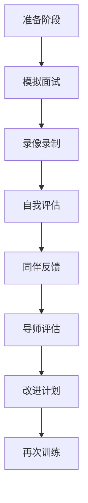

# 🎯 模拟面试系统指南

## 📋 概述

模拟面试是求职准备中最有效的训练方式。本指南提供完整的模拟面试系统，包括题库、评分标准、反馈机制、录像分析和实战训练方案。

---

## 🏗️ 模拟面试系统架构

### 1. 系统组成
```
模拟面试系统
├── 题库系统
│   ├── 算法题库
│   ├── 系统设计题库
│   ├── 行为面试题库
│   └── AI Agent专业题库
├── 评分系统
│   ├── 评分标准
│   ├── 评分表模板
│   └── 自动化评分工具
├── 反馈系统
│   ├── 即时反馈
│   ├── 详细报告
│   └── 改进建议
├── 训练系统
│   ├── 个人训练
│   ├── 同伴互练
│   └── 导师指导
└── 分析系统
    ├── 录像分析
    ├── 数据统计
    └── 进度跟踪
```

### 2. 训练流程


---

## 📚 题库系统

### 1. 算法题库
**题目来源**：
- LeetCode高频题目（前200题）
- 公司真题（字节、阿里、腾讯、百度）
- AI Agent相关算法题

**分类训练**：
| 类别 | 题目数量 | 训练重点 |
|------|----------|----------|
| 数组与字符串 | 30题 | 双指针、滑动窗口、哈希表 |
| 链表 | 20题 | 指针操作、反转、环检测 |
| 树与图 | 25题 | 遍历、递归、动态规划 |
| 动态规划 | 25题 | 状态定义、转移方程 |
| 回溯与搜索 | 20题 | DFS、BFS、剪枝 |
| 堆与优先队列 | 15题 | 堆操作、优先级调度 |
| 设计题 | 15题 | 数据结构设计 |

**AI Agent相关算法题**：
1. **状态机实现**：设计对话状态机
2. **任务调度**：带优先级的任务队列
3. **缓存设计**：LRU缓存实现
4. **工具调用**：工具注册和查找系统
5. **多Agent协作**：任务分配和结果合并

### 2. 系统设计题库
**基础设计题**：
1. 设计一个简单的AI Agent框架
2. 设计一个对话状态管理系统
3. 设计一个工具调用系统
4. 设计一个中间件链系统

**进阶设计题**：
1. 设计一个支持百万并发的智能客服系统
2. 设计一个多Agent协作的任务分配系统
3. 设计一个高可用的AI模型服务平台
4. 设计一个跨语言的AI Agent平台

**企业真题**：
- **字节跳动**：设计抖音智能客服系统
- **阿里巴巴**：设计淘宝智能导购Agent
- **腾讯**：设计微信对话助手系统
- **百度**：设计文心一言插件系统

### 3. 行为面试题库
**通用问题**：
1. 自我介绍
2. 最有挑战性的项目
3. 最大的技术挑战
4. 团队冲突处理
5. 职业规划

**AI Agent专业问题**：
1. 为什么选择DeerFlow/LangChain？
2. 如何保证Agent系统的稳定性？
3. 如何处理用户的模糊或错误输入？
4. Agent的输出如何保证可控性？
5. 如何评估Agent的效果？

**情景问题**：
1. 如果你发现同事的代码有严重问题怎么办？
2. 项目deadline很紧，但质量要求很高怎么办？
3. 技术方案团队有分歧怎么办？
4. 如何向非技术背景的同事解释技术方案？

### 4. AI Agent专业题库
**框架原理**：
1. DeerFlow中间件链的执行顺序设计考虑？
2. LangChain工具调用的实现原理？
3. 如何扩展DeerFlow的状态管理？
4. 多Agent协作的通信机制？

**实践问题**：
1. 如何设计一个安全的工具调用机制？
2. Agent状态管理有哪些挑战？如何解决？
3. 如何优化Agent的响应时间？
4. 如何处理长对话的上下文管理？

**场景设计**：
1. 设计一个智能客服Agent的需求分析
2. 设计一个多Agent协作的旅游规划系统
3. 设计一个金融风控Agent系统
4. 设计一个代码生成Agent系统

---

## 📊 评分系统

### 1. 算法面试评分标准
| 维度 | 权重 | 评分标准（1-5分） |
|------|------|------------------|
| **正确性** | 30% | 1=完全错误，3=部分正确，5=完全正确 |
| **时间复杂度** | 20% | 1=最差复杂度，3=可接受，5=最优解 |
| **空间复杂度** | 15% | 1=最差，3=可接受，5=最优 |
| **代码质量** | 20% | 1=混乱，3=可读，5=优雅规范 |
| **沟通表达** | 15% | 1=表达不清，3=清晰，5=优秀 |

**详细评分表**：
```
题目：[题目名称]
考察点：[主要考察点]

评分：
1. 正确性：□1 □2 □3 □4 □5
   - 是否通过所有测试用例？
   - 边界情况处理？
   
2. 时间复杂度：□1 □2 □3 □4 □5
   - 分析是否正确？
   - 是否最优？
   
3. 空间复杂度：□1 □2 □3 □4 □5
   - 分析是否正确？
   - 是否最优？
   
4. 代码质量：□1 □2 □3 □4 □5
   - 变量命名？
   - 代码结构？
   - 注释说明？
   
5. 沟通表达：□1 □2 □3 □4 □5
   - 思路表达？
   - 互动交流？
   - 问题澄清？

总分：[ ]/25
反馈建议：[具体建议]
```

### 2. 系统设计评分标准
| 维度 | 权重 | 评分标准（1-5分） |
|------|------|------------------|
| **需求分析** | 20% | 理解需求，明确约束 |
| **架构设计** | 25% | 模块划分，接口设计 |
| **技术选型** | 15% | 合理选型，理由充分 |
| **可扩展性** | 15% | 考虑增长，设计扩展 |
| **容错设计** | 15% | 错误处理，降级策略 |
| **沟通表达** | 10% | 清晰表达，有效沟通 |

**详细评分表**：
```
题目：[设计题目]
考察点：[主要考察点]

评分：
1. 需求分析：□1 □2 □3 □4 □5
   - 是否理解核心需求？
   - 是否明确约束条件？
   
2. 架构设计：□1 □2 □3 □4 □5
   - 模块划分是否合理？
   - 接口设计是否清晰？
   - 数据流是否明确？
   
3. 技术选型：□1 □2 □3 □4 □5
   - 技术选型是否合理？
   - 理由是否充分？
   
4. 可扩展性：□1 □2 □3 □4 □5
   - 是否考虑系统增长？
   - 扩展方案是否可行？
   
5. 容错设计：□1 □2 □3 □4 □5
   - 错误处理是否完善？
   - 降级策略是否合理？
   
6. 沟通表达：□1 □2 □3 □4 □5
   - 表达是否清晰？
   - 沟通是否有效？

总分：[ ]/30
反馈建议：[具体建议]
```

### 3. 行为面试评分标准
| 维度 | 权重 | 评分标准（1-5分） |
|------|------|------------------|
| **内容质量** | 30% | 故事真实，细节丰富 |
| **结构逻辑** | 25% | STAR结构，逻辑清晰 |
| **量化成果** | 20% | 数据支撑，成果量化 |
| **反思深度** | 15% | 总结经验，展示成长 |
| **表达自信** | 10% | 自信表达，自然流畅 |

**详细评分表**：
```
问题：[面试问题]
考察点：[主要考察点]

评分：
1. 内容质量：□1 □2 □3 □4 □5
   - 故事是否真实可信？
   - 细节是否丰富具体？
   
2. 结构逻辑：□1 □2 □3 □4 □5
   - 是否遵循STAR结构？
   - 逻辑是否清晰连贯？
   
3. 量化成果：□1 □2 □3 □4 □5
   - 是否有数据支撑？
   - 成果是否量化？
   
4. 反思深度：□1 □2 □3 □4 □5
   - 是否有经验总结？
   - 是否展示成长？
   
5. 表达自信：□1 □2 □3 □4 □5
   - 表达是否自信？
   - 是否自然流畅？

总分：[ ]/25
反馈建议：[具体建议]
```

### 4. 综合评分报告
**报告模板**：
```
模拟面试评估报告
候选人：[姓名]
面试时间：[日期]
面试类型：[算法/系统设计/行为/综合]

各部分得分：
1. 算法面试：[分数]/25
2. 系统设计：[分数]/30
3. 行为面试：[分数]/25
综合得分：[总分]/80

优势分析：
1. [优势1]
2. [优势2]
3. [优势3]

改进建议：
1. [建议1]
2. [建议2]
3. [建议3]

短期行动计划（1-2周）：
1. [行动1]
2. [行动2]
3. [行动3]

长期发展建议（1-2个月）：
1. [建议1]
2. [建议2]
3. [建议3]
```

---

## 🔄 反馈机制

### 1. 即时反馈
**面试过程中**：
- 思路卡住时的提示
- 代码错误的即时指正
- 表达不清时的澄清引导

**反馈技巧**：
- 先肯定，后建议
- 具体明确，避免模糊
- 提供替代方案或思路

### 2. 详细反馈报告
**报告结构**：
- **总体评价**：综合表现概述
- **分项分析**：各维度详细分析
- **具体案例**：举例说明问题
- **改进建议**：具体可行建议
- **资源推荐**：学习资源和练习建议

**反馈原则**：
- 客观公正，基于事实
- 建设性，帮助改进
- 具体可操作，避免空泛

### 3. 同伴反馈机制
**互评流程**：
1. 配对分组（3-4人一组）
2. 轮流担任面试官、候选人、观察员
3. 多角度反馈
4. 集体讨论改进

**反馈表模板**：
```
同伴反馈表
面试官：[姓名]
候选人：[姓名]
观察员：[姓名]

优点：
1. 
2. 
3. 

改进建议：
1. 
2. 
3. 

学习收获：
1. 
2. 
3. 
```

### 4. 导师反馈
**导师角色**：
- 专业评估，权威反馈
- 职业指导，发展建议
- 资源推荐，机会引荐

**导师反馈频率**：
- 初始评估：1次
- 中期检查：2-3次
- 最终模拟：1次
- 随时咨询：按需

---

## 🎥 录像分析

### 1. 录制设置
**设备要求**：
- 摄像头：清晰，光线充足
- 麦克风：清晰，无噪音
- 录制软件：OBS、Zoom、腾讯会议

**录制内容**：
- 面部表情和肢体语言
- 屏幕共享（编码过程）
- 语音对话

### 2. 分析维度
**技术表现**：
- 解题思路的清晰度
- 编码速度和准确性
- 问题分析能力

**沟通表达**：
- 语言表达的流畅度
- 技术术语使用的准确性
- 与面试官的互动质量

**非语言表现**：
- 眼神交流
- 肢体语言
- 表情管理

**时间管理**：
- 各部分时间分配
- 节奏控制
- 超时情况

### 3. 自我分析表
```
录像分析表
录像时间：[日期]
面试类型：[类型]

观看记录：
时间点 | 观察内容 | 自我评价 | 改进建议
-------|----------|----------|----------
[00:00] | 自我介绍 | □优 □良 □中 □差 | 
[00:30] | 问题理解 | □优 □良 □中 □差 |
[01:00] | 思路阐述 | □优 □良 □中 □差 |
... | ... | ... | ...

关键发现：
1. 
2. 
3. 

行动计划：
1. 
2. 
3. 
```

### 4. 对比分析
**对比对象**：
- 自己的不同次面试
- 优秀面试案例
- 同伴的表现

**分析方法**：
- 同一题目的不同解法
- 相似问题的处理方式
- 表达风格的差异

---

## 🏋️ 训练方案

### 1. 个人训练方案
**每日训练（1-2小时）**：
- 算法题：2-3题（LeetCode）
- 系统设计：1题（分析设计）
- 行为面试：1-2题（录音练习）

**每周训练（5-6小时）**：
- 完整模拟面试：1次（录像）
- 专题训练：算法/设计/行为各1次
- 复盘分析：2小时

**每月训练**：
- 全真模拟：2-3次（不同面试官）
- 能力评估：1次（综合评分）
- 计划调整：根据评估结果

### 2. 同伴训练方案
**训练小组**：
- 规模：3-4人
- 频率：每周2次
- 时长：每次2-3小时

**训练流程**：
1. **准备阶段**（15分钟）
   - 确定题目和角色
   - 设定训练目标
2. **模拟面试**（45分钟/人）
   - 轮流担任候选人
   - 真实面试环境
3. **反馈讨论**（30分钟/人）
   - 多角度反馈
   - 集体讨论
4. **总结提升**（15分钟）
   - 记录关键点
   - 制定改进计划

### 3. 导师指导方案
**指导频率**：
- 初始指导：职业规划，训练计划
- 定期检查：每月1次，进度评估
- 专题指导：按需，难点突破
- 最终模拟：求职前，全真模拟

**指导内容**：
- 技术深度指导
- 面试技巧培训
- 职业发展咨询
- 资源推荐引荐

### 4. 专项训练方案
**算法专项**：
- 弱点突破：针对薄弱题型
- 速度训练：限时解题
- 白板编码：无IDE练习

**系统设计专项**：
- 框架学习：学习优秀设计
- 案例研究：分析真实系统
- 设计练习：从简单到复杂

**行为面试专项**：
- 故事打磨：优化个人故事
- 压力训练：模拟压力面试
- 录像分析：改进表达方式

---

## 📈 进度跟踪

### 1. 训练日志
**日志模板**：
```
训练日志
日期：[日期]
训练类型：[算法/设计/行为/综合]
时长：[小时]

训练内容：
1. [内容1]
2. [内容2]
3. [内容3]

收获与发现：
1. 
2. 
3. 

问题与困难：
1. 
2. 
3. 

明日计划：
1. 
2. 
3. 
```

### 2. 能力成长曲线
**跟踪指标**：
- 算法解题正确率
- 解题平均时间
- 系统设计评分
- 行为面试评分
- 综合模拟评分

**可视化图表**：
- 折线图：能力变化趋势
- 雷达图：各维度能力分布
- 柱状图：进步对比

### 3. 里程碑设置
**准备阶段里程碑**：
- 里程碑1：完成基础算法训练（LeetCode 100题）
- 里程碑2：掌握系统设计基础（5个完整设计）
- 里程碑3：行为面试故事准备（10个完整故事）
- 里程碑4：第一次全真模拟（综合评分>60）
- 里程碑5：最终准备完成（综合评分>75）

**达成标准**：
- 每个里程碑有明确标准
- 达成后庆祝奖励
- 未达成分析原因调整

---

## 🛠️ 工具推荐

### 1. 录制分析工具
- **OBS Studio**：免费开源录制软件
- **Zoom/腾讯会议**：会议录制，方便回放
- **Loom**：简单易用的屏幕录制
- **Veed.io**：在线视频编辑分析

### 2. 练习平台
- **LeetCode**：算法练习
- **Pramp**：免费模拟面试
- **Interviewing.io**：匿名模拟面试
- **AlgoExpert**：算法系统学习

### 3. 时间管理
- **Toggl**：时间跟踪
- **Forest**：专注训练
- **Notion**：训练计划管理
- **Google Calendar**：训练安排

### 4. 反馈收集
- **Google Forms**：反馈表收集
- **Typeform**：美观的反馈表
- **Airtable**：结构化数据管理
- **Trello**：任务和进度管理

---

## 🎯 实战模拟计划

### 1. 4周冲刺计划
**第1周：基础巩固**
- 算法：每日3题，重点薄弱题型
- 设计：每日1题，基础设计模式
- 行为：每日2题，故事打磨
- 模拟：周末1次全真模拟

**第2周：能力提升**
- 算法：每日4题，中等难度
- 设计：每日1题，进阶设计
- 行为：每日2题，压力训练
- 模拟：周末2次全真模拟

**第3周：综合训练**
- 算法：每日5题，混合难度
- 设计：每日2题，企业真题
- 行为：每日3题，情景模拟
- 模拟：周中1次，周末2次

**第4周：最终调整**
- 算法：回顾错题，保持手感
- 设计：回顾优秀设计，总结模式
- 行为：优化表达，调整心态
- 模拟：每日1次简短模拟

### 2. 面试前准备清单
**前1天**：
- [ ] 复习个人项目和简历
- [ ] 准备面试服装和环境
- [ ] 测试设备和网络
- [ ] 准备水和笔记工具
- [ ] 放松心态，保证睡眠

**前1小时**：
- [ ] 最后检查设备和环境
- [ ] 复习常见问题和答案
- [ ] 进行简短的热身练习
- [ ] 调整心态，保持自信
- [ ] 提前10分钟进入等待

**面试后**：
- [ ] 记录面试问题和表现
- [ ] 发送感谢邮件（如合适）
- [ ] 复盘分析，总结经验
- [ ] 准备后续面试或谈判

---

## 🆘 常见问题与解答

### Q1：模拟面试和真实面试有多大差距？
A：高质量的模拟面试可以达到真实面试80%的效果。关键在于模拟的真实性：真实环境、真实题目、真实反馈。建议找有经验的面试官进行模拟。

### Q2：应该进行多少次模拟面试？
A：建议至少10-15次完整模拟，包括不同面试官、不同题目类型。具体次数根据基础水平和进步速度调整。

### Q3：如何找到合适的模拟面试伙伴？
A：可以通过课程社区、技术社群、校友网络寻找。选择水平相当或略高的伙伴，建立长期互练关系。

### Q4：模拟面试中发现自己有很多问题怎么办？
A：这是正常过程。发现问题就是进步的开始。制定针对性改进计划，逐个解决。记录进步，保持信心。

### Q5：如何评估自己是否准备好真实面试？
A：当满足以下条件时：
- 全真模拟评分稳定在75分以上
- 各类题目都有稳定表现
- 能够应对压力面试
- 对自己的能力有信心

---

## 📚 资源推荐

### 书籍
- 《Cracking the Coding Interview》
- 《System Design Interview》
- 《Behavioral Interviews》
- 《AI Agent System Design》

### 在线课程
- LeetCode精选课程
- Educative系统设计课程
- Coursera面试准备课程
- 本课程面试准备模块

### 社区
- LeetCode讨论区
- Blind（匿名职场社区）
- 一亩三分地（海外求职）
- 脉脉（国内职场）

### 工具
- 本指南提供的所有模板
- 课程提供的模拟面试服务
- 导师一对一指导服务
- 同伴互练匹配服务

---

## 🏁 最后建议

1. **持续练习**：面试技能需要持续训练
2. **真实反馈**：寻求真实、具体的反馈
3. **记录进步**：看到自己的成长，保持动力
4. **调整心态**：面试是双向选择，不是审判
5. **享受过程**：每一次面试都是学习机会

**记住**：模拟面试的目的是暴露问题、改进提升。不要害怕发现问题，这正是进步的机会。

**祝您模拟面试顺利，真实面试成功！**