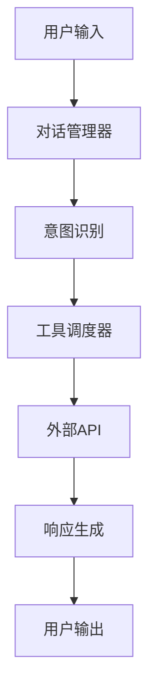
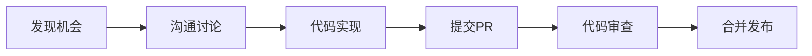

# 🐙 GitHub Portfolio 优化指南

## 📋 概述

GitHub Portfolio（GitHub作品集）是AI Agent工程师展示技术能力的重要窗口。一个优秀的GitHub Profile可以显著提升求职竞争力，特别是对于技术岗位。

---

## 🎯 目标与价值

### 为什么GitHub Portfolio重要？
1. **技术能力证明**：展示实际编码能力和项目经验
2. **开源贡献记录**：体现社区参与和技术热情
3. **学习轨迹展示**：反映技术成长和持续学习
4. **招聘筛选加分**：大厂技术面试官常查看GitHub
5. **个人品牌建设**：建立技术影响力和个人品牌

### 优秀GitHub Portfolio特征
- ✅ 有高质量的完整项目
- ✅ 代码规范、文档完整
- ✅ 活跃的贡献记录
- ✅ 技术博客或教程
- ✅ 社区互动和影响力

---

## 🏗️ GitHub Profile 整体优化

### 1. Profile README（个人主页）
创建`.github/profile/README.md`文件，展示个人简介和技术栈。

**优秀示例**：
```markdown
# 👋 Hi, I'm 张明 - AI Agent Engineer

🚀 **About Me**
- 🔭 Currently working on: Building enterprise AI Agent systems
- 🌱 Learning: Advanced multi-agent collaboration patterns
- 👯 Looking to collaborate on: Open source AI Agent frameworks
- 💬 Ask me about: DeerFlow, LangChain, multi-turn dialogue systems
- 📫 How to reach me: zhangming@email.com

## 🔧 Tech Stack
**AI Agent Frameworks**


**Programming Languages**


## 🚀 Featured Projects

### [Smart Customer Service Agent](https://github.com/zhangming/smart-customer-service)
A production-ready AI Agent for customer service, built with DeerFlow.
- 🏗️ Architecture: Microservices, Event-driven
- 📊 Performance: 10M+ daily conversations, 99.99% availability
- 🎯 Accuracy: 92% intent recognition rate

### [Multi-Agent Collaboration Framework](https://github.com/zhangming/multi-agent-framework)
An open-source framework for multi-agent task decomposition and collaboration.
- ⭐ 200+ Stars, 50+ Forks
- 🏆 Featured on GitHub Trending

## 📊 GitHub Stats


## 📝 Latest Blog Posts
<!-- BLOG-POST-LIST:START -->
- [DeerFlow实战：构建企业级AI Agent系统](https://zhuanlan.zhihu.com/p/123456)
- [多Agent协作系统设计模式](https://zhuanlan.zhihu.com/p/123457)
- [LangChain源码解析](https://zhuanlan.zhihu.com/p/123458)
<!-- BLOG-POST-LIST:END -->

## 🤝 Let's Connect
[](https://linkedin.com/in/zhangming)
[](https://twitter.com/zhangming)
[](https://www.zhihu.com/people/zhangming)
```

### 2. Pin重要项目
在GitHub主页置顶3-6个最佳项目，确保多样性：
1. **完整产品项目**：展示工程能力
2. **开源框架贡献**：展示社区参与
3. **技术教程/示例**：展示教学能力
4. **研究项目**：展示创新能力

### 3. 贡献图活跃度
- **每日提交**：保持规律的小提交
- **多样化贡献**：PR、Issue、Wiki、Discussions
- **长期维护**：至少1-2个活跃维护的项目

---

## 📁 项目展示优化

### 1. 项目README标准结构
每个重要项目都应有完整的README.md：

```markdown
# 项目名称

[](LICENSE)
[](https://python.org)
[](https://deerflow.io)

## 🎯 项目概述
简要说明项目目标、解决的问题、核心功能。

## 📊 核心特性
- **多轮对话管理**：基于状态机的对话流程控制
- **工具调用系统**：插件化工具注册和执行
- **性能优化**：支持高并发，低延迟响应
- **可扩展架构**：易于添加新功能和集成

## 🏗️ 架构设计
### 系统架构图


### 技术栈
- **框架**: DeerFlow 1.2.0
- **后端**: FastAPI, PostgreSQL, Redis
- **部署**: Docker, Kubernetes
- **监控**: Prometheus, Grafana

## 🚀 快速开始
### 安装
```bash
pip install -r requirements.txt
```

### 配置
```bash
cp .env.example .env
# 编辑环境变量
```

### 运行
```bash
python main.py
```

## 📁 项目结构
```
project/
├── src/
│   ├── agents/          # Agent定义
│   ├── tools/           # 工具实现
│   ├── middleware/      # 中间件
│   └── utils/          # 工具函数
├── tests/              # 测试代码
├── docs/              # 文档
└── examples/          # 示例代码
```

## 🔧 使用示例
```python
from src.agents.customer_service import CustomerServiceAgent

agent = CustomerServiceAgent()
response = agent.run("我想查询订单状态")
print(response)
```

## 📈 性能指标
| 指标 | 值 | 说明 |
|------|-----|------|
| 响应时间 | <200ms P99 | 端到端延迟 |
| 吞吐量 | 5000 QPS | 单实例处理能力 |
| 可用性 | 99.99% | 月度可用性 |
| 准确率 | 92% | 意图识别准确率 |

## 🤝 贡献指南
欢迎贡献！请查看[CONTRIBUTING.md](CONTRIBUTING.md)。

## 📄 许可证
本项目基于MIT许可证 - 查看[LICENSE](LICENSE)文件。

## 🙏 致谢
感谢以下开源项目：
- [DeerFlow](https://deerflow.io)
- [LangChain](https://langchain.com)
- [FastAPI](https://fastapi.tiangolo.com)
```

### 2. 项目质量指标
- **代码规范**：遵循PEP8，使用Black格式化
- **测试覆盖**：单元测试覆盖率>80%
- **文档完整**：API文档、使用示例、部署指南
- **CI/CD**：GitHub Actions自动化测试和部署
- **依赖管理**：明确的requirements.txt或pyproject.toml

### 3. 演示和展示
- **在线Demo**：提供可交互的演示（Streamlit、Gradio）
- **截图/GIF**：展示界面和功能
- **视频教程**：录制功能演示视频
- **性能报告**：基准测试结果

---

## 📝 技术博客整合

### 1. GitHub Pages博客
使用GitHub Pages搭建个人技术博客：

```bash
# 使用Jekyll、Hugo或Hexo
# 示例：使用Jekyll
gem install jekyll bundler
jekyll new my-blog
cd my-blog
bundle exec jekyll serve
```

### 2. 博客内容规划
| 类型 | 频率 | 目标 |
|------|------|------|
| **技术教程** | 每月1-2篇 | 详细讲解特定技术 |
| **项目总结** | 每项目1篇 | 分享项目经验教训 |
| **源码解析** | 每季度1-2篇 | 深度分析开源框架 |
| **行业分析** | 每季度1篇 | AI Agent发展趋势 |

### 3. 自动同步
使用GitHub Actions自动同步其他平台内容：

```yaml
# .github/workflows/sync-blog.yml
name: Sync Blog Posts
on:
  schedule:
    - cron: '0 0 * * 0'  # 每周日运行
jobs:
  sync:
    runs-on: ubuntu-latest
    steps:
      - uses: actions/checkout@v3
      - name: Sync from Zhihu
        run: python scripts/sync_zhihu.py
      - name: Commit and Push
        run: |
          git config --local user.email "action@github.com"
          git config --local user.name "GitHub Action"
          git add .
          git commit -m "Sync blog posts" || echo "No changes"
          git push
```

---

## 🤝 开源贡献策略

### 1. 贡献目标框架
- **DeerFlow**：字节跳动内部框架，贡献价值高
- **LangChain**：业界标准，贡献能见度高
- **AutoGen**：微软项目，学术和工业结合
- **相关工具库**：PyTorch、Hugging Face等

### 2. 贡献类型
1. **Bug修复**：从简单的issue开始
2. **文档改进**：补充文档、翻译、示例
3. **功能开发**：实现新功能或优化
4. **性能优化**：提升框架性能
5. **测试覆盖**：增加测试用例

### 3. 贡献流程


### 4. 贡献记录展示
在README中展示贡献记录：

```markdown
## 🏆 Open Source Contributions

### DeerFlow
- [#123](https://github.com/deerflow/deerflow/pull/123): Fixed state management bug
- [#89](https://github.com/deerflow/deerflow/pull/89): Added middleware examples

### LangChain
- [#456](https://github.com/langchain-ai/langchain/pull/456): Improved tool calling documentation
- [#234](https://github.com/langchain-ai/langchain/pull/234): Added Chinese translation
```

---

## 📊 数据驱动优化

### 1. GitHub Insights利用
- **流量分析**：了解项目访问来源
- **星标趋势**：观察项目受欢迎程度
- **贡献者增长**：社区参与度指标
- **代码频率**：开发活跃度

### 2. 量化目标
- **短期（1个月）**：2个完整项目，10次提交
- **中期（3个月）**：1个知名项目贡献，100星标
- **长期（6个月）**：建立个人技术品牌，500+关注者

### 3. 监测指标
| 指标 | 目标值 | 监控工具 |
|------|--------|----------|
| 仓库星标 | >100 | GitHub Insights |
| 贡献频率 | 每周5+提交 | GitHub Contributions |
| 问题响应 | <24小时 | GitHub Notifications |
| 文档完整度 | 100% | 自动化检查 |

---

## 🚀 进阶技巧

### 1. GitHub Actions自动化
```yaml
name: CI/CD Pipeline
on: [push, pull_request]
jobs:
  test:
    runs-on: ubuntu-latest
    steps:
      - uses: actions/checkout@v3
      - name: Set up Python
        uses: actions/setup-python@v4
        with:
          python-version: '3.9'
      - name: Install dependencies
        run: pip install -r requirements.txt
      - name: Run tests
        run: pytest --cov=src --cov-report=xml
      - name: Upload coverage
        uses: codecov/codecov-action@v3
```

### 2. GitHub Pages高级部署
- **自定义域名**：使用个人域名
- **HTTPS加密**：自动SSL证书
- **CDN加速**：使用Cloudflare
- **分析集成**：Google Analytics

### 3. GitHub Discussions社区建设
- **技术问答**：回答相关问题
- **项目讨论**：收集用户反馈
- **功能投票**：社区参与决策
- **知识库建设**：积累常见问题

### 4. GitHub Sponsors变现
- **设置赞助**：提供赞助者权益
- **独家内容**：为赞助者提供额外内容
- **咨询机会**：提供一对一咨询
- **培训服务**：提供付费培训

---

## 🎯 针对AI Agent工程师的特殊优化

### 1. 项目类型推荐
1. **完整的Agent系统**：展示端到端能力
2. **工具扩展库**：展示扩展框架能力
3. **性能基准测试**：展示优化能力
4. **部署模板**：展示工程化能力
5. **教学示例**：展示教学和文档能力

### 2. 技术栈展示重点
- **框架深度**：不仅会用，还要懂原理
- **性能优化**：有具体的优化案例
- **架构设计**：清晰的架构图和设计文档
- **生产就绪**：考虑监控、日志、部署

### 3. 行业相关性
- **企业级应用**：展示解决实际业务问题的能力
- **开源贡献**：展示对生态的贡献
- **技术前瞻**：展示对新技术的探索

---

## 📈 成功案例

### 案例1：应届毕业生
- **初始状态**：只有课程作业项目
- **优化策略**：
  1. 重构课程项目为完整产品
  2. 贡献LangChain文档翻译
  3. 创建DeerFlow教程系列
- **结果**：GitHub获得200+星标，拿到3个大厂offer

### 案例2：转型工程师
- **初始状态**：传统后端项目，无AI经验
- **优化策略**：
  1. 学习并实现AI Agent项目
  2. 贡献开源框架Bug修复
  3. 撰写技术博客分享经验
- **结果**：成功转型AI Agent工程师，入职字节跳动

### 案例3：资深工程师
- **初始状态**：项目杂乱，缺乏重点
- **优化策略**：
  1. 整理并突出核心项目
  2. 建立个人技术品牌
  3. 参与知名开源项目
- **结果**：成为技术影响力人物，获得更多机会

---

## 🛠️ 工具推荐

### 1. 代码质量
- **Black**：代码格式化
- **Flake8**：代码规范检查
- **MyPy**：静态类型检查
- **Pytest**：测试框架

### 2. 文档生成
- **MkDocs**：项目文档生成
- **Sphinx**：API文档生成
- **Read the Docs**：文档托管

### 3. 自动化
- **GitHub Actions**：CI/CD
- **Dependabot**：依赖更新
- **CodeQL**：代码安全扫描

### 4. 分析监控
- **Google Analytics**：流量分析
- **Hotjar**：用户行为分析
- **Uptime Robot**：可用性监控

---

## 🏁 行动计划

### 第1周：基础建设
- [ ] 完善Profile README
- [ ] 整理现有项目
- [ ] 设置GitHub Actions基础工作流

### 第2-4周：项目优化
- [ ] 优化1-2个核心项目README
- [ ] 增加测试覆盖率到80%+
- [ ] 部署在线Demo

### 第5-8周：内容建设
- [ ] 撰写2-3篇技术博客
- [ ] 贡献1-2个开源项目
- [ ] 建立技术社区互动

### 第9-12周：品牌建设
- [ ] 建立个人技术品牌
- [ ] 参与技术分享活动
- [ ] 优化整体Portfolio展示

---

## 🔍 检查清单

### 基础检查
- [ ] Profile README完整且专业
- [ ] 项目有清晰的README
- [ ] 代码规范遵循PEP8
- [ ] 有基本的测试覆盖
- [ ] 提交记录规律且有意义

### 进阶检查
- [ ] 有在线演示或Demo
- [ ] 有性能基准测试
- [ ] 有架构设计文档
- [ ] 有社区互动记录
- [ ] 有技术博客内容

### 高级检查
- [ ] 参与知名开源项目
- [ ] 建立个人技术品牌
- [ ] 有完整的产品项目
- [ ] 有技术影响力指标
- [ ] 有持续更新和维护

---

## 📚 学习资源

### 官方文档
- [GitHub Docs](https://docs.github.com)
- [GitHub Pages](https://pages.github.com)
- [GitHub Actions](https://github.com/features/actions)

### 优秀案例
- [Awesome GitHub Profile README](https://github.com/abhisheknaiidu/awesome-github-profile-readme)
- [GitHub Portfolio Examples](https://github.com/topics/portfolio)

### 工具资源
- [Shields.io](https://shields.io)：徽章生成
- [GitHub Readme Stats](https://github.com/anuraghazra/github-readme-stats)：统计卡片
- [GitHub Contribution Chart](https://github.com/Ashutosh00710/github-readme-activity-graph)：贡献图

---

**祝您GitHub Portfolio优化顺利，打造令人印象深刻的技术名片！**